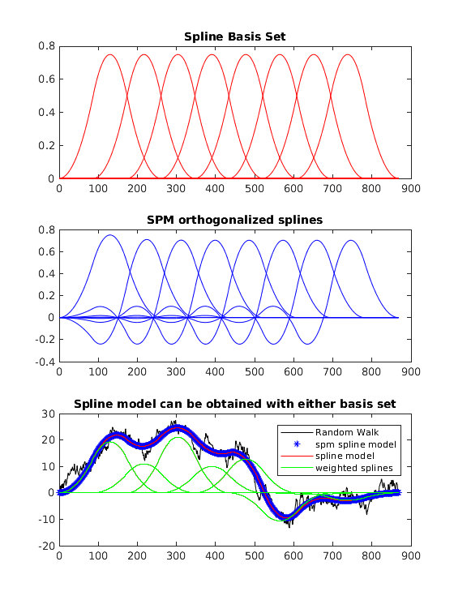

# Spline models with SPM

Spline interpolation is a method of estimating smooth but flexible HRF functions, and are a substitute for canonical models 
like the double gamma HRF. Spline interpolation is suppoted natively by some fMRI packages like AFNI, but not SPM. 
spm_spline.patch provides support for spline modeling in SPM, and canlab tools are already configured for compatability. For
canlab tools compatibility refer to canlab_glm_dsgninfo.txt and in particular DSGN.convolution and DSGN.multiregbehav.

Spline interpolation works by fitting a bellshaped curve (the spline basis function, although strictly speaking it could
be more triangular than bellshaped, depending on how your parameterize it) at a particular point in time to the HRF estimate, 
similar to how a single canonical HRF function might be fit, except instead of a single curve you have multiple (figure, top 
panel). A weighted sum (linear combination) of these curves adds up to a smooth fit to a line, with a couple of 'nodes' which
are the inflection points of the curve. These nodes are defined by the crossover points in time of the underlying basis 
functions. This is shown in the figure below (bottom panel).

All SPM needs to do to fit a canonical HRF to BOLD data is to estimate a scaling factor that optimizes the fit. That scaling 
factor is then your contrast estimate (say at a particular voxel). Similarly, when fitting spline basis sets SPM will 
estimate a scaling factor for each basis function at each voxel, and as a result you don't get a single contrast estimate,
rather you get multiple: one statistical parametric map per basis function.

Spline basis functions are not strictly speaking basis functions because they're not orthogonal. SPM does not support 
non-orthogonal basis functions for HRF convolution. Instead SPM will automatically orthogonalize your spline basis set
and if you look at SPM.xBF.bf you will see that these do not resemble true spline basis functions (top panel), but rather
some strange variation on this (middle panel). However, (true) spline basis functions are a linear combination of these
orthogonalized basis functions SPM uses, so you can reconstruct individual spline basis functions from the parametric maps
SPM gives you. This can be automated at the first level with appropriate contrast estimates. Please refer to spm_patch.README
for an example.

You might use spline basis functions if you're interested in the temporal properties of an evoked response, but more often
you might simply want to make fewer assumptions about the shape of the evoked response while otherwise asking similar 
questions to those you might ask with a canonical HRF. In the case of the canonical HRF you're only interested in overall
contrast, not in subdividing the evoked response into subcomponents. This is straightforward when working with the canonical
HRF because you have a single parameter estimate the represents this contrast, but with spline models you have multiple
estmates (one for each basis function) and you need to somehow combine these to get an estimate of "overall" contrast. The
most straightforward approach is to compute the area under the curve of the estimated spline function. Given the parameter
estimates of the true (non orthogonal) spline basis functions, the area under the curve is proportional to the average
parameter estimate. The proportionality constant will depend on the number of splines used, your spline order (e.g. linear, 
cubic, etc), but it's a constant. In principle we don't care about the exact area under the curve because BOLD contrast
isn't quantitative, so having an estimate that's proportional to the area up to a scaling constant is fine, as long as
you're using the same spline function parameterization across all instances you're comparing (e.g. all subjects, all voxels,
etc.). If you're using different spline parameterizations, or using splines in some cases and canonical HRFs in others,
you will want to compute this proportionality constant and correct for it before comparing HRFs fit using different models.
This is unlikely to be a common scenario though.

As far as the naive AUC estimate (i.e. without estimating the proportionality constant), there's still a catch: We don't 
have the parameter estimates for the true spline basis functions. We only have the parameter estimates from the orthogonal 
spline basis functions. These span the same linear subspace, so you can compute the area under the curve from the orthogonal 
splines as well, but doing so will require a little extra work, and properly defined contrasts in your first level design. 
Refer to spm_spline.README for more details and an example.
