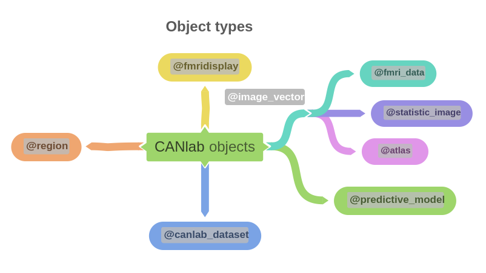
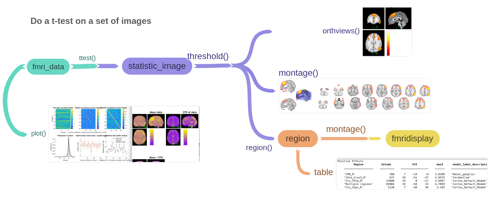
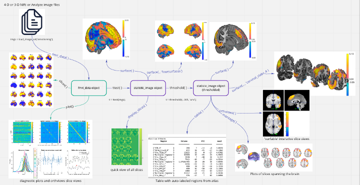

# Object methods in CanlabCore

CanlabCore is built around a small set of MATLAB classes that wrap neuroimaging data. Each class has **properties** (the data fields it stores — image values, masks, design matrices, region labels, etc.) and **methods** (the things you can do with that data — plot it, threshold it, run a t-test, render it on a brain surface, save it to disk). This page is the entry point to per-class documentation.



The design philosophy is interactive analysis with simple commands. A typical group analysis is a handful of one-liners:

```matlab
imgs = load_image_set('emotionreg');     % fmri_data with 30 images
plot(imgs);                              % QC summary
t    = ttest(imgs);                      % voxelwise t-test -> statistic_image
t    = threshold(t, 0.005, 'unc');       % re-threshold
r    = region(t);                        % connect blobs -> region object
table(r);                                % atlas-labeled results table
montage(r);                              % brain montage
```


Most user-facing image classes inherit from a common abstract base, `image_vector`, which stores image data as a flat `[voxels x images]` matrix in a `.dat` field with the inverse mapping back to 3-D space in `.volInfo`. This is what lets generic statistical / ML code operate on `.dat` while the class methods handle the spatial reconstruction transparently.

## Tutorials and walkthroughs

The fastest way to learn the toolbox is by example.

- **[Walkthroughs](https://canlab.github.io/walkthroughs/)** — step-by-step analysis tutorials with code.
- **[Tutorials](https://canlab.github.io/tutorials/)** — longer-form tutorials.
- **[canlab.github.io](https://canlab.github.io/)** — top-level entry point with Setup, Repositories, Interactive fMRI, and the second-level batch script system.

## Class hierarchy

```
image_vector  (abstract base; rarely used directly)
├── fmri_data           generic image data + .X, .Y, covariates
├── statistic_image     stat maps with t / p / sig
├── atlas               labeled parcellation with probability maps
└── fmri_mask_image     binary mask (legacy)

region                  list of contiguous clusters
fmridisplay             figure-handle container for layered brain montages
brainpathway            connectivity / pathway model (one subject)
brainpathway_multisubject   group-level extension of brainpathway
fmri_timeseries         specialized container for raw timeseries
canlab_dataset          subject x variable behavioral / clinical data
fmri_glm_design_matrix  first-level GLM design matrix (onsets, basis set, X)
glm_map                 mass-univariate GLM / regression estimator (1st & 2nd level)
predictive_model        artifacts of a fitted multivariate prediction model
```

## Object classes

Listed in roughly the order most users encounter them. Click a class name for the full per-class page (intro, properties, methods grouped by category).

| Class | Description |
|---|---|
| **[`fmri_data`](fmri_data_methods.md)** | The workhorse. This object holds fMRI / PET / images plus additional metadata table and auxiliary data and metadata. The idea is a complete analysis-ready package in a single object. Images can be time series, trial-level, contrast images, or others, with metadata fields to mark image semantics. Most analysis methods (`predict`, `regress`, `ica`, `searchlight`, `ttest`, `signtest`) live here. |
| **[`image_vector`](image_vector_methods.md)** | Abstract superclass. You rarely create one directly, but most of the methods you call on an `fmri_data`, `statistic_image`, or `atlas` are inherited from here (`apply_mask`, `resample_space`, `montage`, `surface`, `extract_roi_averages`, etc.). |
| **[`statistic_image`](statistic_image_methods.md)** | Stat maps (t / p / effect-size) with thresholding state. Produced by `ttest`, `regress`, etc. The `threshold` method re-thresholds without losing the underlying values. |
| **[`atlas`](atlas_methods.md)** | Brain atlases / parcellations. Includes both winner-take-all labels for each parcel and probabilistic maps, region labels ( `.labels`), `.references`, and other metadata. Makes it easy to extract or analyze data within named atlas regions or on region/parcel averages. Methods include `select_atlas_subset`, `merge_atlases`, `downsample_parcellation`, `atlas2region`. Use `load_atlas` to load by keyword. |
| **[`region`](region_methods.md)** | Vector storing information about a set of contiguous clusters / ROIs as a unit of analysis, with one element per region. Designed to hold a compact representation of thresholded maps, including data, voxel coordinates and locations, and facilitate rendering on brains and tables. Produced by `region(t)` from a thresholded `statistic_image`. Consumed by `montage`, `table`, `surface`, `extract_data`. |
| **[`fmridisplay`](fmridisplay_methods.md)** | Container holding figure handles for slice montages and surfaces. Built by invoking methods like `montage` or with preconfigured sets in `canlab_results_fmridisplay`; lets you swap blob layers in / out without re-rendering the anatomy underneath. |
| **[`brainpathway`](brainpathway_methods.md)** | Connectivity / pathway-modeling object for one subject. The `brainpathway_multisubject` extension is documented on the same page. |
| **[`fmri_timeseries`](fmri_timeseries_methods.md)** | Specialized container for raw timeseries data. |
| **[`canlab_dataset`](canlab_dataset_methods.md)** | Generic subject x variable behavioral / clinical data container with its own `glm`, `mediation`, `scatterplot`, `get_var`, `add_vars`, 'write' (to text file) and plotting methods. Designed for two-level datasets (within-person, between-person) common in cognitive neuroscience |
| **[`fmri_glm_design_matrix`](fmri_glm_design_matrix_methods.md)** | Holds GLM design matrices (X) for first-level fMRI analyses. Methods like `build`, `add`, `replace_basis_set`. |
| **[`glm_map`](glm_map_methods.md)** | scikit-learn-style estimator for mass-univariate GLM / multiple regression. Bundles the design (event/first-level onsets via a wrapped `fmri_glm_design_matrix`, or a static second-level design matrix), the fitted result maps (`betas`/`t`/contrasts), and design diagnostics (VIF/cVIF, leverage, Cook's D, efficiency, high-pass filter). The canonical output of `fmri_data.regress`. Workflow: `build_design`/`import_onsets`/`import_SPM` → `add_contrasts` → `run_diagnostics` → `fit` → `threshold`/`table`/`montage`. |
| **[`predictive_model`](predictive_model_methods.md)** | Holds a multivariate prediction model and its artifacts — setup variables, cross-validated predictions, weight maps, performance summaries. |

## Cross-cutting topics

- **[Workflows](Workflows.md)** — end-to-end, didactic walkthroughs that chain methods together to accomplish a common goal (e.g. extracting and visualizing ROI / atlas data). Each workflow links a conceptual overview ("roadmap") and a runnable code walkthrough.
- **[Recasting (converting) between object types](recasting_objects.md)** — `region2fmri_data`, `atlas2region`, `region(t)`, etc., and when to call `replace_empty` before converting.
- **[fmri_data_methods.md](fmri_data_methods.md)** is also the cross-cutting *functional* index of `@fmri_data` + `@image_vector` methods, organized by area (basic math / display / resampling / statistics / multivariate prediction / tables / annotation / data extraction / data processing / quality control / misc utilities). The same category structure is used in every per-class page.
- **[Atlases, regions, and patterns](atlases_regions_and_patterns.md)** — registry of available atlases, named regions, and multivariate signature patterns, with paper citations.
- **[Sample datasets](sample_datasets.md)** — the small datasets that ship with CanlabCore plus the `load_image_set` keyword registry, with paper citations.
- **[Toolbox folder map](toolbox_folders.md)** — what lives in each subfolder of `CanlabCore/`.

## Cross-validation helpers (stand-alone)

A small set of stand-alone helpers that are not class methods but are used by `predict` and other multivariate workflows.

| Function | One-liner |
|---|---|
| [`xval_select_holdout_set`](individual_functions/xval_select_holdout_set.md) | Build holdout sets balanced on outcome and nuisance covariates |
| [`xval_classify`](individual_functions/xval_classify.md) | k-fold cross-validated linear discriminant classification (`fitcdiscr`) |
| [`xval_SVM`](individual_functions/xval_SVM.md) | Repeated-CV SVM classification with bootstrap weight inference (`fitcsvm`) |
| [`xval_SVR`](individual_functions/xval_SVR.md) | Repeated-CV support-vector regression with bootstrap weight inference (`fitrsvm`) |
| [`roc_plot`](individual_functions/roc_plot.md) | ROC curve, accuracy stats, and Gaussian SDT fit for a binary classifier |

## Visualizing images and results

Most image objects (`fmri_data`, `statistic_image`, `atlas`) share a common set of visualization
entry points — pick by output medium:

- **`montage(obj)`** — slice montage on a canonical anatomical underlay; the workhorse for static figures.
- **`orthviews(obj)`** — SPM-based interactive three-plane viewer in MATLAB; `canlab_orthviews` adds CANlab conveniences (multiple blobs, region tables).
- **`surface(obj)` / `isosurface(obj)`** — render activation on 3-D cortical surfaces / isosurfaces in MATLAB.
- **`canlab_results_fmridisplay(obj)`** — pre-built montage + surface scaffolds returning a registered `fmridisplay`.
- **[`canlab_niivue(obj)`](canlab_niivue_guide.md)** — interactive **web** orthviews (NiiVue): a portable, point-and-click `.html` viewer with colormap/threshold/opacity controls that you can email or embed in an HTML report. See the **[canlab_niivue guide](canlab_niivue_guide.md)**.

## Visualization helpers (stand-alone)

Functions that are not class methods but are widely used to render brains, regions, and statistics.

| Function | One-liner |
|---|---|
| [`addbrain`](individual_functions/addbrain.md) | Add a canonical anatomical surface or named region (cortex, BG, thalamic nuclei, etc.) to current axes |
| [`canlab_niivue`](canlab_niivue_guide.md) | Interactive web-based orthviews (NiiVue): underlay + stat overlay in the browser; embeddable in HTML reports |
| [`canlab_results_fmridisplay`](individual_functions/canlab_results_fmridisplay.md) | Pre-built montage / surface scaffolds (`'full'`, `'compact'`, ...) that return a registered `fmridisplay` |
| [`cluster_surf`](individual_functions/cluster_surf.md) | Render clusters / regions on a canonical surface (legacy; superseded by `addbrain` + `render_on_surface`) |
| [`barplot_columns`](individual_functions/barplot_columns.md) | Bar plot of column means with errors and per-column tests |
| [`image_scatterplot`](individual_functions/image_scatterplot.md) | Voxelwise scatterplot comparing two image objects, with optional density / p-value overlays |
| [`plot_correlation_matrix`](individual_functions/plot_correlation_matrix.md) | Heatmap or circle-plot of a correlation matrix with significance markers |
| [`canlab_force_directed_graph`](individual_functions/canlab_force_directed_graph.md) | Force-directed network plot of variable inter-correlations with optional 3-D brain view |
| [`clusterdata_permtest`](individual_functions/clusterdata_permtest.md) | Hierarchical clustering with permutation-based selection of `k` |

These can be used with fmri_data, statistic_image, and other objects to create a variety of figures and tables.


## Conventions

- **State management.** Many methods rely on the "removed voxels / removed images" bookkeeping. If you are manipulating `.dat` directly, call `replace_empty(obj)` to expand to the full padded voxel space before reasoning about voxel positions, and `remove_empty(obj)` before doing math across `.dat` rows. See the relevant section of [`fmri_data_methods.md`](fmri_data_methods.md).
- **Provenance.** The `.history` cell array tracks transformations applied to an object. Many methods append to it automatically.
- **Polymorphism.** Most "image-like" arguments accept either a filename, an `fmri_data`, or any `image_vector` subclass and dispatch with `isa(...)`. Spaces are reconciled with `resample_space` when objects don't already match.
