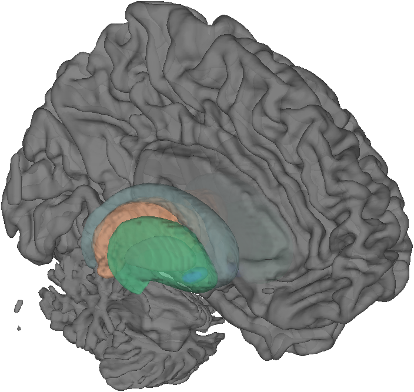

# `addbrain` — build canonical anatomical surfaces with reusable graphics handles

[Object methods index](../Object_methods.md) ·
[Atlases / regions / patterns](../atlases_regions_and_patterns.md)

`addbrain` is the workhorse anatomical-rendering helper for CANlab plots.
A single keyword — for example `'hires left'`, `'thalamus'`, `'BG'`, or
`'midbrain_group'` — adds a transparent 3-D surface to the current axes
and returns the patch handle(s) so you can adjust face/edge color,
transparency, or lighting interactively, or pass the handles on to
[`render_on_surface`](../image_vector_methods.md) to colormap a stat
image onto them.

It works by reading pre-built `*.mat` surface files distributed with
`CanlabCore` and `Neuroimaging_Pattern_Masks`, calling MATLAB's `patch`
to render them, and stacking lighting / camlight defaults appropriate
for whole-brain figures. The same call pattern works for cortical
surfaces, subcortical nuclei (via `canlab_load_ROI`), brainstem and
cerebellum surfaces, slabs / cutaways, and curated multi-region groups.

## Quick example

A combined sub-cortical / midbrain figure on a left-hemisphere cortical
surface:

```matlab
create_figure('ab'); set(gcf, 'Position', [100 100 900 700]);
p = addbrain('hires left'); set(p, 'FaceAlpha', .8);
addbrain('thalamus');
addbrain('bg');
view(135, 10); lightRestoreSingle;
```



## Usage

```matlab
p = addbrain                    % default: transparent_surface (legacy)
p = addbrain(method)            % method string (see below)
p = addbrain(method, suppress_lighting)
p = addbrain('colorchange', rgb, p)   % recolor an existing patch
p = addbrain('eraseblobs', p)         % reset patch colors to gray
```

`method` is a keyword string from one of the families below. The return
value `p` is a handle (or array of handles) you can set/get properties
on (`FaceAlpha`, `FaceColor`, `EdgeColor`, `FaceVertexCData`, ...).

## How it works

1. **Surface lookup.** `addbrain` resolves the keyword by `switch`
   dispatch on `method`. Subcortical / brainstem keywords delegate to
   [`canlab_load_ROI`](https://github.com/canlab/CanlabCore) which
   resolves the region to a binary mask + colour and renders it as a
   patch via `imageCluster`. Cortical and slab keywords load a saved
   `*.mat` file containing pre-computed `vertices` and `faces` and call
   MATLAB's `patch`.

2. **Patch handle.** Every call returns a Patch object handle. Composite
   keywords (`'limbic'`, `'BG'`, `'midbrain_group'`, `'subcortex'`,
   `'foursurfaces'`, `'inflated surfaces'`, `'multi_surface'`, …)
   internally call `addbrain` repeatedly and concatenate the handles into
   a vector.

3. **Lighting.** Unless you pass a second argument to suppress it, the
   final call applies a light + `axis vis3d` so transparency and
   highlights look right. Re-call `lightRestoreSingle` after `view(...)`
   if you rotate the camera.

4. **Recolouring blobs.** `addbrain('colorchange', rgb, p)` walks the
   given patch handles and replaces non-blob (background gray) faces
   with the supplied RGB. `addbrain('eraseblobs', p)` resets the same
   set of patches back to their default grey colour, which is useful
   when you want to re-render a different stat image on top of the same
   anatomical scaffold.

5. **Rendering maps in colormapped colors.** `addbrain` only draws the
   anatomy. To overlay a continuous-valued stat map use the
   [`render_on_surface`](../image_vector_methods.md) method on the
   appropriate `image_vector` / `statistic_image` / `fmri_data` /
   `region` / `atlas` object, passing the patch handles returned by
   `addbrain` as the surface(s) to render onto. It uses MATLAB's
   `isocolors` for fast colormapping and works correctly on the
   high-resolution surfaces below — see `'surface left'`/`'surface
   right'` and the `'hcp inflated …'` family.

## Cortical surface keywords

| Keyword | Description |
|---|---|
| `'hires left'` / `'hires right'` | Hi-resolution medial cortex with cerebellum (Caret-segmented MNI single-subject template). Files: `surf_spm2_brain_left.mat`, `surf_spm2_brain_right.mat`. |
| `'surface left'` / `'surface right'` | HCP MSM-aligned partially inflated pial surfaces (Glasser et al. 2016). |
| `'hcp inflated left'` / `'hcp inflated right'` | HCP MSM-aligned heavily inflated mid-thickness surfaces. |
| `'fsavg_left'` / `'inflated left'` (and `'_right'`) | FreeSurfer fsaverage inflated surfaces with the Yeo-group RF-ANTs MNI↔fsaverage mapping. |
| `'flat left'` / `'flat right'` | Flat maps in 32k fsaverage space (Glasser HCP). |
| `'hires surface left'` / `'bigbrain left'` (and `'_right'`) | Surfaces from the BigBrain single-subject atlas. |
| `'transparent_surface'` *(legacy)* | 2 mm SPM2 brain surface. |
| `'hires'` *(legacy)* | High-resolution Colin27 cortex. |
| `'left'` / `'right'` *(legacy)* | 2 mm hemisphere without cerebellum. |
| `'brainbottom'` | Bottom of brain and head. |

## Cutaway / slab keywords

| Keyword | Description |
|---|---|
| `'cutaway'` | Canonical cortical cutaway via `canlab_canonical_brain_surface_cutaways`. |
| `'left_cutaway'` / `'right_cutaway'` | Keuken et al. 2014 7T MNI cutaway. |
| `'right_cutaway_x8'` | Like `right_cutaway` but offset to x = 8 mm. |
| `'left_insula_slab'` / `'right_insula_slab'` | Insula-centred slab. |
| `'accumbens_slab'` | Slab through the nucleus accumbens. |
| `'coronal_slabs'` / `'coronal_slabs_4'` / `'coronal_slabs_5'` | Pre-cut coronal slabs at standard locations. |

## Subcortical / brainstem region keywords

These resolve through [`canlab_load_ROI`](../atlases_regions_and_patterns.md).
See that page for the canonical reference. Common keywords:

```
amygdala, amygdala hires, hippocampus, hipp, hippocampus hires,
thalamus, thal, LGN, MGN, VPthal, VPL, VPLthal, intralaminar_thal,
md (mediodorsal), cm (centromedian), habenula, mammillary, hypothalamus,
brainstem, suit brainstem, midbrain, pag, sn (substantia nigra),
SNc, SNr, VTA, rn (red nucleus), PBP, drn, mrn, lc (locus coeruleus),
pbn, rvm, nts, sc, ic, stn (subthalamic nucleus), olive, nrm,
caudate, put (putamen), GP, GPe, GPi, nacc (nucleus accumbens),
BST, vmpfc, VeP, ncs_B6_B8, nrp_B5, ncf, vep,
medullary_raphe, spinal_trigeminal, nuc_ambiguus, dmnx_nts
```

## Macro subcortical surfaces

| Keyword | Description |
|---|---|
| `'pauli_subcortical'` | High-res combined surface from the Pauli CIT168 reinforcement-learning atlas. |
| `'CIT168'` | Lower-res version of the same. |
| `'cerebellum'` / `'cblm'` | `surf_spm2_cblm` SPM2 cerebellar surface. |
| `'brainstem'` | `surf_spm2_brainstem` SPM2 brainstem surface. |
| `'suit brainstem'` | Diedrichsen SUIT brainstem + cerebellum (`suit_surface_brainstem_cerebellum.mat`). |

## Composite keywords (build many surfaces at once)

| Keyword | Description |
|---|---|
| `'BG'` / `'basal ganglia'` | Caudate, putamen, pallidum, accumbens. |
| `'limbic'` / `'limbic hires'` | Limbic subcortical nuclei + left cortical surface. |
| `'subcortex'` | SUIT brainstem/cerebellum + thalamus + BG + amygdala + hippocampus. |
| `'midbrain_group'` | Midbrain structures (PAG, SN, VTA, RN, …). |
| `'brainstem_group'` | Midbrain + pons + medulla. |
| `'thalamus_group'` | Thalamic-nuclei composite. |
| `'foursurfaces'` | Lateral + medial cortical views with brainstem. |
| `'foursurfaces_hcp'` | Same with HCP pial surfaces. |
| `'inflated surfaces'` | Left + right inflated cortex (fsavg). |
| `'flat surfaces'` | Left + right flat cortex. |
| `'insula surfaces'` | Insula slabs + inflated surfaces, zoomed. |
| `'multi_surface'` | Composite multi-region figure for paper-style multi-panel renders. |

## Special commands

| Form | Description |
|---|---|
| `addbrain('colorchange', rgb, p)` | Replace the gray "background" colour of patches in `p` with a new RGB. Useful for tinting an entire surface. |
| `addbrain('eraseblobs', p)` | Reset all faces of patches in `p` to gray. Useful when re-rendering a different stat image onto the same anatomical scaffold. |
| Second argument truthy | Suppress the default `axis vis3d` + `camlight` invocation. Use this when you have a multi-surface plot whose autocorrected sizes are getting clipped. |
| `'disableVis3d'` keyword | Same effect — disables `axis vis3d`. |

## Inputs

| Argument | Type | Description |
|---|---|---|
| `method` | string | One keyword from the families above. Defaults to `'transparent_surface'`. |
| 2nd arg (optional) | any | If supplied, suppresses default lighting/`axis vis3d` calls. Pass `'disableVis3d'` for the same behaviour. |
| 2nd arg (special commands) | RGB / handle vector | For `'colorchange'` / `'eraseblobs'`, see Special commands above. |

## Outputs

| Output | Type | Description |
|---|---|---|
| `p` | patch handle (or array) | Handle to the rendered patch objects. Use to set `FaceAlpha`, `FaceColor`, etc., or pass to `render_on_surface(...)`. Composite keywords return a vector of handles. |

## Notes

- Spaces vary across keywords. Most subcortical regions are in MNI152
  template space; the inflated `fsavg` surfaces use a Yeo-group MNI ↔
  fsaverage mapping. For accurate colormap rendering of a stat image,
  ensure the image's space matches the surface (or use
  [`render_on_surface`](../image_vector_methods.md) which handles
  space matching).
- Composite keywords build multiple `patch` objects in one call. Set
  `FaceAlpha` after the fact on the returned handle vector to make all
  components transparent uniformly.
- After `view(az, el)` rotate the camera, call `lightRestoreSingle` (or
  `lightFollowView`) to keep the lighting consistent.

## Examples

```matlab
% Midbrain group + left cortex backdrop
figure; addbrain('midbrain_group');
addbrain('lc'); addbrain('rvm');
addbrain('VPL'); addbrain('thalamus');
addbrain('bg');
addbrain('hires left');
view(135, 10); lightRestoreSingle;

% Render a stat map onto an addbrain surface using render_on_surface
imgs = load_image_set('emotionreg');
t = ttest(imgs); t = threshold(t, .005, 'unc', 'k', 10);
create_figure('rs'); p = addbrain('hires left');
set(p, 'FaceAlpha', 1);
render_on_surface(t, p, 'colormap', 'hot');
```

## See also

- [`region.surface`](region_surface.md) — render a `region` object on canonical surfaces
- [`region.isosurface`](region_isosurface.md) — 3-D blob isosurface in the same axes
- [`fmri_data.surface`](fmri_data_surface.md) — direct surface rendering from a stat map
- [`canlab_results_fmridisplay`](canlab_results_fmridisplay.md) — pre-built montage / surface scaffolds
- [`cluster_surf`](cluster_surf.md) — older surface-rendering primitive (`addbrain` + `render_on_surface` is the modern replacement)
- `canlab_load_ROI` — region keyword resolution used by subcortical/brainstem `addbrain` calls
- `render_on_surface` — apply a colormap to a stat image on top of any patch handle from `addbrain`
