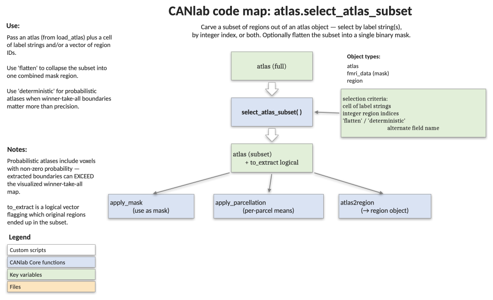

# `atlas.select_atlas_subset` — pull a subset of regions out of an atlas

[back to `atlas` methods](../atlas_methods.md) ·
[Object methods index](../Object_methods.md) ·
[Atlases / regions / patterns](../atlases_regions_and_patterns.md)

Returns a smaller `atlas` object containing only the regions you ask for —
selected by label keyword, by integer index, or both. Optionally collapses
the selected regions into a single 1/0 mask. The standard way to grab a
specific ROI (e.g. amygdala, VPL thalamus, default-mode network) from a
larger parcellation, or to build a custom mask from a combination of
parcels.

## Code map



[Editable PowerPoint version](../code_maps_pptx/atlas_select_atlas_subset_codemap.pptx)

## Usage

```matlab
[obj_subset, to_extract] = select_atlas_subset(obj, [optional inputs])
```

The selectors are positional (cell array of strings, numeric vector, or
both) and may be combined freely with the named flags.

## Inputs

| Argument | Type | Description |
|---|---|---|
| `obj` | `atlas` | The source atlas object. |
| cell of strings | e.g. `{'VPL' 'VPM'}` | Substrings to match against `obj.labels` (or another label field — see `'labels_2'` below). Default is partial match. |
| numeric vector | e.g. `[1 3 5]` | Integer region indices to include. Combined (union) with any string matches. |
| `'flatten'` | flag | Collapse selected regions into a single 1/0 mask. `.probability_maps` is recomputed as the posterior probability of the union under a conditional-independence assumption (or as the max over regions if probabilities don't sum to 1). |
| `'conditionally_ind'` | flag | When `'flatten'` is on, force the conditional-independence assumption even if probabilities don't sum to 1. |
| field name | e.g. `'labels_2'`, `'label_descriptions'` | Search this field instead of `.labels`. Any field name on `obj` is accepted. |
| `'exact'` | flag | Require exact string equality, not substring match. Avoids accidentally grabbing `Cblm_Vermis_VII` when you wanted `Cblm_Vermis_VI`. |
| `'regexp'` | flag | Treat the search strings as regular expressions. |
| `'deterministic'` or `'mostprob'` | flag | When the source atlas has `.probability_maps`, return only voxels where p(region) > p(any other region). Default behaviour returns all voxels with p(region) > 0, which can extend past the visible (winner-take-all) boundary. |

## Outputs

| Output | Type | Description |
|---|---|---|
| `obj_subset` | `atlas` | A new atlas containing only the selected regions, with `.labels`, `.label_descriptions`, `.labels_2..5`, `.image_names`, `.fullpath`, `.probability_maps`, and `.dat` reindexed to match. |
| `to_extract` | `1 × n_regions` logical | Which regions in the original `obj` were selected. |

## Notes

- For probabilistic atlases, the default extracts every voxel with non-zero
  probability of belonging to the region. The boundary of `obj_subset` will
  therefore exceed the visible boundary in a winner-takes-all montage of
  the source atlas. Use `'deterministic'` for a more intuitive (but less
  faithful) extraction; consider also thresholding the probability map.
- `'flatten'` is the canonical recipe for building a custom mask from a
  combination of parcels (e.g. all intralaminar thalamic nuclei).
- When `'flatten'` is requested, the resulting object has a single label
  built from the concatenated input strings/integers and a single
  `label_descriptions` entry of the form `'Combined subset: ...'`.
- If `obj.probability_maps` has the wrong size for the atlas, it is
  silently dropped from the subset (with a warning).

## Example: pull the sensory thalamus out of the Morel atlas

```matlab
% Load the Morel thalamus atlas
atlasfile = which('Morel_thalamus_atlas_object.mat');
load(atlasfile)  % loads `atlas_obj`

% Sensory ventral posterior thalamus (lateral + medial + inferior)
[obj_subset, to_extract] = select_atlas_subset(atlas_obj, {'VPL' 'VPM' 'VPI'});

% Visualise the extracted regions
montage(obj_subset);

% Build a single binary mask from the intralaminar nuclei
mask = select_atlas_subset(atlas_obj, {'CL' 'CeM' 'CM' 'Pf'}, 'flatten');
r = atlas2region(mask);
orthviews(r)
```

## Other examples

```matlab
% Select by integer index, by name, or both
obj_subset = select_atlas_subset(atlas_obj, [1 3]);
obj_subset = select_atlas_subset(atlas_obj, [1 3], {'VPL'});

% Search a different label field (network-level labels in canlab2018_2mm)
atlas_obj = load_atlas('canlab2018_2mm');
obj_subset = select_atlas_subset(atlas_obj, {'Cerebellum', 'Def'}, 'labels_2');

% Exact match: avoid grabbing 'Cblm_Vermis_VII' when you want 'Cblm_Vermis_VI'
obj_subset = select_atlas_subset(atlas_obj, {'Cblm_Vermis_VI'}, 'exact');

% Regexp: all bilateral amygdala subregions
obj_subset = select_atlas_subset(atlas_obj, {'^Amy_.*'}, 'regexp');

% Winner-take-all extraction for a probabilistic atlas
obj_subset = select_atlas_subset(atlas_obj, {'Hb'}, 'deterministic');
```

## See also

- [`atlas` methods](../atlas_methods.md) — full method index for the `atlas` class
- [`image_vector.select_voxels_by_value`](../image_vector_methods.md) — voxel-value-based selection on any image-like object
- [Atlases, regions, and patterns](../atlases_regions_and_patterns.md) — catalogue of CANlab atlases and how to load them
- [`fmri_data.ttest_table_and_lateralization_test`](fmri_data_ttest_table_and_lateralization_test.md) — example downstream consumer (Yeo 17-network parcellation)
