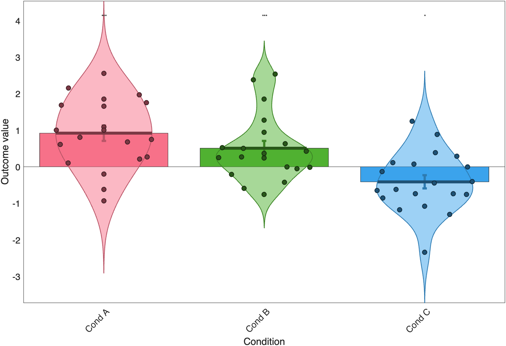

# `barplot_columns` — bar plot of column means with errors and tests

[Object methods index](../Object_methods.md)

`barplot_columns` is the workhorse helper for publication-style bar / dot
/ violin figures of small condition or ROI summaries in CANlab. Hand it
a numeric matrix (subjects × conditions), a cell vector of unequal-length
columns, or a MATLAB `table`, and it draws one bar per column with
standard-error whiskers, optional overlaid points / lines / violins, and
significance stars derived from one-sample t-tests against zero.

The same call doubles as a small statistics engine. It supports robust
(IRLS) means, within-subject error bars derived from a contrast matrix,
95% CIs, regression-corrected means after partialling out covariates,
and pairwise t-tests across all column combinations. The numeric
summaries (mean, t, p, FDR-q, Cohen's d) come back in a `statstable`
return so the function is useful even when `'skipallplots'` is set and
no figure is drawn.

Internally each column is fit by `partialcor` against an intercept-only
(or covariate-augmented) design, with optional bisquare reweighting.
Standard errors come from the SE of the intercept term; covariate
adjustment is therefore reflected in the means but, by design, NOT in
the error bars. Violins use `violinplot`; individual points are jittered
with optional outlier circling. Sig. stars use `*=p<.05`, `**=p<.01`,
`***=q<.05 FDR` across the columns plotted in this call.

## Quick example

```matlab
rng(7);
Y = [randn(20,1)+1, randn(20,1)+0.3, randn(20,1)-0.5];
colors = seaborn_colors(3);     % 3 maximally-distinct hues from the palette
barplot_columns(Y, 'nofig', 'names', {'Cond A', 'Cond B', 'Cond C'}, ...
                'colors', colors);
```



## Usage

```matlab
[handles, dat, xdat, statstable, order_idx, pairwise_results] = ...
    barplot_columns(dat, [other optional arguments])
```

`dat` can be a numeric matrix (rows = subjects, columns = bars), a cell
vector with one entry per bar (lengths may differ; padded with NaN), or
a MATLAB `table` (variable names become bar labels).

## How it works

1. **Input coercion.** Tables are converted via `table2array` (variable
   names are kept as bar labels). Cell-vector inputs are concatenated
   into a NaN-padded matrix by `enforce_padded_matrix_form`. After this
   step the function works on a single `[n_subjects × n_columns]` matrix
   internally.

2. **Optional reordering.** If `'order'` is `'ascend'` or `'descend'`,
   columns are sorted by their mean, and the permutation is returned in
   `order_idx` so colors/names stay aligned.

3. **Per-column fitting.** Each column is regressed on the design matrix
   `X = [covs ones(n,1)]`. The intercept term yields the mean and its
   standard error; covariates (if any) are partialled out by
   `partialcor`. With `'dorob'`, IRLS robust regression is used;
   `stats.w` returns the per-row weights. With `'within'`, the SE is
   replaced by the within-subject SE from a one-way repeated-measures
   ANOVA scheme; with `'95CI'`, SE is multiplied by `tinv(.975, n-1)`.

4. **Covariate handling.** `'covs'` mean-centers and appends regressors
   to `X`. `'wh_reg'` chooses one of those regressors to leave in (so
   the plotted points slope along it); pass `'wh_reg', 0` to remove all
   covariates and plot the fully-adjusted means. The error bars are not
   adjusted for covariates.

5. **Plotting.** The function draws bars (`bar`) or lines (`'line'`),
   then overlays a violin (`violinplot`) and/or individual points
   (jittered scatter), connecting subjects across bars with `'dolines'`.
   Outliers (|z| ≥ 1.96) can be circled (`'plotout'`) or dropped from
   the stats (`'removeout'`). Stars are drawn above each bar from the
   single-sample t-test against zero.

6. **Pairwise tests.** With `'pairwisetest'`, all column pairs are
   compared by paired t-test (when N matches across columns) or
   independent t-test, with Cohen's d, and the result returned as
   `pairwise_results`. Significant comparisons are drawn as bracket
   connectors with stars above the bars.

## Inputs

| Argument | Type | Description |
|---|---|---|
| `dat` | matrix / cell / table | Required. Rows = subjects, columns = bars. Cell input lets columns have different N. Table variable names become bar labels. |

## Optional inputs

### Figure control

| Argument | Type | Description |
|---|---|---|
| `'nofig'` / `'nofigure'` | flag | Don't open a new figure (use the current axes). |
| `'skipallplots'` | flag | Compute stats only — return the table, draw nothing. |

### Plot type

| Argument | Type | Description |
|---|---|---|
| `'line'` | flag | Line plot instead of bars. |
| `'violin'` | flag | Add a violin (kernel density) per bar with data points (sets `noind`). |
| `'noviolin'` / `'noviolins'` | flag | Suppress the default violin. |
| `'nobars'` | flag | Suppress bars (e.g. when only violins are wanted). |
| `'width'` | scalar | Bar width (default 0.8). |
| `'x'` | numeric vector | x-coordinates for the bars (use to place groups side-by-side). |
| `'noxlim'` | flag | Don't reset `XLim` (good when overlaying on an existing axes). |

### Points, lines and outliers

| Argument | Type | Description |
|---|---|---|
| `'noind'` | flag | Don't plot individual data points. |
| `'dolines'` | flag | Connect subjects with lines across bars (within-subject view). |
| `'plotout'` | flag | Circle outliers (`|z|≥1.96`) in red. |
| `'removeout'` | flag | Drop outliers from stats. Mutually exclusive with `'plotout'`. |
| `'number'` | flag | Plot case numbers instead of point markers. |
| `'MarkerSize'` | scalar | Marker size for points (default 6). |
| `'MarkerAlpha'` / `'MarkerFaceAlpha'` | scalar | Marker transparency (0–1). |

### Statistics

| Argument | Type | Description |
|---|---|---|
| `'dorob'` | flag | Robust IRLS for means and covariate fits. |
| `'within'` | flag | Within-subject SE (one-way repeated-measures ANOVA scheme). |
| `'95within'` | flag | As `within` but scaled to a 95% CI. |
| `'95CI'` | flag | Replace SE with 95% CI (`SE * tinv(.975, n-1)`). |
| `'custom_se'` | vector | User-supplied error bars (one per bar). |
| `'custom_p'` | cell | User-supplied p-values for stars. |
| `'pairwisetest'` | flag | All-pairs t-tests with Cohen's d, drawn as significance brackets and returned as `pairwise_results`. |
| `'stars'` / `'dostars'` | flag | Draw stars above bars (default). |
| `'nostars'` | flag | Don't draw significance stars. |
| `'notable'` | flag | Suppress the printed-table chatter. |

### Covariates

| Argument | Type | Description |
|---|---|---|
| `'covs'` | matrix | Continuous covariates (`n × k`, mean-centered internally). |
| `'wh_reg'` | integer | Which covariate to leave in and sort points by; pass `0` to remove all covariates. |

### Labels and styling

| Argument | Type | Description |
|---|---|---|
| `'names'` | cell of strings | One bar label per column. |
| `'title'` | string | Figure title (or `[]` for none). |
| `'color'` / `'colors'` | RGB or cell | Single color for all bars (`'r'`, `[1 0 0]`) or one entry per bar. |
| `'order'` | `'ascend'` / `'descend'` | Sort columns by mean before plotting. |

## Outputs

| Output | Type | Description |
|---|---|---|
| `handles` | struct | Graphics handles for the bars, violins, points, lines, etc. |
| `dat` | matrix | Possibly reordered / cleaned data matrix actually plotted. |
| `xdat` | numeric | x-coordinate per row plotted (jitter included). |
| `statstable` | table | One row per column with `Mean_Value`, `Std_Error`, `T`, `P`, `Cohens_d`, `n`. |
| `order_idx` | vector | Permutation used by `'order'` (empty if no reordering). |
| `pairwise_results` | table | When `'pairwisetest'` is set: comparison label, t, p, Cohen's d, paired/unpaired flag. |

## Notes

- Standard errors are NOT adjusted when covariates are partialled out;
  only the means are. If you need fully-adjusted CIs, fit your own
  model and pass them via `'custom_se'`.
- When `'covs'` is supplied, an automatically-detected user intercept
  is dropped before the function adds its own. Don't pre-center or
  append your own intercept column.
- FDR-significance stars (`***`) are computed across the columns in
  the call, not across the entire experiment. Plot related conditions
  together for honest correction.
- Cell input is the easiest way to handle unequal-N groups (e.g.
  patients vs. controls); the matrix is internally NaN-padded to
  matrix shape.
- All-NaN columns are silently replaced with zeros so the figure can
  still be drawn — the table will show NaN means for those bars.

## Examples

```matlab
% Group-level NPS by study, with one color per study, using a covariate
barplot_columns(nps_by_study, 'title', 'NPS by study', ...
    'colors', mycolors, 'nofig');

% Within-subject errors, given a contrast matrix c
barplot_columns(dat, 'title', 'Means', 'nofig', 'within', c);

% Two groups side-by-side with custom widths and x positions
exp_dat     = EXPT.error_rates(EXPT.group ==  1, :);
control_dat = EXPT.error_rates(EXPT.group == -1, :);
barplot_columns(exp_dat,     'title', 'Error rates', 'nofig', ...
    'noind', 'color', 'r', 'width', .4);
barplot_columns(control_dat, 'title', 'Error rates', 'nofig', ...
    'noind', 'color', 'b', 'width', .4, 'x', (1:9) + .5);
set(gca, 'XLim', [0 10], 'XTick', 1:9);

% Remove a "group" covariate before plotting
barplot_columns(mydata, figtitle, 'colors', DAT.colors, 'dolines', ...
    'nofig', 'names', DAT.conditions, 'covs', group, 'wh_reg', 0);

% All-pairs comparisons drawn as brackets above the bars
[~, ~, ~, stats, ~, pairwise] = ...
    barplot_columns(Y, 'pairwisetest', 'names', conds);
```

## See also

- [`plot_correlation_matrix`](plot_correlation_matrix.md) — heatmap of pairwise correlations
- [`image_scatterplot`](image_scatterplot.md) — bivariate voxel-value scatter
- `lineplot_columns` — line variant for repeated-measures designs
- `barplot_colored` — continuous-color bar variant
- `line_plot_multisubject` — per-subject lines with group means
- `violinplot` — vendored kernel-density violin used internally
- `boundedline` — shaded-error line plot for time-series data (vendored under `External/`)
