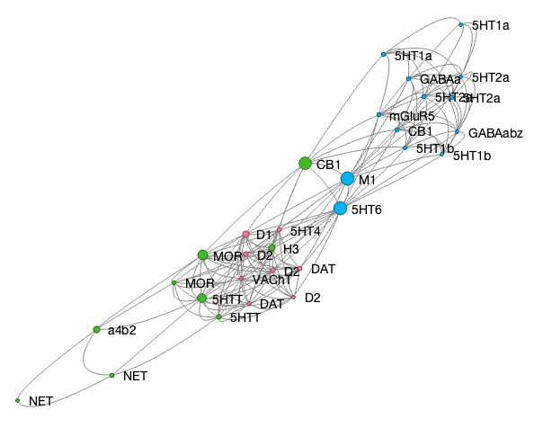

# `canlab_force_directed_graph` — force-directed network plot of variable inter-correlations

[Object methods index](../Object_methods.md) ·
[Atlases / regions / patterns](../atlases_regions_and_patterns.md)

`canlab_force_directed_graph` lays out a set of variables (signatures,
ROIs, neurotransmitter maps, parcels, behavioral measures, …) as a network
graph, where node positions are pulled by their pairwise associations.
Pass it either an observations × variables data matrix (and it will
inter-correlate columns and threshold the resulting matrix) or a
pre-computed signed connection matrix (correlation / t-stat / partial-r
between every pair). Nodes can be coloured by partition, sized by
graph-theoretic measures (betweenness centrality or degree), labelled
with names from the data or pulled from a `region` / `cluster` structure,
and optionally rendered alongside a 3-D brain view of the same regions.

The function relies on the `matlab_bgl` graph theory toolbox (vendored
under `CanlabCore/External/`) for the force-directed layout and for
betweenness / degree calculations.

## Quick example

The Hansen 2022 neurotransmitter maps are a natural test case: the maps
are highly inter-correlated within transmitter family (serotonin,
dopamine, GABA) and weakly correlated across families, so a
force-directed graph cleanly separates them into family-level clusters.

```matlab
% Load the prepped Hansen maps
obj = load_image_set('hansen22');

% Inter-correlation matrix among the tracer maps
OUT = plot_correlation_matrix(obj.dat, 'doimage', true, 'docircles', false);

% Threshold to binarize (keeps strong positive associations only)
r = OUT.r;
r(r < 0.4) = 0;

% Cluster the maps based on similarity, colour by cluster
obj = remove_empty(obj);
clust = clusterdata_permtest(obj.dat', 'k', 2:7, ...
                             'reducedims', true, 'ndims', 25);
c = clust.best_cluster_labels;

% Render the network with receptor / transmitter names
names = obj.metadata_table.target;
[gstats, handles] = canlab_force_directed_graph(r, ...
    'names', names, 'partitions', c, ...
    'partitioncolors', seaborn_colors(max(c)));
```



Receptor / transporter labels (5HT subtypes, GABA, dopamine D1/D2, etc.)
sit near the family they correlate most strongly with; node size encodes
betweenness centrality (default), and node colour reflects the
permutation-tested cluster solution from `clusterdata_permtest`.

## Usage

```matlab
canlab_force_directed_graph(activationdata)
canlab_force_directed_graph(connection_matrix)
[stats, handles] = canlab_force_directed_graph(X, name, value, ...)
```

If the first argument is rectangular, it is treated as observations ×
variables and the function inter-correlates columns and thresholds the
resulting matrix (default: Bonferroni). If the first argument is square,
it is taken as a signed (already-thresholded) connection matrix —
expected to be the average of subject-level correlations or thresholded
group-level t-values.

## Inputs

| Argument | Type | Description |
|---|---|---|
| `activationdata` *or* `connection_matrix` | numeric matrix | Either obs × variables (will be inter-correlated and thresholded) or a square signed connection matrix to use directly. |

## Optional inputs

### Connection / threshold

| Argument | Type | Description |
|---|---|---|
| `'connectmetric', s` | `'corr'` (default) or `'partial_corr'` | Pairwise association metric when an obs-by-variable matrix is supplied. |
| `'threshtype', s` | `'bonf'` (default) or `'fdr'` | Multiple-comparison correction across all pairs. |

### Sizing

| Argument | Type | Description |
|---|---|---|
| `'degree'` | flag | Use node degree rather than betweenness centrality for sizing. |
| `'sizescale', s` | `'sigmoidal'` (default), `'linear'`, or `'custom'` | Mapping from the size statistic to point size. |
| `'sizes', v` | numeric vector | One size per node; only used with `'sizescale', 'custom'`. |

### Partitioning / colour

| Argument | Type | Description |
|---|---|---|
| `'partitions'` / `'rset'` | cell of vectors *or* integer vector | Group membership per node — either a `{1×g}` cell of node indices per group, or a vector of integer cluster labels (e.g., directly from `clusterdata` or `clusterdata_permtest`). |
| `'partitioncolors'` / `'setcolors'` | cell of RGB | One colour per group. Pair with `'partitions'`. |

### Labels

| Argument | Type | Description |
|---|---|---|
| `'names', c` | cell of strings | One label per node. |
| `'namesfield', s` | string | If you pass `'cl'`, pull labels from this field of the `region` / cluster structure (e.g., `'shorttitle'`). |

### Brain rendering

| Argument | Type | Description |
|---|---|---|
| `'cl', regions` | `region` or cluster structure | Render the same nodes as 3-D blobs on a brain montage alongside the graph. |

### Line styling

| Argument | Type | Description |
|---|---|---|
| `'linewidth', w` | scalar | Line width for edges. |
| `'linestyle', s` | `'curved'` (default) or anything else for straight | Edge geometry. |

## Outputs

| Output | Type | Description |
|---|---|---|
| `stats` | struct | Graph-theoretic descriptive stats: betweenness centrality, degree per node, etc. |
| `handles` | struct | Plot handles (lines, markers, text, optional 3-D brain blobs). |

## Notes

- `'partitions'` accepts both forms — a cell of node-index vectors *or* a
  flat vector of integer labels — so you can drop the output of
  `clusterdata`, `clusterdata_permtest`, or k-means in directly.
- The default sigmoid size scale visually saturates very high
  betweenness/degree values, which usually reads better than linear when
  one or two nodes are extreme outliers. Switch with `'sizescale',
  'linear'` if you want raw scaling, or `'custom'` + `'sizes', v` for
  full manual control.
- Edge thresholding (Bonferroni or FDR) is applied across all pairs of
  variables in the input matrix. Pass a pre-thresholded square connection
  matrix to bypass the internal threshold and use your own criterion.
- The graph layout uses the matlab_bgl toolbox (vendored under
  `CanlabCore/External/`); no separate install is needed if your CANlab
  path is set up via `canlab_toolbox_setup`.

## Other examples

```matlab
% Plain / vanilla — no labels, default settings
[stats, handles] = canlab_force_directed_graph(r);

% Pull labels from a region structure's 'shorttitle' field, with brain blobs
[stats, handles] = canlab_force_directed_graph(r, 'cl', cl, ...
    'namesfield', 'shorttitle', 'degree');

% Pre-grouped sets with custom colors
[stats, handles] = canlab_force_directed_graph(r, 'cl', cl, ...
    'namesfield', 'shorttitle', 'degree', ...
    'rset', rset, 'setcolors', setcolors);

% Custom node sizes (e.g. emphasize a small set of "hub" nodes)
[stats, handles] = canlab_force_directed_graph(G, ...
    'sizescale', 'custom', 'sizes', [6 * ones(17, 1); 12 * ones(7, 1)]);
```

## See also

- [`plot_correlation_matrix`](plot_correlation_matrix.md) — heatmap /
  circle-plot of the same correlation matrix
- [`clusterdata_permtest`](clusterdata_permtest.md) — pick the number of
  clusters and label nodes for use with `'partitions'`
- `canlab_sort_distance_matrix` — re-order a distance / correlation
  matrix by hierarchical clustering before plotting
- [`fmri_data.hansen_neurotransmitter_maps`](fmri_data_hansen_neurotransmitter_maps.md) — polar version of the same Hansen-map comparison
- `matlab_bgl` (vendored under `CanlabCore/External/`) — graph-theory
  primitives used internally
