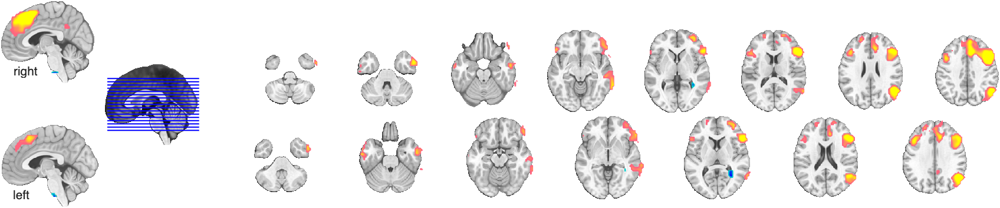

# `canlab_results_fmridisplay` — pre-built montage / surface scaffolds

[Object methods index](../Object_methods.md) ·
[Atlases / regions / patterns](../atlases_regions_and_patterns.md)

`canlab_results_fmridisplay` is the canonical entry point for results
figures across CANlab examples and walkthroughs. It builds a
registered [`fmridisplay`](../fmridisplay_methods.md) object with a
chosen anatomical underlay and a curated set of slices and/or cortical
surfaces, then optionally lays an input map on top via `addblobs`.
Returns the `fmridisplay` handle so the figure persists — you can
swap blob layers in and out with `removeblobs(o2)` / `addblobs(o2, ...)`
without redrawing the anatomical scaffold each time.

The function takes a single keyword (`'full'`, `'compact'`, `'multirow'`,
`'full hcp inflated'`, etc.) that selects a pre-engineered layout of
axes positions, slice ranges, and surface types. That keyword
mechanism is the single biggest reason most users reach for it: a
publication-ready multi-panel figure is one line.

Inputs are flexible — pass an `fmri_data`, `statistic_image`, `region`,
or NIfTI/Analyze filename and the function will convert it to a
`region` object and overlay the blobs. Pass `[]` (or no argument) to
get just the anatomy, ready for you to call `addblobs` later. Pass an
existing `fmridisplay` object and it will be reused (combined with
`'addmontages'` to extend a previous layout).

## Quick example

```matlab
imgs = load_image_set('emotionreg');
t = ttest(imgs);
t = threshold(t, .005, 'unc', 'k', 10);
o2 = canlab_results_fmridisplay(t);
```



## Usage

```matlab
o2 = canlab_results_fmridisplay(input_activation, [optional inputs])

% Layouts:
o2 = canlab_results_fmridisplay(t);                       % default 'compact'
o2 = canlab_results_fmridisplay(t, 'full');
o2 = canlab_results_fmridisplay([], 'multirow', 2);       % anatomy only
o2 = canlab_results_fmridisplay(t, 'full hcp inflated');
o2 = canlab_results_fmridisplay(t, 'regioncenters');      % per-region row
o2 = canlab_results_fmridisplay([], 'overlay', myunderlay);

% Reuse: swap blobs without redrawing anatomy
removeblobs(o2);
o2 = addblobs(o2, region(t2), 'color', [0 0 1]);
```

## How it works

1. **Input dispatch.** A character input that matches a layout keyword
   (`'compact'`, `'full'`, …) is treated as "set up the anatomy only,
   no blobs". A filename, `region`, `image_vector`, `fmri_data`, or
   `statistic_image` is converted to a `region` object internally
   (via `region(fmri_data(input))` for filenames, `cluster2region` for
   legacy struct arrays, or `region(image_vector)` directly).

2. **Anatomy underlay.** Unless an existing `fmridisplay` object is
   passed in, a new one is created from the chosen `'overlay'` image
   (default: brain-extracted MNI152NLin2009cAsym 1 mm template via
   `canlab_get_underlay_image`). Legacy templates (Keuken 7T, SPM8
   Colin27) are also available via the `'overlay'` argument.

3. **Layout switch.** A long `switch montagetype` block places axes,
   selects slice ranges, and calls `montage(o2, ...)` (an `fmridisplay`
   method) repeatedly to render each panel. Surface layouts call
   `surface(o2, ...)` to add the cortical patches and link them into
   `o2.surface`. With `'blobcenters'` / `'regioncenters'`, the function
   creates one panel per blob centred on its `mm_center`.

4. **Blobs.** If `doblobs` is true (i.e. an actual map was passed),
   `addblobs(o2, cl, ...)` is called with the supplied `splitcolor`,
   `outlinecolor`, etc. With `'addmontages'` and an existing `o2`, new
   slices are appended rather than replacing the old layout.

5. **Return.** The registered `fmridisplay` object is returned. Its
   `.montage` and `.surface` cells hold the axes/patch handles; its
   `.activation_maps` cell holds blob layers (with their `cmaprange`,
   `legendhandle`, etc.). Subsequent `removeblobs(o2)` / `addblobs(o2)`
   calls update the figure in place.

## Layouts (`'montagetype'` keywords)

| Keyword | Description |
|---|---|
| `'compact'` *(default)* | Midline sagittal + two rows of axial slices. The default one-call results figure. |
| `'compact2'` | Single row: midline sagittal + axial slices. Smallest publication-ready layout. |
| `'compact3'` | One row of axial slices, midline sagittal, and 4 HCP surfaces. |
| `'full'` | Multi-row axial / coronal / sagittal slices and 4 cortical surfaces. The most comprehensive layout. |
| `'full2'` | Like `'full'` but with axes spaced to avoid colorbar overlap. |
| `'full no surfaces'` | `'full'` slice grid, no cortical surfaces. |
| `'full hcp'` | `'full'` layout but using HCP-based volumes and surfaces. |
| `'full hcp inflated'` | `'full'` with HCP inflated surfaces. |
| `'multirow'` | A vertical stack of `'compact2'` rows. Pass the number of rows after the keyword: `canlab_results_fmridisplay([], 'multirow', 3)`. Use to compare several maps side by side. |
| `'regioncenters'` / `'blobcenters'` | One axis per region, centred on its `mm_center`. Creates a new figure tagged `'fmridisplay_regioncenters'`. Not compatible with `'nofigure'`. |
| `'hcp inflated'` | Connectome-Workbench-style 4-surface inflated layout, no slices. |
| `'freesurfer inflated'` | Same idea on fsaverage 164k surfaces. |
| `'hcp grayordinates'` | 4 surfaces + 18 zoomed-in subcortical slices. |
| `'hcp grayordinates compact'` | 4 surfaces + 4 subcortical slices. |
| `'hcp grayordinates subcortex'` | Just the zoomed subcortical slices. |
| `'MNI152NLin2009cAsym {pial|midthickness|white}'` | Volumetric layout using MNI152NLin2009cAsym surfaces sampled at the chosen depth. Useful when your data is in that template space — naive vertex sampling will give correct results without `render_on_surface` projection. |
| `'MNI152NLin6Asym {pial|midthickness|white}'` | Same idea for MNI152NLin6Asym. |
| `'subcortex full'` / `'subcortex compact'` / `'subcortex 3d'` / `'subcortex slices'` | Subcortical-only layouts. |
| `'allslices'` | Whole-brain slice grid. |
| `'leftright inout'` / `'leftright inout subcortex'` | Specialty layouts for left/right contrasts. |
| `'coronal'` / `'saggital'` | Single-orientation grids. |

## Inputs

| Argument | Type | Description |
|---|---|---|
| `input_activation` | filename / `region` / `fmri_data` / `statistic_image` / `image_vector` / `[]` | The map to overlay. Pass `[]` to set up just the anatomical scaffold (use `addblobs` later). |

## Optional inputs

| Argument | Type | Description |
|---|---|---|
| `montagetype` keyword | string | One of the layout keywords above. Default `'compact'`. |
| `'noblobs'` | flag | Don't display blobs (only the underlay). |
| `'outline'` / `'nooutline'` | flag | Draw blob outlines (default off). |
| `'addmontages'` | flag | Add montages to an existing `fmridisplay` instead of replacing. |
| `'noremove'` | flag | Don't remove pre-existing blobs when adding new ones. |
| `'nofigure'` | flag | Don't open a new figure (use the current one). |
| `'outlinecolor'` | RGB | Outline color (default `[0 0 0]`). |
| `'splitcolor'` | 4-cell of RGB | Color stops for negative-min, negative-max, positive-min, positive-max. Default `{[0 0 1] [0 .8 .8] [1 .4 .5] [1 1 0]}`. |
| `'overlay'` | filename | Anatomical underlay image. Default brain-extracted MNI152NLin2009cAsym 1 mm. Legacy options include `'keuken_2014_enhanced_for_underlay.img'` and `'SPM8_colin27T1_seg.img'`. |
| `'coordinates'` | flag | Show slice coordinates as text annotations. |
| `'noverbose'` | flag | Suppress chatter for `publish` / scripted runs. |
| `'cmaprange'`, `'trans'`, `'color'`, `'nolegend'`, … | passed through | Any other args are forwarded to `addblobs` / `render_on_surface`. See `help fmridisplay`. |

## Outputs

| Output | Type | Description |
|---|---|---|
| `o2` | `fmridisplay` | Registered handle. `.montage{i}` holds slice axes; `.surface{i}` holds surface patches; `.activation_maps{i}` holds blob layers, each with its own `cmaprange`, `legendhandle`, color stops, etc. Pass back into `addblobs` / `removeblobs` / `render_on_surface` to update the figure in place. |

## Notes

- The default `'compact'` layout is the right choice for most quick
  results figures. Use `'full'` for publication, and `'multirow'` to
  compare several maps in one figure.
- Use `brighten(.4)` after the call to tone-up the underlay if the
  brain looks too dark.
- Do `clear o2` before re-creating the figure — the object retains a
  lot of memory, and stale handles can cause weird overlap.
- `'regioncenters'` creates its own tagged figure and ignores
  `'nofigure'`.
- The MNI152NLin2009cAsym/6Asym surface layouts use naive vertex
  interpolation, which only gives correct results when your data is
  already in the matching template space. For data in another space,
  use `render_on_surface` with an explicit `srcdepth` argument (see
  `help render_on_surface`).
- Colorbar legends are managed inside `render_on_surface`; their
  handles live in `o2.activation_maps{i}.legendhandle` and you can
  reposition them after the fact.

## Examples

```matlab
% Anatomy only, then add blobs in two colors
o2 = canlab_results_fmridisplay([], 'compact2', 'noverbose');
o2 = addblobs(o2, region(t_pos), 'color', [1 .4 0]);
o2 = addblobs(o2, region(t_neg), 'color', [0 .4 1]);

% Side-by-side comparison of two thresholded maps
o2 = canlab_results_fmridisplay([], 'multirow', 2);
o2 = addblobs(o2, region(t_001), 'wh_montages', 1:2);
o2 = addblobs(o2, region(t_05),  'wh_montages', 3:4);

% Per-region focused panels for a region table
r = region(threshold(t, .005, 'unc', 'k', 10));
o2 = canlab_results_fmridisplay(r, 'regioncenters');

% Recolor: remove old blobs and re-add with a new colormap range
o2 = removeblobs(o2);
o2 = addblobs(o2, region(t), 'cmaprange', [-.5 .5], ...
              'splitcolor', {[0 0 1] [.3 0 .8] [.9 0 .5] [1 1 0]}, ...
              'outlinecolor', [.5 0 .5]);

% Save a figure for slides
scn_export_papersetup(400);
saveas(gcf, 'pain_meta_fmridisplay.png');
```

## See also

- [`fmridisplay`](../fmridisplay_methods.md) — the underlying class
- [`fmri_data.montage`](fmri_data_montage.md) — single-call montage on default underlay
- [`fmri_data.surface`](fmri_data_surface.md) — surface rendering
- `addblobs` / `removeblobs` — swap blob layers on the returned `fmridisplay` handle
- `render_on_surface` — colormap a stat image onto a cortical surface
- [`addbrain`](addbrain.md) — anatomical-surface helper used internally
- [`region`](../region_methods.md) — the cluster object passed to `addblobs`
