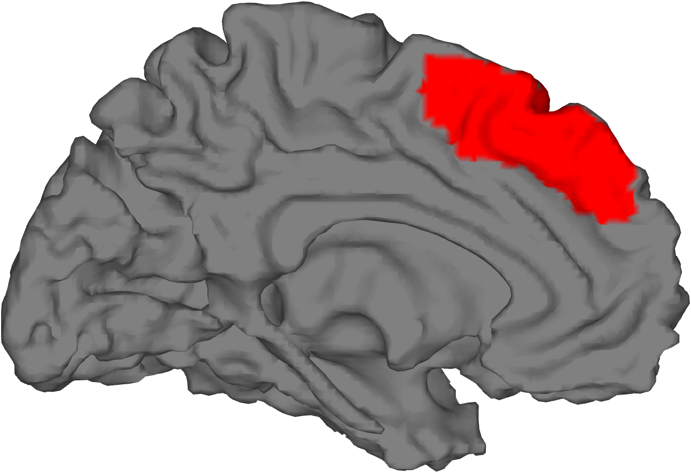

# `cluster_surf` — render clusters / regions on a canonical surface (legacy)

[Object methods index](../Object_methods.md) ·
[Atlases / regions / patterns](../atlases_regions_and_patterns.md)

> **DEPRECATED.** `cluster_surf`, along with `surface_cutaway` and
> `tor_3d`, uses an older surface-rendering pipeline that is dramatically
> slower than the modern `addbrain` + `render_on_surface` combination.
> The current recommendation is to call [`addbrain`](addbrain.md) to
> obtain a patch handle and then render a stat image onto it with
> `render_on_surface` (which uses MATLAB's `isocolors` for fast vectorised
> color sampling). `cluster_surf` is still available, however, and is
> particularly useful for inflated surfaces, for rendering several sets
> of regions in different colors on the same brain, and for cases where
> you want flexible control over the distance from blob to surface.

`cluster_surf` paints a `region` object (legacy name "cluster" / `cl`)
onto a chosen canonical brain surface. It accepts one or more region
sets, each with its own color (or a colormap with `'heatmap'`), a depth
parameter `mmdeep` controlling how far from the surface a voxel can be
and still influence vertex color, and either a built-in surface keyword
(`'left'`, `'right'`, `'bg'`, `'cerebellum'`, …), a `*.mat` filename
holding `vertices`/`faces`, or an existing patch handle from `addbrain`.

## Quick example

Render a thresholded group t-map on a left medial cortical surface:

```matlab
imgs = load_image_set('emotionreg');
t = ttest(imgs);
t = threshold(t, .005, 'unc', 'k', 10);
r = region(t);
create_figure('cs'); set(gcf, 'Position', [100 100 1000 700]);
cluster_surf(r, 5, 'left');
```



## Usage

```matlab
[surface_handle, colorchangestring] = cluster_surf(varargin)

% Common forms:
cluster_surf(cl, mmdeep, surface_keyword)
cluster_surf(cl, mmdeep, {[r g b]}, surface_keyword)
cluster_surf(cl, mmdeep, surface_handle)            % from addbrain
cluster_surf(cl, mmdeep, 'heatmap')                 % map .Z to color
cluster_surf(cl, mmdeep, 'heatmap', 'colormaps', poscm, negcm)
cluster_surf(cl1, cl2, mmdeep, colors_cell, 'left') % multi-set
```

`mmdeep` is the maximum distance (mm) from the surface at which a voxel
contributes color to a vertex; typical values are `2`–`10`. `colors_cell`
is a cell array of `[r g b]` per region set; if you supply more colors
than region sets the extras are used as overlap colors (n+1 = pairwise
overlap, n+2 = all-set overlap), with `[0 1 1]` (cyan) reserved for
multi-set overlap.

## How it works

1. **Argument dispatch.** `cluster_surf` walks `varargin` by type. A
   `struct` or `region` becomes one cluster set (multiple are allowed).
   A cell array is interpreted as colors. A numeric scalar is `mmdeep`.
   A string is either a surface keyword, a `*.mat` filename, or a flag
   (`'colorscale'`, `'heatmap'`, `'normalize'`, `'colormaps'`,
   `'noverbose'`). A patch handle re-uses an existing surface (typically
   from [`addbrain`](addbrain.md)).

2. **Surface load.** If a keyword is given, `cluster_surf` calls
   `addbrain` (or, for legacy keywords, loads a built-in `*.mat` file
   directly) to create the patch. Vertices and faces are extracted from
   the patch object.

3. **Vertex coloring.** For each vertex, the function searches for any
   in-cluster voxel within `mmdeep` mm. If found, the vertex face color
   is set to the supplied solid color OR (with `'heatmap'`) to a value
   sampled from the positive / negative colormap based on the voxel's
   `.Z` value, OR (with `'colorscale'`) to a transparency-mixed blend
   between the surface gray and the cluster color, scaled by `.Z`.

4. **Color modes.**
   - **Solid:** one RGB per cluster set; each set paints over the
     previous, with overlap colors used when colors > sets.
   - **`'colorscale'`:** scales the cluster color by `.Z` row vector,
     producing a soft transparent overlay. Use `'normalize'` to rescale
     `.Z` to ±1 first.
   - **`'heatmap'`:** uses the positive/negative colormaps (`poscm`,
     `negcm`, supplied via `'colormaps'`) to map `.Z` to color. Solid
     colors passed in are ignored. Combine with `'colorscale'` for
     transparent heatmaps.

5. **Reference range.** With `'heatmap'` you can pass a
   `[zmin_act zmax_act zmax_negact zmin_negact]` 4-vector to control
   the data range mapped to the colormap (otherwise inferred from the
   cluster Z values). A typical recipe is
   `clZ = cat(2, clusters.Z); refZ = [min(clZ(clZ>0)) max(clZ) min(clZ(clZ<0)) min(clZ)];`.

6. **Output.** Returns the surface patch handle (so you can re-apply
   another set on the same surface) and a `colorchangestring` that can
   be `eval`-ed to re-paint the same colors after editing the surface.

## Inputs

| Argument | Type | Description |
|---|---|---|
| `clusters` / region | struct array or `region` | One or more cluster sets to render. Pass several to overlay multiple sets in different colors. |
| `mmdeep` | scalar | Maximum mm-from-surface distance for a voxel to color a vertex (typical 2–10). |
| `surface` | keyword / `*.mat` filename / patch handle | Where to draw. Keyword resolved via `addbrain`. |
| `colors` | cell of `[r g b]` | One color per cluster set; extras = overlap colors. Cyan reserved for overlap. |

## Optional inputs

| Argument | Type | Description |
|---|---|---|
| `'heatmap'` | flag | Map cluster `.Z` values to a colormap (overrides solid colors). |
| `'colorscale'` | flag | Transparency-mix cluster color by `.Z`. Combine with `'heatmap'` for transparent heatmaps. |
| `'normalize'` | flag | Rescale `.Z` to [-1, 1] before colorscaling. |
| `'colormaps'` | followed by two `[N×3]` matrices | Custom positive and negative colormaps. Defaults: orange-yellow / blue-cyan. |
| reference range | 4-vector | `[zmin_act zmax_act zmax_negact zmin_negact]` for `'heatmap'` color limits. |
| `'noverbose'` | flag | Suppress chatter. |

### Surface keywords

The keyword set mirrors [`addbrain`](addbrain.md). Common ones:
`'left'`, `'right'`, `'hires left'`, `'hires right'`, `'fsavg_left'`,
`'fsavg_right'`, `'surface left'`, `'surface right'`,
`'hires surface left'`, `'bigbrain'`, `'bg'`, `'limbic'`,
`'cerebellum'`, `'brainstem'`, `'amygdala'`, `'thalamus'`,
`'hippocampus'`, `'midbrain'`, `'caudate'`, `'globus pallidus'`,
`'putamen'`, `'nucleus accumbens'`, `'hypothalamus'`. Pass an existing
patch handle from `addbrain(...)` to bypass the keyword lookup.

## Outputs

| Output | Type | Description |
|---|---|---|
| `surface_handle` | patch handle | The rendered patch. Pass back into a subsequent `cluster_surf` call to overlay more region sets. |
| `colorchangestring` | char | An `eval`-able string that re-applies the most recent vertex coloring (used internally for re-rendering after rotation / editing). |

## Notes

- **Deprecated** but still functional. Prefer
  [`addbrain`](addbrain.md) + `render_on_surface` for new code,
  especially when rendering continuous stat maps onto cortical surfaces.
- `mmdeep` interacts strongly with the surface: tighter values give
  crisper localisation but may miss small blobs whose centre is more
  than a couple of mm beneath pial surface.
- After rotating the camera (`view(...)`), call `lightRestoreSingle`
  (or `camlight`) to keep highlights consistent.
- Multiple cluster sets paint sequentially; later sets overwrite
  earlier ones at shared vertices. Order your calls accordingly.
- Cyan (`[0 1 1]`) is reserved as the multi-set overlap color and
  should not be used as a solid cluster color.

## Examples

```matlab
% Heatmap onto basal ganglia, 2 mm mapping
cluster_surf(cl, 2, 'bg', 'heatmap');

% A multi-color, multi-threshold display on cerebellum, sharing one surface
colors = {[1 1 0] [1 .5 0] [1 .3 .3]};
tor_fig;
sh = cluster_surf(cl{3}, colors(3), 5, 'cerebellum');
cluster_surf(cl{2}, colors(2), 5, sh);
cluster_surf(cl{1}, colors(1), 5, sh);

% Custom positive / negative colormaps on the left lateral surface
poscm = colormap_tor([.2 .2 .4], [1 1 0], [.9 .6 .1]);  % slate -> orange -> yellow
negcm = colormap_tor([0 0 1],   [0 .3 1]);              % light to dark blue
create_figure('Brain Surface');
cluster_surf(cl, 2, 'heatmap', 'colormaps', poscm, negcm, 'left');

% Single-color transparent map (green) using colorscale + normalize
cluster_surf(cl, 2, {[0 1 0]}, 'colorscale', sh, 'normalize');

% Render onto a hi-res addbrain surface handle
surf_han = addbrain('hires surface left');
cluster_surf(r, 2, 'colors', {[1 1 0]}, surf_han);
view(275, 10); lightRestoreSingle;
set(surf_han, 'FaceAlpha', 1);
```

## See also

- [`addbrain`](addbrain.md) + `render_on_surface` — modern, faster replacement
- [`region.surface`](region_surface.md) — region-class surface rendering
- [`region.isosurface`](region_isosurface.md) — 3-D blob rendering
- `surface_cutaway` — companion legacy helper for cortical-cutaway views
- `cluster_cutaways` — legacy multi-cutaway companion
- [`canlab_results_fmridisplay`](canlab_results_fmridisplay.md) — pre-built montage / surface scaffolds
