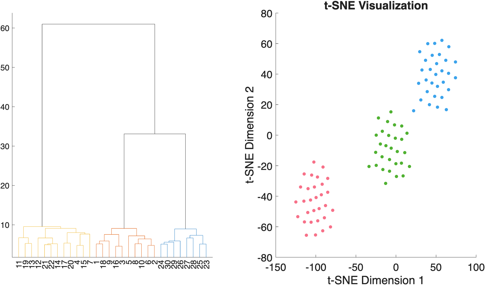

# `clusterdata_permtest` — hierarchical clustering with permutation-based selection of `k`

[Object methods index](../Object_methods.md) ·
[Atlases / regions / patterns](../atlases_regions_and_patterns.md)

`clusterdata_permtest` runs hierarchical clustering over a candidate set of
cluster counts (`k = 2:7` by default) and returns the solution whose
within-cluster cohesion is maximally separated from a permutation null.
For each candidate `k`, it computes a clustering quality statistic on the
real data and on `nperm` shuffled versions of the same data, and reports
the pseudo-Z (`(observed − null mean) / null std`) per `k`. The
recommended `k` is the one with the largest pseudo-Z.

This is the canonical CANlab way of choosing the number of clusters when
you do not have a strong a-priori reason to fix it. It works on any
numeric matrix (observations × features), with optional PCA dimensionality
reduction and any distance metric / linkage method that `pdist` and
`linkage` accept. The output cluster labels are designed to plug straight
into [`canlab_force_directed_graph`](canlab_force_directed_graph.md),
[`plot_correlation_matrix`](plot_correlation_matrix.md), or any other
CANlab visualization helper that accepts a `partitions` vector.

## Quick example

Three well-separated Gaussian blobs in 10-D — `clusterdata_permtest`
should pick `k = 3`:

```matlab
rng(7);
n_per = 30; n_vars = 10;
X = [randn(n_per, n_vars);
     randn(n_per, n_vars) + 2.0;
     randn(n_per, n_vars) - 2.0];
stats = clusterdata_permtest(X, 'k', 2:6);
```



The default plot pairs the linkage dendrogram (left) with a 2-D t-SNE
embedding of the data (right), coloured by the best-`k` cluster
assignment. The full quality-by-`k` table (silhouette / pseudo-Z /
p-value) is printed and stored in `stats.output_table`.

## Usage

```matlab
stats = clusterdata_permtest(X)
stats = clusterdata_permtest(X, 'k', [2:7], 'reducedims', true, ...)
```

`X` is `[n × p]` — rows are observations, columns are features. For very
high-dimensional data (`p > n`) set `'reducedims', true` and optionally
`'ndims', d`; otherwise PCA is auto-enabled when there are fewer than
twice as many cases as variables.

## Inputs

| Argument | Type | Description |
|---|---|---|
| `X` | numeric matrix | `n × p` observations × features. |

## Optional inputs

### Cluster search

| Argument | Type | Description |
|---|---|---|
| `'k', v` | numeric vector | Candidate cluster counts (default `2:7`). |
| `'distancemetric', s` | string | Any `pdist` metric (default `'euclidean'`). |
| `'linkagemethod', s` | string | Any `linkage` method (default `'ward'`). |
| `'nperm', N` | scalar | Number of permutations for the null (default 100). |

### Dimensionality reduction

| Argument | Type | Description |
|---|---|---|
| `'reducedims'` | logical | Do PCA before clustering (default true if `p ≥ n / 2`). |
| `'ndims', d` | scalar | Number of PCs to keep when `'reducedims'` is on. If empty, picked via `barttest` at p < .05. |

### Output control

| Argument | Type | Description |
|---|---|---|
| `'doplot'` | logical | Default true. Set false to suppress the dendrogram + t-SNE plot. |
| `'verbose'` | logical | Default true. Set false to suppress chatter. |

## Outputs

`stats` is a struct with:

| Field | Description |
|---|---|
| `inputs` | The parameters used (`k`, distance, linkage, `reducedims`, `ndims`, `nperm`, `verbose`). |
| `cluster_quality_descrip` | Description of the quality metric (e.g., `'Mean silhouette value'`). |
| `cluster_quality` | Mean silhouette value at each candidate `k`. |
| `cluster_quality_null_mean`, `cluster_quality_null_std` | Permutation null distribution per `k`. |
| `cluster_quality_pseudoZ` | `(observed − null mean) / null std` per `k`. |
| `P_val` | One-sided p-value per `k` from the permutation null. |
| `max_pseudoZ`, `wh_best_k`, `best_k` | The chosen `k` (max pseudo-Z) and its position in the candidate vector. |
| `output_table` | Matlab `table` summarizing quality / null / pseudo-Z / p across `k`. |
| `best_cluster_labels` | `[n × 1]` cluster assignment for the chosen `k`. |
| `all_cluster_labels` | `[n × numel(k)]` matrix of cluster labels for every candidate `k`. |
| `silhouette_values` | Per-observation silhouette values used in the quality computation. |
| `linkage_tree` | The linkage tree from hierarchical clustering. |

## Notes

- The pseudo-Z formulation (rather than raw silhouette) is what makes `k`
  comparable across cluster counts — silhouette by itself tends to favour
  smaller `k`, and the permutation null absorbs that bias.
- With `'reducedims', true` and an empty `'ndims'`, the function uses
  `barttest` at p < .05 to pick the number of PCs. For high-dimensional
  brain-imaging data this is usually appropriate; for small-`p` problems
  set `'reducedims', false`.
- `best_cluster_labels` plugs directly into the `'partitions'` argument of
  [`canlab_force_directed_graph`](canlab_force_directed_graph.md) and
  [`plot_correlation_matrix`](plot_correlation_matrix.md) for follow-up
  visualization.
- The default plot uses MATLAB's t-SNE for the right-hand panel; turn off
  with `'doplot', false` if you only want the cluster-quality table.

## Other examples

```matlab
% Null data — should not strongly prefer any k
X = randn(99, 10);
stats = clusterdata_permtest(X, 'k', 2:7);

% Cluster the emotionreg image set in voxel space
obj = load_image_set('emotionreg');
stats = clusterdata_permtest(obj.dat', 'k', 2:7, 'reducedims', true);

% Cluster the kragel270 multi-study image set, keep 25 PCs
obj = load_image_set('kragel270');
obj = rescale(obj, 'zscoreimages');
stats = clusterdata_permtest(obj.dat', 'k', 2:20, ...
                             'reducedims', true, 'ndims', 25);

% Sort the spatial-correlation matrix by cluster for visualization
[labels_sorted, order_idx] = sort(stats.best_cluster_labels, 'ascend');
X = obj.dat(:, order_idx);
OUT = plot_correlation_matrix(X, 'doimage', true, 'docircles', false, ...
                              'partitions', labels_sorted);
```

## References

- The pseudo-Z + permutation-null approach used here has been applied in
  Wager, Scott & Zubieta (2007, *PNAS*); Wager et al. (2008, *Neuron*);
  and Atlas et al. (2014, *Pain*).

## See also

- [`canlab_force_directed_graph`](canlab_force_directed_graph.md) —
  network plot whose `'partitions'` accepts `best_cluster_labels` directly
- [`plot_correlation_matrix`](plot_correlation_matrix.md) — heatmap with
  partition shading driven by the same labels
- `kmeans`, `linkage`, `pdist`, `silhouette` — MATLAB primitives used
  internally
- `canlab_sort_distance_matrix` — re-order a distance matrix by
  hierarchical clustering
