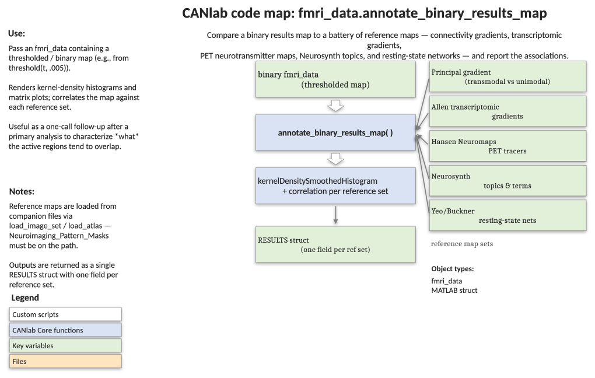

# `fmri_data.annotate_binary_results_map` — annotate a binary results map with gradients, networks, and Neurosynth terms

[← back to `fmri_data` methods](../fmri_data_methods.md) ·
[Object methods index](../Object_methods.md) ·
[Recasting objects](../recasting_objects.md)

Take a thresholded binary brain map (e.g., a results map from a contrast or a
neuromarker) and produce a one-shot interpretation report: where it falls on
the principal cortical gradient, which transcriptomic gradients it loads on,
which neurotransmitter receptor systems it overlaps with, which Neurosynth
topics and terms describe it, and how it aligns with canonical resting-state
networks.

## Code map



[Editable PowerPoint version](../code_maps_pptx/fmri_data_annotate_binary_results_map_codemap.pptx)

## Usage

```matlab
RESULTS = annotate_binary_results_map(test_map)
```

`test_map` is a single `fmri_data` (or `statistic_image`) object containing a
thresholded binary or signed map. Positive and negative voxels are annotated
separately on the principal-gradient figure; everywhere else the function uses
the z-scored test map.

## Inputs

| Argument | Type | Description |
|---|---|---|
| `test_map` | `fmri_data` | A thresholded binary results map (one image). Signed values are allowed; positive vs. negative voxels are plotted separately on the principal-gradient panel. |

## Outputs

| Field | Type | Description |
|---|---|---|
| `RESULTS.transuni_vals` | numeric | Principal FC-gradient values for active voxels (positive then negative). |
| `RESULTS.transcriptomic_vals` | numeric | Allen-brain transcriptomic gradient values for active voxels. |
| `RESULTS.hansen_vals` | numeric | Hansen 2022 PET neurotransmitter binding values for active voxels. |
| `RESULTS.neurosynth_vals` | cell | `{forward_topics, reverse_topics, terms}` — top-correlating Neurosynth feature tables. |
| `RESULTS.networks` | numeric | Per-region values from `wedge_plot_by_atlas` against `yeo17networks`. |

The function also produces a series of figures (kernel-density panels with
inset surfaces, a polar plot of neurotransmitter correlations, a Yeo/Buckner
network similarity plot, and a Yeo-17 wedge plot).

## Notes

- The test map is z-scored internally so that zero-valued voxels are not
  treated as missing during correlation analyses.
- Reference maps must be continuous; an error is raised if a reference map
  has fewer than three unique values.
- Reference maps are resampled to the test map's space (rather than the
  reverse) on the assumption that the gradient maps are coarser and tolerate
  interpolation better.
- Requires `Neuroimaging_Pattern_Masks` on the path so that `load_image_set`
  can resolve `'principalgradient'`, `'transcriptomic_gradients'`,
  `'hansen22'`, `'bucknerlab_wholebrain'`, and `'yeo17networks'`, plus
  `neurosynth_data_obj.mat`.

## Example: annotate a Neurosynth somatosensory topic map

```matlab
% Load Neurosynth topic maps and pick the somatosensory topic
ns = load(which('neurosynth_data_obj.mat'));
test_map = get_wh_image(ns.topic_obj_reverseinference, 1);

% Generate the full annotation report
RESULTS = annotate_binary_results_map(test_map);

% Inspect the top-correlating Neurosynth topics (reverse inference)
disp(RESULTS.neurosynth_vals{2})
```

## See also

- [`fmri_data.hansen_neurotransmitter_maps`](fmri_data_hansen_neurotransmitter_maps.md) — neurotransmitter polar plot only
- [`image_similarity_plot`](../fmri_data_methods.md) — generic spatial-similarity polar/bar plot
- [`fmri_data.regress`](fmri_data_regress.md) — produce the maps that this function annotates
- [`statistic_image.threshold`](../statistic_image_methods.md) — threshold a t-map before annotation
- [Atlases, regions, and patterns](../atlases_regions_and_patterns.md) — reference maps used here
