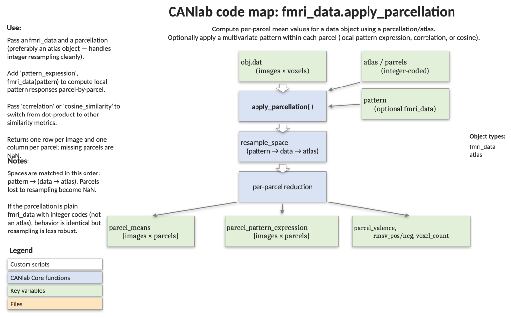

# `fmri_data.apply_parcellation` — average data within parcels and apply local patterns

[← back to `fmri_data` methods](../fmri_data_methods.md) ·
[Object methods index](../Object_methods.md) ·
[Recasting objects](../recasting_objects.md)

Reduce a voxel-level `fmri_data` object to a region-by-image matrix using a
parcellation (an `atlas` or labelled `fmri_data` mask). Optionally apply a
multivariate pattern locally — voxel by voxel within each parcel — to obtain
per-region pattern responses, plus diagnostic measures of pattern valence and
positive/negative root-mean-square contribution. The function handles
resampling, missing parcels, and partial coverage automatically, and always
returns a full-width matrix with `NaN`s for parcels that drop out.

## Code map



[Editable PowerPoint version](../code_maps_pptx/fmri_data_apply_parcellation_codemap.pptx)

## Usage

```matlab
[parcel_means, parcel_pattern_expression, parcel_valence, ...
 rmsv_pos, rmsv_neg, voxel_count, parcel_ste] = ...
    apply_parcellation(dat, parcels, varargin)
```

`dat` is an `fmri_data` (or other `image_vector`) holding the data to
summarize. `parcels` is an `atlas` object (preferred) or an `fmri_data` whose
`.dat` carries integer parcel IDs. Pass a `'pattern_expression'` keyword with
an `fmri_data` weight map to compute local pattern responses in addition to
the means.

## Inputs

| Argument | Type | Description |
|---|---|---|
| `dat` | `fmri_data` | Data to summarize. `.dat` is `[voxels × images]`. |
| `parcels` | `atlas` or `fmri_data` | Parcellation. Each parcel is a unique integer code. `atlas` is preferred — it resamples integer label vectors more cleanly. |
| `'pattern_expression', pat` | `fmri_data` | Apply the multivariate pattern `pat` locally within each parcel. Returns one expression value per parcel per image in `parcel_pattern_expression`. |
| `'correlation'` | flag | Use Pearson correlation as the pattern similarity metric. |
| `'cosine_similarity'` | flag | Use cosine similarity (dot product / product of L2 norms) as the metric. |
| `'norm_mask'` | flag | L2-normalize pattern weights before applying. |
| `'ignore_missing'` | flag | Pattern-expression only. Ignore zero-valued voxels in test images instead of warning about them. |

## Outputs

| Output | Type | Description |
|---|---|---|
| `parcel_means` | `[images × parcels]` | Mean data value within each parcel. Always returned, even when pattern expression is requested. |
| `parcel_pattern_expression` | `[images × parcels]` | Local pattern response per parcel (returned with `'pattern_expression'`). Parcels not covered by the pattern are `NaN`. |
| `parcel_valence` | `[images × parcels]` | Cosine similarity of each parcel's voxel values with the unit vector. `+1` = uniform positive activation, `-1` = uniform negative, `0` = balanced/no net direction. Useful for interpreting whether a pattern computes a "region average" or something more complex. |
| `rmsv_pos`, `rmsv_neg` | `[images × parcels]` | Signed root-mean-square values for positive- and negative-valued voxels in each parcel, expressed in weights / cm³ of tissue (volume regularized by +1 cm³). Useful for assessing where a weight pattern places its energy. |
| `voxel_count` | `[1 × parcels]` | Voxels in each parcel after resampling. |
| `parcel_ste` | `[1 × parcels]` | Per-parcel standard error, computed only when `dat` is a `statistic_image` with a populated `.ste` field. |

Space matching: pattern → (data → atlas). Parcels lost to resampling or
missing data are accounted for; the returned matrices always have one column
per **original** parcel ID, with `NaN` for parcels that dropped out.

## Notes

- Use `atlas` objects when possible. They resample integer-valued labels with
  nearest-neighbour interpolation and avoid corrupting parcel IDs.
- Currently supports one parcellation image and one pattern at a time.
- The `rmsv_pos` / `rmsv_neg` outputs are most informative when the input
  data is itself a pattern weight map — they tell you where positive and
  negative weights are concentrated by region.
- Voxels missing in the data but present in the parcellation are excluded
  from each parcel's mean (the parcel is renormalized).

## Example

```matlab
% Load a parcellation and the emotion-regulation sample dataset
parcel_image = which('shen_2mm_268_parcellation.nii');
parcel_obj = atlas(parcel_image, 'noverbose');
dat = load_image_set('emotionreg');

% Mean activity per parcel for each image
parcel_means = apply_parcellation(dat, parcel_obj);

% Local NPS pattern response in each parcel of the Shen atlas
nps = load_image_set('npsplus');
nps = get_wh_image(nps, 1);
[parcel_means, local_pattern_response] = ...
    apply_parcellation(dat, parcel_obj, 'pattern_expression', nps);

% Visualize parcels that overlap the NPS
r = region(parcel_obj, 'unique_mask_values');
wh_parcels = ~all(isnan(local_pattern_response));
orthviews(r(wh_parcels));
```

## Other examples

```matlab
% Plot per-region positive and negative RMS contributions of a pattern
% (using the painpathways atlas and the cPDM weight pattern)
load(which('cPDM.mat'), 'cPDM');
[parcel_means, ppe, pv, rmsv_pos, rmsv_neg] = ...
    apply_parcellation(painpathways, cPDM, ...
    'pattern_expression', cPDM, 'cosine_similarity');

create_figure('bars');
bar(rmsv_pos, 'FaceColor', [.9 .5 .2]); hold on;
bar(rmsv_neg, 'FaceColor', [.4 .3 1]);
set(gca, 'XTick', 1:size(parcel_means, 2), ...
    'XTickLabel', format_strings_for_legend(painpathways.labels), ...
    'XTickLabelRotation', 90);
```

## See also

- [`fmri_data.extract_roi_averages`](fmri_data_extract_roi_averages.md) — region/cluster-level averages with optional pattern expression
- [`atlas` methods](../atlas_methods.md) — building, slicing, and resampling atlas objects
- [`fmri_data` methods](../fmri_data_methods.md) — full method index
- [Atlases, regions, and patterns](../atlases_regions_and_patterns.md) — overview of how parcellations and patterns interact
