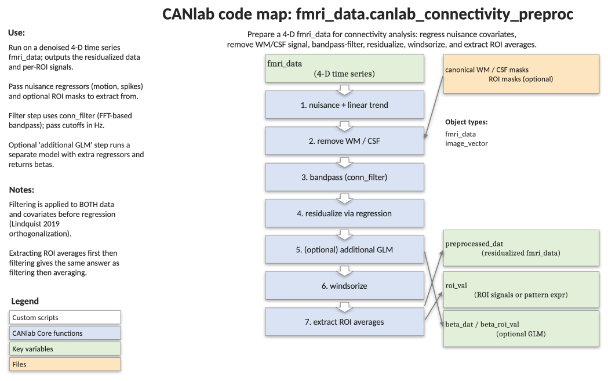

# `fmri_data.canlab_connectivity_preproc` — denoise a 4-D time series for connectivity analysis

[← back to `fmri_data` methods](../fmri_data_methods.md) ·
[Object methods index](../Object_methods.md) ·
[Recasting objects](../recasting_objects.md)

Prepare 4-D fMRI data for connectivity analysis: regress out nuisance
covariates (including ventricle/white-matter signals), apply high-pass,
low-pass, or bandpass temporal filtering, optionally Windsorize, and
optionally extract ROI averages or pattern-expression time courses from one
or more masks. Pass-filtering and nuisance regression are performed
simultaneously to avoid the sequential-filtering bias described in
Lindquist et al. 2019.

## Code map



[Editable PowerPoint version](../code_maps_pptx/fmri_data_canlab_connectivity_preproc_codemap.pptx)

## Usage

```matlab
[preprocessed_dat, roi_val, maskdat] = canlab_connectivity_preproc(dat, varargin)
[preprocessed_dat, roi_val, maskdat, beta_dat, beta_roi_val] = canlab_connectivity_preproc(dat, varargin)
```

Steps applied in order (each is optional unless the data require it):

1. Build the nuisance regressor matrix (`dat.covariates`, plus any extras).
2. Optionally remove ventricle and white-matter signal.
3. Apply high-/low-/bandpass filter to brain data and to covariates.
4. Residualize the brain data against the (filtered) covariates.
5. Optionally fit an additional GLM with user-supplied regressors.
6. Optionally Windsorize the full data matrix to k × SD.
7. Optionally extract per-ROI averages or pattern-expression time courses.

## Inputs

| Argument | Type | Description |
|---|---|---|
| `dat` | `fmri_data` | 4-D time series. `dat.covariates` is treated as the base nuisance matrix. |
| `'additional_nuisance', R` (or `'additional_R'`) | matrix | Extra nuisance regressors `[images × k]`. |
| `'vw'` (or `'ventricle_whitematter'`, `'remove_vw'`) | flag | Remove white-matter and ventricle signal. By default uses canonical eroded masks; pair with `'raw'` to use mean signal instead of the top-5 PCA components. |
| `'datdir', dir` | string | Subject directory for non-canonical WM/ventricle masks. |
| `'hpf', f, TR` | scalars | High-pass filter at frequency `f` Hz with repetition time `TR` (s). |
| `'lpf', f, TR` | scalars | Low-pass filter at frequency `f` Hz. |
| `'bpf', [f_lo f_hi], TR` | scalars | Bandpass filter (e.g. `[.008 .25]`). |
| `'linear_trend'` | flag | Add a linear trend to the nuisance covariates. |
| `'windsorize', k` | scalar | Windsorize the full data matrix to ±k × SD. |
| `'regressors', X` | matrix | Run an additional GLM with `X` (intercept removed). Returns `beta_dat`. |
| `'extract_roi', mask` | char or cell | One or more mask filenames; extract per-region values. |
| `'pattern_expression'` | flag | Use dot-product (pattern expression) instead of averaging in `extract_roi`. |
| `'unique_mask_values'` | flag (default) | Treat each unique value in the mask as a separate region. |
| `'contiguous_regions'` | flag | Treat each contiguous mask cluster as a separate region. |
| `'whole'` | flag | Treat the entire mask as one region. |
| `'no_preproc'` | flag | Skip preprocessing; only run ROI extraction. |
| `'no_plots'` | flag | Suppress QC figures. |

## Outputs

| Output | Type | Description |
|---|---|---|
| `preprocessed_dat` | `fmri_data` | Residualized, filtered (and optionally Windsorized) data. |
| `roi_val` | cell of structs | One cell per mask; each has `.dat` (`[images × regions]`), `.mask_name`, and `.methods`. Empty if `'extract_roi'` not used. |
| `maskdat` | cell of `fmri_data` | Resampled mask objects (one per input mask). |
| `beta_dat` | `fmri_data` | Beta images from the optional additional GLM. |
| `beta_roi_val` | cell | Per-ROI beta values, parallel to `roi_val`. |

## Notes

- Filtering is applied to **both** data and covariates; nuisance regression
  is then orthogonalized with respect to the filter, consistent with
  Lindquist 2019.
- Spike regressors (columns of `R` whose support is a single 1) are pulled
  out before filtering covariates and re-appended afterwards (Wani 08/2019,
  per Ciric et al. 2018).
- The function pushes provenance entries into `dat.history` at each step.
- The additional-GLM path (`'regressors'`) does **not** alter the residualized
  data; it just runs an extra regression on the same nuisance-regressed
  signal, and is intended for task-effect estimation in the same pipeline.
- Equivalent results can be obtained by extracting ROI signals first and
  then running this function on the ROI time series — useful for memory.

## Example: bandpass-filter, remove WM/ventricle, and extract NPS pattern responses

```matlab
% Load a single subject's 4-D BOLD time series
dat = fmri_data(which('swrsub-sid001567_task-pinel_acq-s1p2_run-03_bold.nii.gz'));
TR  = 2;

% NPS as the ROI / pattern of interest
roi_masks = which('weights_NSF_grouppred_cvpcr.img');

% Denoise + bandpass + extract pattern expression in a single call
[preprocessed_dat, roi_val] = canlab_connectivity_preproc(dat, 'vw', ...
    'bpf', [.008 .25], TR, 'extract_roi', roi_masks, 'pattern_expression');

% Pattern time series for the NPS
nps_timecourse = roi_val{1}.dat;
```

## See also

- [`fmri_data.denoise_timeseries_pipeline`](fmri_data_denoise_timeseries_pipeline.md) — newer, more opinionated denoising pipeline
- [`fmri_data.regress`](fmri_data_regress.md) — voxelwise multiple regression (used internally)
- [`fmri_data.extract_measures_batch`](fmri_data_extract_measures_batch.md) — batch extraction of pattern, parcel, and QC measures
- [`extract_roi_averages`](../fmri_data_methods.md) — per-region averaging used here
- [`apply_mask`](../image_vector_methods.md) — masking primitive used by `extract_roi`
