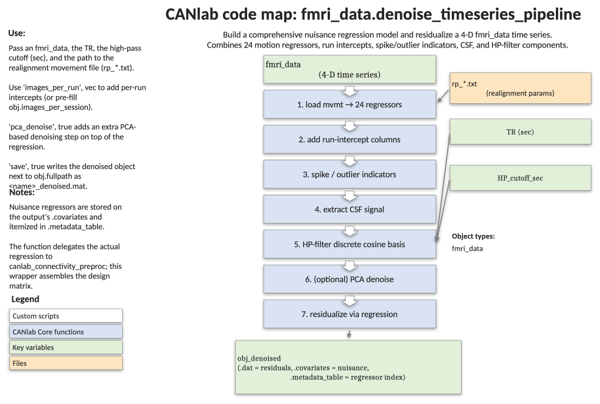

# `fmri_data.denoise_timeseries_pipeline` — opinionated nuisance-regression pipeline for 4-D time series

[← back to `fmri_data` methods](../fmri_data_methods.md) ·
[Object methods index](../Object_methods.md) ·
[Recasting objects](../recasting_objects.md)

End-to-end denoising for a single 4-D fMRI run (or a multi-run object with
`images_per_session` set): builds 24 movement regressors from an SPM
`rp_*.txt` file, adds run intercepts, framewise-displacement spike
regressors, the mean CSF signal, optional PCA-based motion-related component
removal, and a high-pass filter; then regresses everything out using the
`'residual'` and `'grandmeanscale'` options of
[`regress`](fmri_data_regress.md). Returns the cleaned `fmri_data` plus a
covariate matrix and a labelled metadata table.

## Code map



[Editable PowerPoint version](../code_maps_pptx/fmri_data_denoise_timeseries_pipeline_codemap.pptx)

## Usage

```matlab
obj_denoised = denoise_timeseries_pipeline(obj, TR, HP_cutoff_sec, mvmtfname, varargin)
```

Steps applied in order:

1. Compute the 24 movement regressors from `mvmtfname`.
2. Add run intercepts (from `obj.images_per_session` or `'images_per_run'`).
3. Add spike regressors (uncorrected FD outliers from `outliers()`).
4. Add the mean CSF signal from `extract_gray_white_csf()`.
5. Optionally remove PCA components correlated with motion (`'pca_denoise'`).
6. Build SPM-style high-pass filter regressors at `HP_cutoff_sec`.
7. Rescale all covariates for visualisation.
8. Optionally plot the covariate matrix.
9. Run `regress(obj, 'residual', 'grandmeanscale', 'add_voxelwise_intercept')`.
10. Attach `covariates` and `metadata_table` to the denoised object.
11. Optionally plot the cleaned object.
12. Optionally save `<basename>_denoised.mat`.

## Inputs

| Argument | Type | Description |
|---|---|---|
| `obj` | `fmri_data` | 4-D time series object. |
| `TR` | scalar | Repetition time in seconds. |
| `HP_cutoff_sec` | scalar | High-pass filter cutoff in seconds (e.g. 128). |
| `mvmtfname` | string | Path to the SPM `rp_*.txt` realignment-parameter file. |
| `'plot', tf` | logical | Show intermediate figures (default `true`). |
| `'verbose', tf` | logical | Print progress messages (default `true`). |
| `'save', tf` | logical | Save denoised object next to the source as `*_denoised.mat` (default `false`). |
| `'pca_denoise', tf` | logical | Run PCA and remove components with R² > 0.7 against the 24 movement regressors (default `false`). |
| `'images_per_run', v` | numeric vector | Number of volumes per run; written into `obj.images_per_session` if set. |

## Outputs

| Field of `obj_denoised` | Type | Description |
|---|---|---|
| `.dat` | `[voxels × time]` | Residuals after regressing out all nuisance covariates. |
| `.covariates` | `[time × k]` | Full nuisance matrix used for residualization. |
| `.metadata_table` | table | Labelled covariates: 24 motion (`mvmt_*`), run intercepts (`Run1...`), spike regressors (`Out*`), `MeanCSF`, and HP-filter columns (`HPfilt*`). |
| `.image_metadata.is_timeseries` | logical | `true`. |
| `.image_metadata.is_HP_filtered` | logical | `true`. |
| `.image_metadata.covariates_removed` | logical | `true`. |
| `.image_metadata.TR_in_sec`, `.HP_filter_cutoff_sec` | numeric | Recorded for provenance. |

## Notes

- Uses the `'residual'` option of `fmri_data.regress` so that the returned
  object is the residual time series, not the betas.
- `'grandmeanscale'` rescales each run (per `images_per_session`) to a grand
  mean of 100 — important when stacking runs with different intensity scales.
- `'add_voxelwise_intercept'` preserves the per-voxel mean so that maps of
  overall signal level (and SPM implicit masking) still behave sensibly.
- PCA denoising is opt-in. When enabled, components with R² > 0.7 against the
  24 motion regressors are removed before high-pass filtering.
- Spike regressors come from FD-based outlier detection in `outliers()`.

## Example: denoise a single Pinel-task run

```matlab
% Load the 4-D BOLD image
fname = which('swrsub-sid001567_task-pinel_acq-s1p2_run-03_bold.nii.gz');
obj   = fmri_data(fname);

% TR from the JSON sidecar
js = jsondecode(fileread(which('sub-sid001567_task-pinel_acq-s1p2_run-03_bold.json')));
TR = js.RepetitionTime;

% SPM realignment parameters
mvmtfname = which('rp_sub-sid001567_task-pinel_acq-s1p2_run-03_bold.txt');

% Run the pipeline
obj_denoised = obj.denoise_timeseries_pipeline(TR, 128, mvmtfname, ...
    'plot', true, 'verbose', true);

% Inspect labelled covariates
head(obj_denoised.metadata_table)
```

## See also

- [`fmri_data.regress`](fmri_data_regress.md) — voxelwise regression engine used here
- [`fmri_data.canlab_connectivity_preproc`](fmri_data_canlab_connectivity_preproc.md) — older, more configurable denoising pipeline
- [`fmri_data.extract_measures_batch`](fmri_data_extract_measures_batch.md) — extract QC and signature measures from cleaned data
- [`outliers`](../fmri_data_methods.md) — framewise-displacement spike detection used internally
- [`extract_gray_white_csf`](../fmri_data_methods.md) — compartment signal extraction used internally
