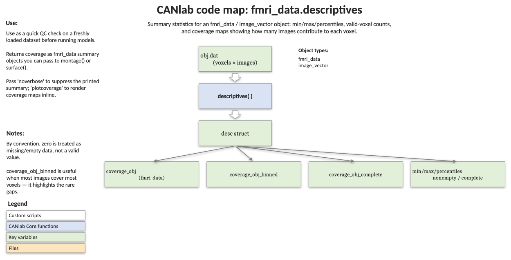

# `fmri_data.descriptives` — summary statistics and coverage report

[← back to `fmri_data` methods](../fmri_data_methods.md) ·
[Object methods index](../Object_methods.md) ·
[Recasting objects](../recasting_objects.md)

Compute descriptive statistics on an `fmri_data` (or other
`image_vector`) object — counts of nonempty / complete voxels and images,
min/max/mean/std, percentile table, inter-image correlations, and summary
`fmri_data` objects mapping spatial coverage. Useful as a one-shot QC step
to confirm an image set looks the way you expect before running
statistics on it.

## Code map



[Editable PowerPoint version](../code_maps_pptx/fmri_data_descriptives_codemap.pptx)

## Usage

```matlab
desc = descriptives(dat, ['noverbose', 'plotcoverage'])
```

`image_vector` objects flatten 3-D images into columns of a 2-D matrix
(`dat.dat`). By convention, **zero indicates missing data** and is not
treated as a valid value.

## Inputs

| Argument | Type | Description |
|---|---|---|
| `dat` | `fmri_data` / `image_vector` | The dataset to summarise. |
| `'noverbose'` | flag | Suppress the printed summary table. |
| `'plotcoverage'` | flag | Render a 2-row montage of complete and binned coverage maps plus a histogram of per-image missing percentages. |

## Outputs

`desc` is a struct. Selected fields:

| Field | Type | Description |
|---|---|---|
| `n_images`, `n_vox`, `n_in_mask` | int | Counts. |
| `num_unique_values`, `databitrate` | numeric | Effective bit rate (warns when very low). |
| `wh_zero`, `wh_nan` | logical `[voxels × images]` | Element-wise missingness indicators. |
| `nonempty_voxels`, `n_nonempty_vox` | logical / int | Voxels with at least one valid image. |
| `complete_voxels`, `n_complete_vox` | logical / int | Voxels valid in *all* images. |
| `nonempty_images`, `n_nonempty_images`, `complete_images`, `n_complete_images` | logical / int | Image-level analogues. |
| `percent_missing_per_image` | column | Percentage of `nonempty_voxels` missing in each image. |
| `images_missing_over_50percent`, `_25percent`, `_10percent` | logical | Threshold-based flags. |
| `min`, `max`, `mean`, `std` | scalar | Across nonempty values only. |
| `prctiles`, `prctile_vals`, `prctile_table` | numeric / table | Percentiles `[0.1 .5 1 5 25 50 75 95 99 99.5 99.9]`. |
| `unique_vals`, `num_unique_vals` | numeric / int | Nonempty unique values. |
| `interimage_correlation`, `mean_image_correlation`, `max_image_correlation` | matrix / scalar | Pairwise image correlations; `max` flags duplicate images when `> 0.999`. |
| `coverage_obj` | `fmri_data` | Map of how many images have valid data in each voxel. |
| `coverage_obj_binned` | `fmri_data` | Same map binned into `100 / 80 / 50 / 1` (all / 80–99.9% / 50–80% / fewer images). |
| `coverage_obj_complete` | `fmri_data` | Binary map of voxels with valid data in *every* image. |

## Notes

- Coverage objects are returned as `fmri_data` so you can hand them
  straight to `montage`, `orthviews`, or `addblobs` for visualisation.
- `descriptives` is called internally by [`fmri_data.outliers`](fmri_data_outliers.md)
  to detect images with > 25% missing voxels.
- A bit rate below `2^10` triggers a warning that the data may have been
  truncated (e.g. saved as a low-precision integer type).

## Example: QC summary on the emotion-regulation dataset

```matlab
% Standard sample dataset
obj = load_image_set('emotionreg');

% Print the summary and plot coverage maps + missing-voxel histogram
desc = descriptives(obj, 'plotcoverage');

% Show areas with valid data for all images
o2 = montage(desc.coverage_obj_complete, 'trans', ...
    'maxcolor', [.5 1 .5], 'mincolor', [0 0 0], ...
    'cmaprange', [1 100], 'transvalue', 0.8);

% Histogram of how many voxels each image is missing
figure; hist(desc.percent_missing_per_image, 30);
xlabel('Percentage of voxels missing'); ylabel('Number of images');
```

## See also

- [`fmri_data.outliers`](fmri_data_outliers.md) — flag artefactual images using these descriptive scores
- [`fmri_data.pca`](fmri_data_pca.md) — exploratory decomposition once the data look healthy
- [`fmri_data.ttest`](fmri_data_ttest.md) — group t-test built on the same `[voxels × images]` matrix
- [`image_vector` methods](../image_vector_methods.md) — full method index
