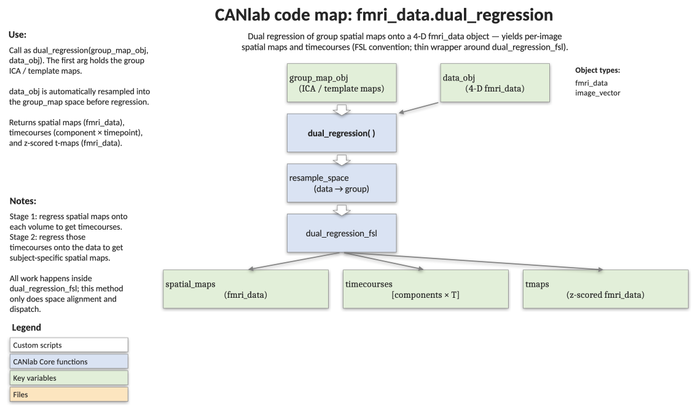

# `fmri_data.dual_regression` — FSL-style dual regression of group maps onto a subject's data

[← back to `fmri_data` methods](../fmri_data_methods.md) ·
[Object methods index](../Object_methods.md) ·
[Recasting objects](../recasting_objects.md)

Project a set of group-level spatial maps (e.g., group ICA components) onto
a single subject's 4-D data to recover (a) per-component time courses and
(b) subject-specific spatial maps. The first regression is spatial (maps
against each volume) and the second is temporal (recovered time courses
against each voxel) — the standard FSL dual-regression workflow.

## Code map



[Editable PowerPoint version](../code_maps_pptx/fmri_data_dual_regression_codemap.pptx)

## Usage

```matlab
[spatial_maps, timecourses, tmaps] = dual_regression(group_map_obj, data_obj, varargin)
```

The method is dispatched on `group_map_obj`: the receiver carries the
group-level component maps and `data_obj` is the subject's 4-D image series.
`data_obj` is resampled into the space of `group_map_obj` before the
regressions are performed; the heavy lifting is delegated to
`dual_regression_fsl`.

## Inputs

| Argument | Type | Description |
|---|---|---|
| `group_map_obj` | `fmri_data` | Group-level spatial maps, one image per component (e.g., from group ICA). |
| `data_obj` | `fmri_data` | Subject's 4-D BOLD time series. Resampled to the space of `group_map_obj`. |
| `varargin` | misc. | Forwarded to `dual_regression_fsl`. |

## Outputs

| Output | Type | Description |
|---|---|---|
| `spatial_maps` | `fmri_data` | Subject-specific spatial maps, one image per component. |
| `timecourses` | matrix | `[components × timepoints]` recovered time courses. |
| `tmaps` | `fmri_data` | Z-scored version of `spatial_maps` (effect-size maps). |

## Notes

- Resampling happens with `resample_space(data_obj, group_map_obj)` — the
  subject data are aligned to the group-map grid, not the other way around.
- All real work is performed by `dual_regression_fsl`; this method exists to
  provide the standard CANlab object-method dispatch and to handle space
  alignment automatically.
- Pair this with `load_image_set('npsplus')`, ICA component sets, or any
  other reference map collection of interest.

## Example: project a small ICA component set onto a subject's run

```matlab
% Use a few CANlab signature maps as stand-in components
group_map_obj = load_image_set('npsplus');
group_map_obj = get_wh_image(group_map_obj, 2:7);
disp(group_map_obj.image_names)

% Single-subject 4-D BOLD data
data_obj = fmri_data(which('swrsub-sid001567_task-pinel_acq-s1p2_run-03_bold.nii.gz'));

% Dual regression
[spatial_maps, timecourses, tmaps] = dual_regression(group_map_obj, data_obj);

% Inspect the recovered time courses
plot(timecourses');
xlabel('Volume'); ylabel('Component score');
```

## See also

- [`fmri_data.ica`](../fmri_data_methods.md) — group ICA that can produce the input maps
- [`fmri_data.predict`](../fmri_data_methods.md) — cross-validated multivariate prediction
- [`fmri_data.regress`](fmri_data_regress.md) — voxelwise multiple regression
- [`apply_parcellation`](../fmri_data_methods.md) — alternative when components are categorical
- [`resample_space`](../image_vector_methods.md) — alignment used internally
