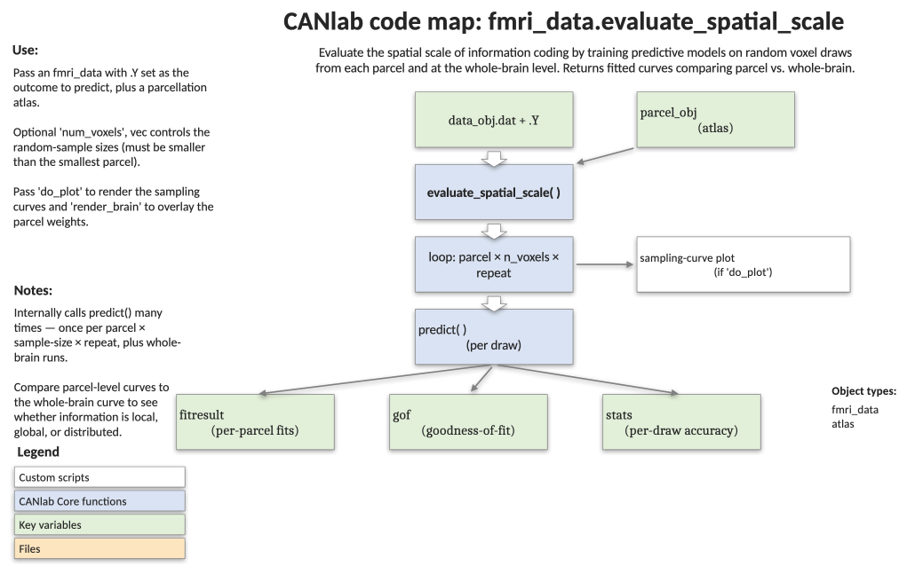

# `fmri_data.evaluate_spatial_scale` — characterise the spatial scale of multivariate information

[← back to `fmri_data` methods](../fmri_data_methods.md) ·
[Object methods index](../Object_methods.md) ·
[Recasting objects](../recasting_objects.md)

Ask whether predictive information about an outcome is carried at the
whole-brain scale, within individual parcels, or distributed across all
parcels. For each parcellation region the function repeatedly draws random
voxel subsets of increasing size, fits a cross-validated `predict` model,
and plots the resulting performance-vs-features curves with confidence
bands. Returns the fitted curves plus pairwise comparisons of effect sizes
across parcels at the second-largest sampling level.

## Code map



[Editable PowerPoint version](../code_maps_pptx/fmri_data_evaluate_spatial_scale_codemap.pptx)

## Usage

```matlab
[fitresult, gof, stats] = evaluate_spatial_scale(data_obj, parcel_obj, varargin)
```

`varargin` accepts both options consumed by this function (`'colors'`,
`'labels'`, `'num_voxels'`, `'iterations'`, `'do_plot'`, `'render_brain'`)
and any options understood by `fmri_data.predict` (e.g.
`'cv_lassopcr'`, `'nfolds'`, `'verbose', 0`). Unknown keys are forwarded.

## Inputs

| Argument | Type | Description |
|---|---|---|
| `data_obj` | `fmri_data` | Brain images with `Y` outcomes set on the object (used by `predict`). |
| `parcel_obj` | `fmri_data` or `atlas` | Parcellation. 1-D label vectors are converted to indicator columns. Resampled to `data_obj` space (nearest-neighbour). |
| `'colors', C` | cell of RGB | Per-parcel colours for the plot. |
| `'labels', L` | cell of strings | Per-parcel display names. |
| `'num_voxels', V` | integer vector | Sampling grid (default `[50 150 250 500 750 1000 1500 5000 10000]`); values larger than the smallest parcel are removed. |
| `'iterations', n` | integer | Random subsamples per `(parcel, n_voxels)` cell (default 1000). |
| `'do_plot'` | flag (default true) | Plot the sampling curves with bounded SD. |
| `'render_brain'` | flag | Add a surface rendering of the parcellation to the plot. |
| `predict` options | misc. | Any `'cv_lassopcr'`, `'nfolds'`, `'verbose'`, etc. options accepted by `fmri_data.predict`. If `'nfolds'` is not supplied, 10-fold CV is used. |

## Outputs

| Output | Type | Description |
|---|---|---|
| `fitresult` | cell | Fit objects from `createFit`. Index 1 is the whole-brain curve, 2 is across-all-parcels, 3..end are per-parcel curves. |
| `gof` | cell | Goodness-of-fit structures parallel to `fitresult`. |
| `stats.pairwise_comparisons.Z` | matrix | Normal-approximation Z-statistics for paired differences in mean prediction r at the second-largest spatial scale. |
| `stats.pairwise_comparisons.P` | matrix | Two-sided p-values matching `Z`. |

## Notes

- The performance metric is `stats.pred_outcome_r` from `predict()` when
  available, otherwise `1 - stats.cverr` (e.g. classification accuracy).
- Three curves are computed: random voxels from the whole brain, random
  voxels from the union of all parcels, and random voxels within each
  individual parcel — letting you see whether being inside a single parcel
  is sufficient or whether spatially-distributed sampling helps.
- Sampling sizes greater than the smallest parcel are discarded so all
  parcels can be evaluated on the same grid.
- For binary outcomes the function still extracts a meaningful score via the
  `cverr` fallback.

## Example: spatial scale of pain coding across resting-state networks

```matlab
% Load BMRK3 pain data and the Buckner-lab resting-state networks
canlab_help_set_up_pain_prediction_walkthrough;   % sets image_obj, subject_id, etc.
[mask_obj, networknames] = load_image_set('bucknerlab');

% Per-network colours
mycolors = {[120 18 134]/255 [70 130 180]/255 [0 118 14]/255 ...
            [196 58 250]/255 [220 248 164]/255 [230 148 34]/255 ...
            [205 62 78]/255};

% Run with cross-validated LASSO-PCR, leave-one-subject-out CV
[fitresult, gof, stats] = evaluate_spatial_scale(image_obj, mask_obj, ...
    'cv_lassopcr', 'nfolds', rem(subject_id, 2) + 1, 'verbose', 0, ...
    'labels', networknames, 'colors', mycolors);
```

## Other examples

```matlab
% Same idea, but sampling within brainstem / thalamus subregions
[mask_obj, networknames] = load_atlas('brainstem');
[fitresult, gof] = evaluate_spatial_scale(image_obj, mask_obj, ...
    'cv_lassopcr', 'nfolds', rem(subject_id, 2) + 1, 'verbose', 0, ...
    'labels', networknames);
```

## References

- Kragel, P. A., Koban, L., Barrett, L. F., & Wager, T. D. (2018).
  *Representation, pattern information, and brain signatures: from neurons
  to neuroimaging.* Neuron, 99(2), 257–273.
- Kragel, P. A., Reddan, M., LaBar, K. S., & Wager, T. D. (2018).
  *Emotion schemas are embedded in the human visual system.* bioRxiv,
  470237.

## See also

- [`fmri_data.predict`](../fmri_data_methods.md) — cross-validated prediction (used internally)
- [`load_atlas`](../atlases_regions_and_patterns.md) — load a parcellation
- [`apply_parcellation`](../fmri_data_methods.md) — extract per-parcel summaries
- [`fmri_data.searchlight`](../fmri_data_methods.md) — alternative scale-of-information approach
- [`apply_mask`](../image_vector_methods.md) — masking primitive used here
