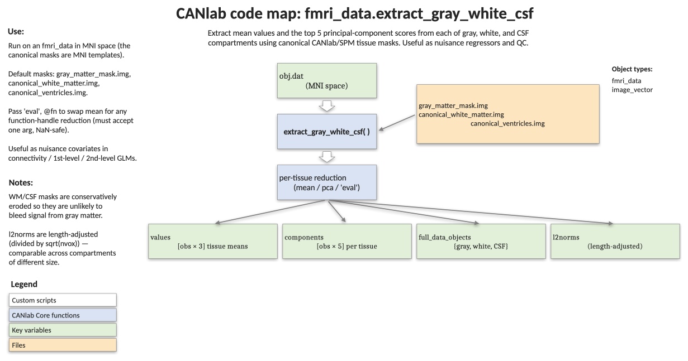

# `fmri_data.extract_gray_white_csf` — summarize signal in GM, WM, and CSF compartments

[← back to `fmri_data` methods](../fmri_data_methods.md) ·
[Object methods index](../Object_methods.md) ·
[Recasting objects](../recasting_objects.md)

For each image in the object, return the mean (or any custom statistic) and
the top principal components of signal within canonical gray-matter,
white-matter, and CSF/ventricle masks. This is the workhorse used to build
nuisance regressors (CompCor-style components, global tissue signals) and
to drive `qc_metrics_second_level` for second-level QC. Images must be in
standard MNI space.

## Code map



[Editable PowerPoint version](../code_maps_pptx/fmri_data_extract_gray_white_csf_codemap.pptx)

## Usage

```matlab
[values, components, full_data_objects, l2norms] = extract_gray_white_csf(obj, varargin)
```

The default tissue masks are bundled with CANlab tools:

```
'gray_matter_mask_sparse.img'
'canonical_white_matter.img'
'canonical_ventricles.img'
```

These are based on SPM8 a priori tissue maps but cleaned, symmetrized, and
eroded so the WM and CSF compartments are unlikely to contain gray-matter
signal. The GM mask is more inclusive.

## Inputs

| Argument | Type | Description |
|---|---|---|
| `obj` | `fmri_data` (or other `image_vector`) | Data object in MNI space. `.dat` is `[voxels × images]`. |
| `'eval', fxn` | function handle | Custom summary statistic per tissue. Must take a single matrix argument and tolerate `NaN`s, e.g. `@(x) nanvar(x, 0, 1)`. Default: `@(x) nanmean(x, 1)`. |
| `'masks', {gm_path, wm_path, csf_path}` | cellstr | Replace the default tissue masks with custom paths (in order: GM, WM, CSF). |

## Outputs

| Output | Type | Description |
|---|---|---|
| `values` | `[images × 3]` | Summary statistic (mean by default) per image, columns ordered GM, WM, CSF. |
| `components` | `1×3` cell of `[images × 5]` | Top 5 principal components within each tissue. Useful as nuisance regressors (CompCor-style). |
| `full_data_objects` | `1×3` cell of `fmri_data` | Per-tissue masked data objects (`.dat` cast to single). Returned only when requested. |
| `l2norms` | `[images × 3]` | Length-adjusted L2 norm (`||x||₂ / sqrt(nvox)`), one per tissue, per image. Useful as a scale-invariant intensity measure. |

## Notes

- Voxels with exactly zero signal are converted to `NaN` before the
  per-tissue summary so they do not bias means downstream.
- Components are computed with `pca` after voxel-wise NaN removal; voxels
  containing any NaN across images are dropped.
- The default GM mask is sparse; the older `gray_matter_mask.img`
  (thresholded at 0.5) is more permissive. Pass it via `'masks'` if you
  need backward compatibility.
- Output rows correspond to the **non-empty** images in `obj` (after
  `remove_empty`). They are not re-padded with NaNs for removed images.

## Example

```matlab
% Mean GM/WM/CSF per image, plus components and L2 norms
obj = load_image_set('emotionreg');
[values, components, full_dat, l2norms] = extract_gray_white_csf(obj);

% values(:,1) = GM means, values(:,2) = WM, values(:,3) = CSF
figure; plot(values, 'o-');
legend({'GM' 'WM' 'CSF'}); xlabel('Image'); ylabel('Mean signal');

% Use the WM/CSF top components as nuisance regressors:
nuisance = [components{2}, components{3}];  % 5 WM + 5 CSF PCs
```

## Other examples

```matlab
% Custom statistic: per-tissue voxelwise variance
values = extract_gray_white_csf(obj, 'eval', @(x) nanvar(x, 0, 1));

% Custom masks
my_masks = {'my_gm.nii' 'my_wm.nii' 'my_csf.nii'};
values = extract_gray_white_csf(obj, 'masks', my_masks);
```

## See also

- [`fmri_data.qc_metrics_second_level`](fmri_data_qc_metrics_second_level.md) — uses these outputs to compute second-level QC summaries
- [`fmri_data.normalize_gm_by_wm_csf`](fmri_data_normalize_gm_by_wm_csf.md) — uses tissue references to shift/scale-normalize images
- [`fmri_data.histogram`](fmri_data_histogram.md) — `'by_tissue_type'` plotting
- [`fmri_data` methods](../fmri_data_methods.md) — full method index
