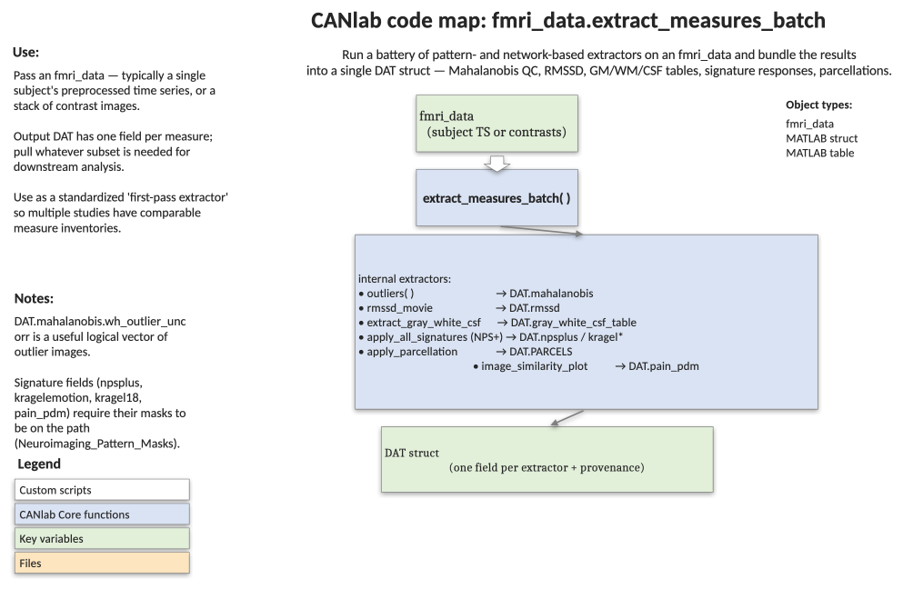

# `fmri_data.extract_measures_batch` — batch-extract pattern, parcel, and QC measures from an `fmri_data` object

[← back to `fmri_data` methods](../fmri_data_methods.md) ·
[Object methods index](../Object_methods.md) ·
[Recasting objects](../recasting_objects.md)

One-shot extraction of a standard set of pattern-based and network-based
measures so that downstream code can pull whatever subset is relevant for a
given analysis. Combines QC outlier metrics, global tissue-compartment
signals, multivariate signature responses (NPS, SIIPS, PINES, Kragel-2015
emotion classifiers, Kragel-2018 PLS, pain-PDM), and per-parcel mean and
local pattern responses for two parcellations (`canlab2018_2mm`,
`yeo17networks`).

## Code map



[Editable PowerPoint version](../code_maps_pptx/fmri_data_extract_measures_batch_codemap.pptx)

## Usage

```matlab
DAT = extract_measures_batch(data_obj)
```

`data_obj` may be a single subject's preprocessed time series or a
group-level set of contrast images. The returned `DAT` struct is intended to
be saved per study/subject and consumed by analysis-specific scripts.

## Inputs

| Argument | Type | Description |
|---|---|---|
| `data_obj` | `fmri_data` | One or more images (time series or group contrasts). Resampled internally to the signature space and to the atlas space. |

## Outputs

`DAT` is a struct with the following top-level fields:

| Field | Type | Description |
|---|---|---|
| `extracted_with` / `extracted_on_date` | strings | Provenance. |
| `image_names`, `fullpath` | strings | Source filenames preserved from `data_obj`. |
| `mahalanobis` | table | Per-image Mahalanobis distance, expected distance, p-value, and outlier flags (corrected/uncorrected). |
| `rmssd` | struct | Root-mean-square successive differences (dVARS) and outlier flags from `preprocess(..., 'outliers_rmssd')`. |
| `gray_white_csf_table` | table | Global gray/white/CSF means, top-5 PCA components per compartment, and L2 norms. |
| `npsplus` | struct | NPS, NPSpos, NPSneg, SIIPS, PINES, Rejection, VPS, GSR, Heart, FM_pain, Empathic_Care, etc., as dot-product, cosine-similarity, and correlation. |
| `kragelemotion` | struct | Kragel 2015 emotion classifier responses (3 metrics). |
| `kragel18` | struct | Kragel 2018 *Nat Neurosci* PLS pattern responses (3 metrics). |
| `pain_pdm` | struct | Geuter et al. principal directions of mediation (10 patterns + combined; 3 metrics). |
| `PARCELS.canlab2018_2mm` | struct | Per-parcel means and local pattern expression for NPS, SIIPS, PINES, VPS, Empathic_Care across ~500 regions. |
| `PARCELS.yeo17networks` | struct | Same fields as above for the 16 Yeo networks split by hemisphere. |

Each `PARCELS.<name>.<sig>` block contains `dat` (per-image local pattern
values), per-parcel `group_t` / `group_p` from `ttest`, an FDR threshold
across parcels, and `fdr_sig` flags.

## Notes

- Tabular fields are MATLAB tables; use
  `DAT.mahalanobis.Properties.VariableNames` to inspect columns and
  `table2array(...)` to extract numeric matrices.
- A reasonable combined outlier vector is
  `outliers = DAT.mahalanobis.wh_outlier_uncorr | DAT.rmssd.wh_outliers_rmssd`.
- Three similarity metrics (`dotproduct`, `cosine_sim`, `correlation`) are
  computed for every signature without rescaling the input images
  (`raw` slot). To compare across studies on a common scale, normalise
  before calling and use the cosine-similarity entries.
- For local pattern expression, only a curated subset of signatures is run
  per parcel (`[NPS SIIPS PINES VPS Empathic_Care]`) to keep memory and
  runtime manageable.
- Requires `Neuroimaging_Pattern_Masks` on the path (signatures and
  atlases).

## Example: extract everything for the emotion-regulation sample

```matlab
% Load 30 single-subject contrast maps
test_images = load_image_set('emotionreg');

% Run the full batch extraction
DAT = extract_measures_batch(test_images);

% Inspect the canlab2018 atlas and the per-parcel mean matrix
orthviews(DAT.PARCELS.canlab2018_2mm.parcel_obj);
disp(DAT.PARCELS.canlab2018_2mm.parcel_obj.labels);

create_figure('parcel_data');
imagesc(DAT.PARCELS.canlab2018_2mm.means.dat{1});
axis tight; ylabel('Image'); xlabel('Parcel'); colorbar;

% Pull NPS dot-product responses into a numeric vector
nps_dot = table2array(DAT.npsplus.raw.dotproduct.NPS);
```

## Other examples

```matlab
% Build a typical nuisance-covariate matrix from the QC fields
outliers = DAT.mahalanobis.wh_outlier_uncorr | DAT.rmssd.wh_outliers_rmssd;
outliers = double(outliers);
outliers(outliers > 0) = find(outliers);
[outlier_indic, levels] = condf2indic(outliers);
outlier_indic(:, levels == 0) = [];

cov_matrix = [DAT.gray_white_csf_table.csf5 ...
              DAT.gray_white_csf_table.gwcsf_l2norm(:, 3) ...
              zscore(DAT.rmssd.rmssd) ...
              outlier_indic];
```

## See also

- [`fmri_data.denoise_timeseries_pipeline`](fmri_data_denoise_timeseries_pipeline.md) — denoising pipeline that complements this batch report
- [`fmri_data.canlab_connectivity_preproc`](fmri_data_canlab_connectivity_preproc.md) — alternative pre-processing path
- [`apply_all_signatures`](../fmri_data_methods.md) — applies the signature batteries used here
- [`apply_parcellation`](../fmri_data_methods.md) — per-parcel mean and pattern extraction
- [Atlases, regions, and patterns](../atlases_regions_and_patterns.md) — references for `canlab2018_2mm` and `yeo17networks`
