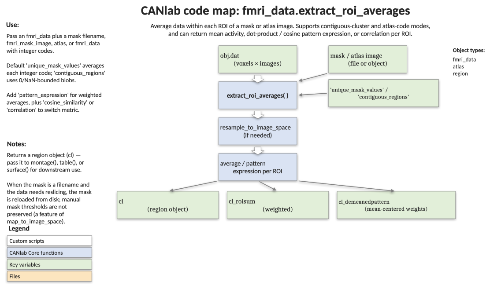

# `fmri_data.extract_roi_averages` — average (or pattern-express) data within ROIs

[← back to `fmri_data` methods](../fmri_data_methods.md) ·
[Object methods index](../Object_methods.md) ·
[Recasting objects](../recasting_objects.md)

Extract per-region summaries from an `fmri_data` object using a mask or
atlas. Returns a `region` object with one element per ROI, each element
holding the per-image mean (or local pattern expression) and the full
voxel-by-image data matrix. Use this when you want subject-by-region tables
for downstream stats, or when you want to apply a CANlab signature locally
to a set of anatomical/atlas regions. Mask space is matched automatically;
atlas labels are honoured.

## Code map



[Editable PowerPoint version](../code_maps_pptx/fmri_data_extract_roi_averages_codemap.pptx)

## Usage

```matlab
[cl, cl_roisum, cl_demeanedpattern] = extract_roi_averages(obj, mask_image, varargin)
```

`mask_image` is optional. When omitted, the data object's own mask is used
and a single ROI containing all in-mask voxels is returned. When supplied,
it can be a filename, an `fmri_mask_image`, an `fmri_data`, an `atlas`, or
a `statistic_image` (in which case the suprathreshold mask is used).

## Inputs

| Argument | Type | Description |
|---|---|---|
| `obj` | `fmri_data` | Data object. `obj.dat` is `[voxels × images]`. |
| `mask_image` | filename / `fmri_mask_image` / `fmri_data` / `atlas` / `statistic_image` | Mask defining the ROIs. Resampled to `obj` space if needed (nearest-neighbour for atlas / unique-mask-values modes; linear otherwise). Optional — defaults to `obj.mask`. |
| `'unique_mask_values'` | flag | (Default) Average over voxels sharing each unique integer code in the mask. The standard atlas-style behaviour. |
| `'contiguous_regions'` | flag | Average over each contiguous blob (connected component bounded by 0/NaN), regardless of mask values. |
| `'pattern_expression'` | flag | Treat mask values as pattern weights and return the weighted dot product within each region instead of the simple mean. |
| `'nonorm'` | flag | Disable the default L1 normalization of pattern weights within each region. |
| `'cosine_similarity'` | flag | Use cosine similarity for pattern expression. Forwarded to `canlab_pattern_similarity`. |
| `'correlation'` | flag | Use Pearson correlation for pattern expression. Forwarded to `canlab_pattern_similarity`. |
| `'noverbose'` | flag | Suppress progress text. |

## Outputs

| Output | Type | Description |
|---|---|---|
| `cl` | `region` array | One element per ROI. `cl(i).dat` is the per-image mean (or pattern expression) in region `i`. `cl(i).all_data` is the full `[images × voxels]` data matrix. `cl(i).val` holds the (possibly L1-normed) pattern weights when applicable. |
| `cl_roisum` | `region` array | Pattern-expression mode only. `cl_roisum(i).dat` is the simple ROI sum (unit-vector pattern) — useful for separating overall ROI activity from pattern shape. |
| `cl_demeanedpattern` | `region` array | Pattern-expression mode only. Pattern expression after orthogonalizing the weights against the region mean — isolates pattern-shape signal from overall activation. |

The output region object can be passed directly to `montage`, `surface`,
`table`, or any region-aware CANlab plotting routine.

## Notes

- This method **loses any previously removed images**: re-apply image
  removal afterwards if needed.
- Mask resampling uses nearest-neighbour interpolation when ROIs are
  defined by `'unique_mask_values'` or when an `atlas` mask is passed —
  this preserves integer label codes.
- Pattern weights are L1-normalized by default within each contiguous
  region. Pass `'nonorm'` to disable.
- For a non-object-oriented alternative, see `extract_image_data`.
- For applying a single global pattern (rather than per-region), see
  [`apply_mask`](fmri_data_apply_mask.md) with `'pattern_expression'`.
- For a parcel-by-parcel matrix with consistent column ordering, see
  [`apply_parcellation`](fmri_data_apply_parcellation.md) — the two
  routines are similar; `apply_parcellation` returns matrices, this one
  returns a `region` object that doubles as a results structure.

## Example

```matlab
% Extract per-parcel averages from the canlab2024 atlas
imgs = load_image_set('emotionreg');
atl = load_atlas('canlab2024');

cl = extract_roi_averages(imgs, atl);
% cl(i).dat is the per-image mean for parcel i

% Visualize the regions and tabulate
montage(cl);
table(cl);
```

## Other examples

```matlab
% Pattern expression of the NPS within each contiguous blob
nps = load_image_set('npsplus'); nps = get_wh_image(nps, 1);
[cl, cl_roisum, cl_demeanedpattern] = ...
    extract_roi_averages(imgs, nps, 'pattern_expression', 'contiguous_regions');

% cl(i).dat       = full pattern expression
% cl_roisum(i).dat = ROI mean (unit vector)
% cl_demeanedpattern(i).dat = pattern shape after removing the mean
```

## See also

- [`fmri_data.apply_parcellation`](fmri_data_apply_parcellation.md) — matrix-returning sibling
- [`fmri_data.apply_mask`](fmri_data_apply_mask.md) — global pattern expression / masking
- [`region` methods](../region_methods.md) — what you can do with the returned `cl`
- [`atlas` methods](../atlas_methods.md) — atlases as masks
