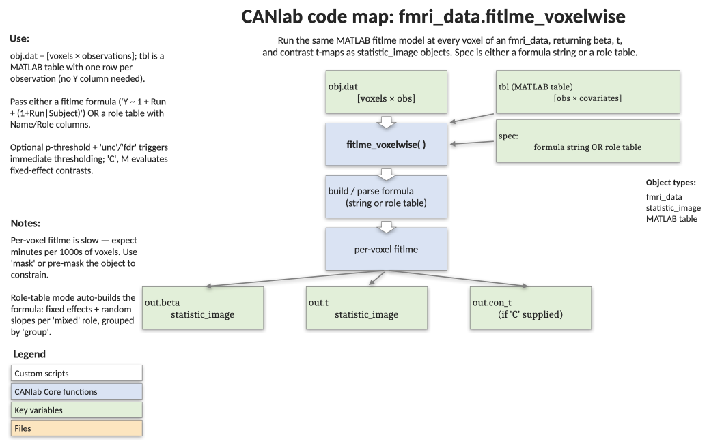

# `fmri_data.fitlme_voxelwise` — voxelwise linear mixed-effects models via MATLAB's `fitlme`

[← back to `fmri_data` methods](../fmri_data_methods.md) ·
[Object methods index](../Object_methods.md) ·
[Recasting objects](../recasting_objects.md)

Fit the same linear mixed-effects model at every voxel using MATLAB's
`fitlme`. Brain data come from `obj.dat`; the design and any covariates
come from a MATLAB table supplied alongside (one row per observation).
The third argument is either a Wilkinson-notation formula or a "role
table" describing each variable, from which the formula is built
automatically. Returns CANlab-style `statistic_image` outputs in the
same shape as [`regress`](fmri_data_regress.md), with optional
fixed-effect contrasts, residuals, and parallel execution.

## Code map



[Editable PowerPoint version](../code_maps_pptx/fmri_data_fitlme_voxelwise_codemap.pptx)

## Usage

```matlab
% Formula mode
out = fitlme_voxelwise(obj, tbl, ...
    'Y ~ 1 + Run + Condition + (1 + Run | Subject)');

out = fitlme_voxelwise(obj, tbl, ...
    'Y ~ 1 + Run + Condition + (1 + Run | Subject)', ...
    .005, 'unc', 'C', C, 'contrast_names', {...});

% Role-table mode (formula built automatically)
role_tbl = table( ...
    {'Subject'; 'Baseline'; 'Run'; 'C1'; 'C2'}, ...
    {'group';   'fixed';    'mixed'; 'mixed'; 'mixed'}, ...
    'VariableNames', {'Name','Role'});

out = fitlme_voxelwise(obj, tbl, role_tbl, .001, 'unc', ...
    'analysis_name', 'LME_with_roles');
% builds: Y ~ 1 + Baseline + Run + C1 + C2 + (1 + Run + C1 + C2 | Subject)
```

## Inputs

| Argument | Type | Description |
|---|---|---|
| `obj` | `fmri_data` (or `image_vector`) | Data. `obj.dat` is `[nVox × nObs]`. |
| `tbl` | MATLAB `table`, `nObs` rows | Design / covariate table. A `Y` column is added internally per voxel; do not supply one. |
| `spec` | `char` / `string` / `table` | Either a `fitlme` formula `'Y ~ ...'` **or** a role table with `Name` and `Role` columns. Roles: `'group'` (one and only one — the grouping factor), `'fixed'`, `'mixed'` (fixed and random slope), `'random_only'`. |
| `pthr, 'unc' \| 'fdr'` | scalar + string | Threshold for t / contrast t-maps. Default `.001 'unc'`. |
| `'C', C` | `[nFixed × nContrasts]` | Contrast matrix over fixed effects (intercept included). |
| `'contrast_names', {...}` | cellstr | Names for each contrast column. Auto-named `Con1, Con2, ...` if omitted. |
| `'analysis_name', str` | string | Stored on `out.analysis_name`. |
| `'doparallel'` | flag | Use `parfor` over voxels (Parallel Toolbox required). |
| `'fitmethod', 'REML' \| 'ML'` | string | Forwarded to `fitlme`. Default `'REML'`. |
| `'residual'` | flag | Save voxelwise residuals as `out.resid` (`fmri_data`, `[nVox × nObs]`). |
| `'display'` / `'display_results'` | flag | `orthviews(out.t)` after fit. |
| `'nodisplay'` | flag | Suppress `orthviews` (default). |
| `'noverbose'` | flag | Suppress progress and summary text. |

Unsupported `regress`-style options (`'robust'`, `'AR'`, `'brainony'`,
`'covdat'`, `'grandmeanscale'`) are accepted but warn and are ignored.

## Outputs

`out` is a structure with the following fields:

| Field | Type | Description |
|---|---|---|
| `b` | `statistic_image` | Fixed-effect betas, one image per fixed effect (unthresholded). `image_labels` carries the fixed-effect names from `fitlme`. |
| `t` | `statistic_image` | Fixed-effect t-values, thresholded at the input `(pthr, type)`. |
| `df` | `fmri_data` | Degrees of freedom per voxel (DFE of the first fixed effect). |
| `sigma` | `fmri_data` | Residual standard deviation per voxel. |
| `contrast_images`, `con_t` | `statistic_image` | Contrast betas (unthresholded) and contrast t-values (thresholded). Returned only when `'C'` is supplied. |
| `resid` | `fmri_data` | Voxelwise residuals (returned only with `'residual'`). |
| `mask` | `[nVox × 1]` logical | Voxels where the model fit succeeded. |
| `formula` | string | The formula actually used (built from a role table if applicable). |
| `fixed_names` | cellstr | Fixed-effect names from `fitlme`. |
| `C`, `contrast_names` | matrix / cellstr | Echo of the contrast inputs. |
| `analysis_name`, `input_parameters`, `warnings` | misc. | Bookkeeping. |

## Notes

- This is computationally heavy: every voxel fits an independent `fitlme`.
  Use `'doparallel'` and consider down-masking to a region of interest
  before calling.
- The threshold-pair shorthand mirrors `regress`: a numeric value
  immediately followed by `'unc'` or `'fdr'` is interpreted as
  `(pthr, type)`. Other type strings are passed through.
- Random-effects components themselves are not returned as voxelwise
  maps — only fixed-effect betas/t/p, plus residual std and DFE.
- The first voxel is fit eagerly to discover the fixed-effect structure;
  if it fails (e.g. rank-deficient design), the whole call errors before
  any loop is entered. Either fix the design or drop voxels with bad
  data.
- For non-mixed-effects voxelwise regression, see
  [`regress`](fmri_data_regress.md).

## Example

```matlab
% Voxelwise LME on the BMRK3 pain dataset (33 subjects × 6 temperatures)
load(which('bmrk3_6levels_pain_dataset.mat'))

% Build a metadata table aligning images with their predictors
t = table(image_obj.additional_info.subject_id, ...
          image_obj.additional_info.temperatures, ...
          'VariableNames', {'subject_id', 'temperature'});
image_obj.metadata_table = t;

% Random intercept + random slope of temperature within subject
out = fitlme_voxelwise(image_obj, image_obj.metadata_table, ...
    'Y ~ 1 + temperature + (1 + temperature | subject_id)', ...
    .005, 'unc');

% The temperature effect map (2nd fixed effect)
t_temp = get_wh_image(out.t, 2);
montage(t_temp);
```

## Other examples

```matlab
% Role-table mode: formula built for you
role_tbl = table({'subject_id'; 'temperature'}, ...
                 {'group';      'mixed'}, ...
                 'VariableNames', {'Name', 'Role'});
out = fitlme_voxelwise(image_obj, image_obj.metadata_table, role_tbl, ...
    .005, 'unc', 'doparallel');

% Add a contrast across fixed effects (e.g. linear weight on temperature)
C = [0; 1];                 % nFixed = 2 (intercept, temperature)
out = fitlme_voxelwise(image_obj, image_obj.metadata_table, ...
    'Y ~ 1 + temperature + (1 + temperature | subject_id)', ...
    .005, 'unc', 'C', C, 'contrast_names', {'TempLinear'});

% Save residuals for downstream connectivity work
out = fitlme_voxelwise(image_obj, image_obj.metadata_table, ...
    'Y ~ 1 + temperature + (1 + temperature | subject_id)', ...
    'residual');
```

## See also

- [`fmri_data.regress`](fmri_data_regress.md) — voxelwise OLS / robust / AR regression sibling
- [`fmri_data.ttest`](fmri_data_ttest.md) — one-sample two-stage summary statistics alternative
- [`fmri_data.robfit_parcelwise`](fmri_data_robfit_parcelwise.md) — robust regression at parcel level
- [`statistic_image.threshold`](statistic_image_threshold.md) — re-threshold the returned t / contrast t-maps
- [`fmri_data` methods](../fmri_data_methods.md) — full method index
