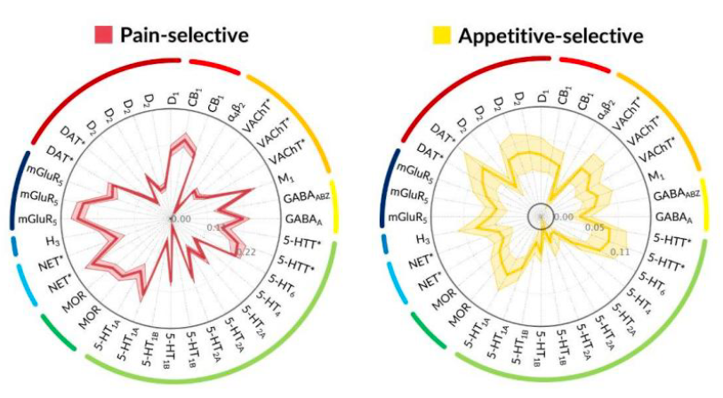
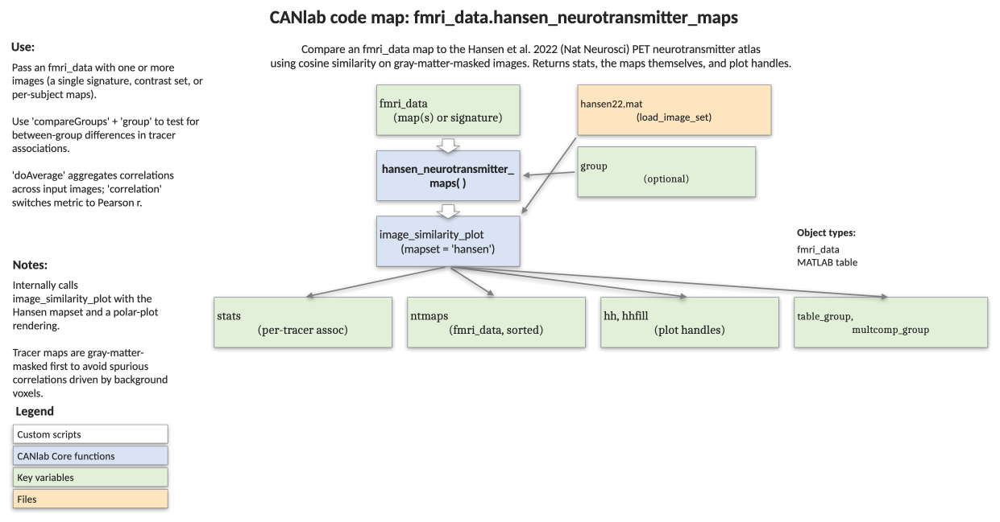

# `fmri_data.hansen_neurotransmitter_maps` — neurotransmitter polar plot from Hansen 2022 PET maps

[← back to `fmri_data` methods](../fmri_data_methods.md) ·
[Object methods index](../Object_methods.md) ·
[Recasting objects](../recasting_objects.md)

Compute and visualise the spatial similarity between an input map (e.g., a
neuromarker, a contrast image, or a set of subject-level maps) and the
PET-derived neurotransmitter receptor and transporter atlases curated by
Hansen et al. 2022 (*Nature Neuroscience*). Returns a stats structure plus
a polar plot grouped by neurotransmitter system. Optional inputs support
group comparisons via one-way ANOVA with Tukey-Kramer multiple comparisons.

The reference maps are NOT loaded from individual NIfTI files. They live in
a single `.mat` file (`hansen22.mat`) of pre-processed, gray-matter-masked
maps that ships with `Neuroimaging_Pattern_Masks` and is loaded by name via
`load_image_set('hansen22')` — the function does this for you internally,
so you do not pass any tracer files.

## Sample output



Each spoke is one Hansen tracer map; the radius is the similarity (correlation
or cosine) between the tracer and the input map(s). Spokes are ordered by
neurotransmitter family (serotonin, dopamine, GABA, …) so related tracers
sit adjacent on the polar plot.

## Code map



[Editable PowerPoint version](../code_maps_pptx/fmri_data_hansen_neurotransmitter_maps_codemap.pptx)

## Usage

```matlab
[stats, ntmaps, hh, hhfill, table_group, multcomp_group] = ...
    hansen_neurotransmitter_maps(fmri_data_obj, varargin)
```

Both the input object and the Hansen reference maps are masked with
`gray_matter_mask.nii` before similarity is computed. The default similarity
metric is correlation; switch with `'cosine_similarity'`. Inherited from
`@image_vector/`, this method works on any `image_vector` subclass
(`fmri_data`, `statistic_image`, `atlas`).

## Inputs

| Argument | Type | Description |
|---|---|---|
| `fmri_data_obj` | `fmri_data` | One or more images. Can be a single signature or a stack of subject-level maps. |
| `'colors', C` | RGB or cell of RGB | Plot colours; one entry per group (or one shared colour). |
| `'nofigure'` | flag | Reuse the current figure instead of creating one. |
| `'noplot'` | flag | Skip plotting; return tables only. |
| `'correlation'` | flag | Use correlation as the similarity metric (default). |
| `'cosine_similarity'` | flag | Use cosine similarity instead. |
| `'dofixrange', [lo hi]` | numeric | Fix the radial axis range on the polar plot (forwarded to `image_similarity_plot`). |
| `'doAverage'` | flag | Average across input images (or across each group when `'compareGroups'` is supplied). |
| `'compareGroups'`, `group` | flag + vector | Run a one-way ANOVA per neurotransmitter map with `group` as factor; pair with `'doAverage'`. |

## Outputs

| Output | Type | Description |
|---|---|---|
| `stats` | struct | Similarity values, network names, and (when grouped) ANOVA / multcompare results. |
| `ntmaps` | `fmri_data` | Hansen reference maps with `metadata_table` (target, transmitter, image names, modeling notes), sorted by transmitter family. |
| `hh` | handles | Polar-plot line handles. |
| `hhfill` | handles | Polar-plot fill handles. |
| `table_group` | cell | One ANOVA table per Hansen map (only when `'compareGroups'` is supplied). |
| `multcomp_group` | cell | Tukey-Kramer multiple-comparison results, one cell per Hansen map. |

## Notes

- Hansen targets are grouped into transmitter families (serotonin, dopamine,
  GABA, acetylcholine, opioid, cannabinoid, histamine, norepinephrine,
  glutamate) and rows are reordered so that the polar plot lays them out by
  family.
- The function masks both inputs with the canonical gray-matter mask before
  the similarity computation; the resulting `stats` therefore reflect
  cortical/subcortical gray-matter overlap only.
- When `'compareGroups'` is supplied without `'doAverage'`, the ANOVA path is
  not taken — pair the two flags.
- Requires `Neuroimaging_Pattern_Masks` on the path (`hansen22.mat` image
  set and `gray_matter_mask.nii`). The Hansen maps are read from
  `hansen22.mat` via `load_image_set('hansen22')`, not from per-tracer
  NIfTI files.

## Example: profile the PINES negative-affect signature

```matlab
% Load Chang et al. 2015 PINES (negative affect) and plot its profile
pines = load_image_set('pines');
[stats, ntmaps] = hansen_neurotransmitter_maps(pines);

% Disable figure creation (overlay into an existing figure)
figure;
[stats, ntmaps] = hansen_neurotransmitter_maps(pines, ...
    'nofigure', 'colors', [0 0 1]);

% Tables only
[stats, ntmaps] = hansen_neurotransmitter_maps(pines, 'noplot');
```

## Other examples

```matlab
% Compare two craving signatures from Koban et al. 2022 on the same axes
ncs_all = load_image_set('ncs');
ncsdrug = get_wh_image(ncs_all, 2);
ncs     = get_wh_image(ncs_all, 1);

[stats, ntmaps, hh, fillh] = hansen_neurotransmitter_maps(ncsdrug);
[stats, ntmaps, hh, fillh] = hansen_neurotransmitter_maps(ncs, ...
    'colors', {[0 0 1]}, 'nofigure');
```

## References

- Hansen, J. Y., et al. (2022). *Mapping neurotransmitter systems to the
  structural and functional organization of the human neocortex.*
  Nature Neuroscience, 25, 1569–1581.

## See also

- [`fmri_data.annotate_binary_results_map`](fmri_data_annotate_binary_results_map.md) — full annotation report (gradients + Hansen + Neurosynth + Yeo)
- [`image_similarity_plot`](../fmri_data_methods.md) — generic spatial-similarity polar plot used internally
- [`fmri_data.regress`](fmri_data_regress.md) — produce maps to profile
- [`apply_mask`](../image_vector_methods.md) — gray-matter masking primitive used here
- [Atlases, regions, and patterns](../atlases_regions_and_patterns.md) — Hansen `hansen22` reference set
