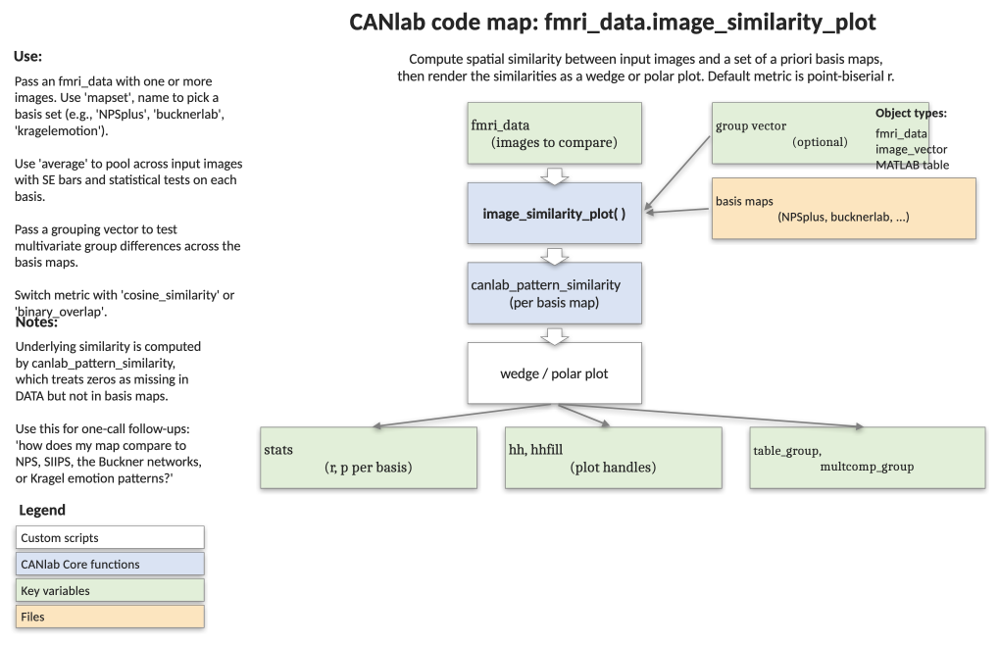

# `fmri_data.image_similarity_plot` — similarity of images vs. a basis set of maps

[← back to `fmri_data` methods](../fmri_data_methods.md) ·
[Object methods index](../Object_methods.md) ·
[Recasting objects](../recasting_objects.md)

Compare one or more brain images to a curated set of spatial basis maps
(neural signatures, networks, gene-expression maps, etc.) and visualise
the similarities as a wedge or polar plot. Useful for asking *"which
known systems does my map resemble?"* — e.g. testing whether group
contrast images load on the Buckner Lab resting-state networks, the NPS,
or Kragel's emotion classifiers. With `'average'`, returns SE bars and
inferential statistics across input images.

## Code map



[Editable PowerPoint version](../code_maps_pptx/fmri_data_image_similarity_plot_codemap.pptx)

## Usage

```matlab
[stats, hh, hhfill, table_group, multcomp_group] = ...
    image_similarity_plot(obj, 'average', 'mapset_keyword', ...)
```

`obj` may be an `fmri_data`, `statistic_image`, `image_vector`, or
`atlas` object. If passed an atlas, probability maps are extracted
automatically. Heavy lifting is done by `canlab_pattern_similarity`.

## Inputs

| Argument | Type | Description |
|---|---|---|
| `obj` | image object | One or more images to compare (rows = subjects/contrasts). Atlas objects are converted to probability maps. |
| `'average'` | flag | Average across input images and report SE + t-tests against zero. Triggered automatically for wedge plots when there are multiple images. |
| `'noaverage'` | flag | Force per-image plotting even when `'average'` would otherwise default on. |
| `'cosine_similarity'` | flag | Use cosine similarity instead of Pearson's r (default). |
| `'binary_overlap'` | flag | Use percent overlap of binary masks. |
| `'mapset', keyword` | string | Choose basis set: `'bucknerlab'` (default, 7 cortical networks), `'bucknerlab_wholebrain'`, `'bucknerlab_wholebrain_plus'`, `'kragelemotion'` (7 Kragel & LaBar 2015 emotion maps), `'allengenetics'` (5 Allen Brain Atlas gene maps), `'pauli' / 'bgloops' / 'pauli17' / 'bgloops17'` (Pauli 2016 BG loops), `'fibromyalgia'` (Lopez-Sola 2017), `'pain_pdm'` (11 pain mediator maps). |
| `'mapset', fmri_data` | object | Custom basis maps; pair with `'networknames', {...}` to label them. |
| `'networknames', {...}` | cellstr | Labels for custom basis maps. |
| `'compareGroups'`, `'group', g` | flag + vector | Run a one-way ANOVA per basis map across groups of input images. `g` may be numeric, categorical, or string. |
| `'plotstyle', 'wedge' \| 'polar'` | string | Plot type. Default `'wedge'`. |
| `'noplot'` | flag | Skip plotting; return stats only. |
| `'nofigure'` | flag | Plot into the current figure rather than creating a new one. |
| `'notable'` | flag | Suppress printed similarity / ANOVA tables. |
| `'colors', {...}` | cell | Colors per image / group. |
| `'bicolor'` | flag | For wedge plots, plot positive entries in `colors{1}` and negative entries in `colors{2}`. |
| `'dofixrange', [min max]` | vector | Fix the radial axis range. |
| `'treat_zero_as_data'` | flag | Treat zero voxels in `obj` as data, not missing (use for binary/thresholded inputs). |
| `'exclude_zero_mask_values'` | flag | Exclude zero values in mask maps from the similarity computation. |
| `'Error_STD'` | flag | Use standard deviation instead of standard error for shading (for bootstrap-sample inputs). |

## Outputs

| Field | Type | Description |
|---|---|---|
| `stats.r` | matrix | Similarity values, `[basis maps × input images]`. |
| `stats.t`, `stats.p`, `stats.df`, `stats.sig` | vectors | T-test on Fisher-z-transformed similarities (only with `'average'`). |
| `stats.descrip` | string | Description of the test performed. |
| `stats.networknames`, `stats.network_imagenames` | cellstr | Basis map labels and source filenames. |
| `stats.inputnames`, `stats.input_imagenames` | cellstr | Input image labels. |
| `stats.table_spatial`, `stats.multcomp_spatial` | table / cell | Repeated-measures ANOVA across basis maps with Tukey-Kramer multiple comparisons (only with `'average'`). |
| `stats.line_handles`, `stats.fill_handles` | handles | Polar-plot handles for cosmetic tweaks. |
| `hh`, `hhfill` | handles | Plot line / fill handles. |
| `table_group`, `multcomp_group` | cell arrays | Per-basis-map between-group ANOVA tables and pairwise comparisons (only with `'compareGroups'`). |

## Notes

- Default similarity metric is **point-biserial correlation (Pearson's r)**.
- By default, voxels that are 0 in the data image are treated as missing
  (SPM convention). Use `'treat_zero_as_data'` for binary/thresholded
  inputs where zero is informative.
- Wedge plots with multiple images auto-default to `'average'` mode;
  override with `'noaverage'`.
- `obj` is resampled to the basis-map space inside the function.
- Significance stars are added to plot labels and printed tables when
  `'average'` is used.

## Example: project group emotion-regulation maps onto the Buckner networks

```matlab
% 30 subject-level reappraisal contrast maps
imgs = load_image_set('emotionreg');

% Cosine similarity with the 7 Buckner cortical networks,
% averaged across subjects, with significance stars in the wedge labels.
stats = image_similarity_plot(imgs, ...
    'cosine_similarity', 'bucknerlab', ...
    'plotstyle', 'wedge', 'average');

% Inspect the matrix: rows = networks, columns = subjects
disp(stats(1).r);
disp([stats(1).t stats(1).p]);
```

## Other examples

```matlab
% Polar plot, multi-line (one line per image, no averaging)
stats = image_similarity_plot(imgs, 'cosine_similarity', ...
    'bucknerlab', 'plotstyle', 'polar');

% Apply a custom basis set
my_maps = fmri_data({'mapA.nii' 'mapB.nii'});
stats = image_similarity_plot(imgs, 'mapset', my_maps, ...
    'networknames', {'A' 'B'}, 'average');

% Compare groups (e.g., patients vs. controls) on each Buckner network
group = imgs.metadata_table.Group;
[stats, ~, ~, table_group, multcomp_group] = ...
    image_similarity_plot(imgs, 'cosine_similarity', 'bucknerlab', ...
    'average', 'compareGroups', group);
```

## See also

- [`fmri_data.wedge_plot_by_atlas`](fmri_data_wedge_plot_by_atlas.md) — wedge plot of a map split by an atlas
- [`fmri_data.table_of_atlas_regions_covered`](fmri_data_table_of_atlas_regions_covered.md) — atlas-coverage table for a thresholded map
- [`fmri_data.jackknife_similarity`](fmri_data_jackknife_similarity.md) — leave-one-out spatial similarity
- [`fmri_data.hansen_neurotransmitter_maps`](fmri_data_hansen_neurotransmitter_maps.md) — Hansen neurotransmitter map similarity
- [`atlas` methods](../atlas_methods.md) — load and manipulate atlases / signatures
