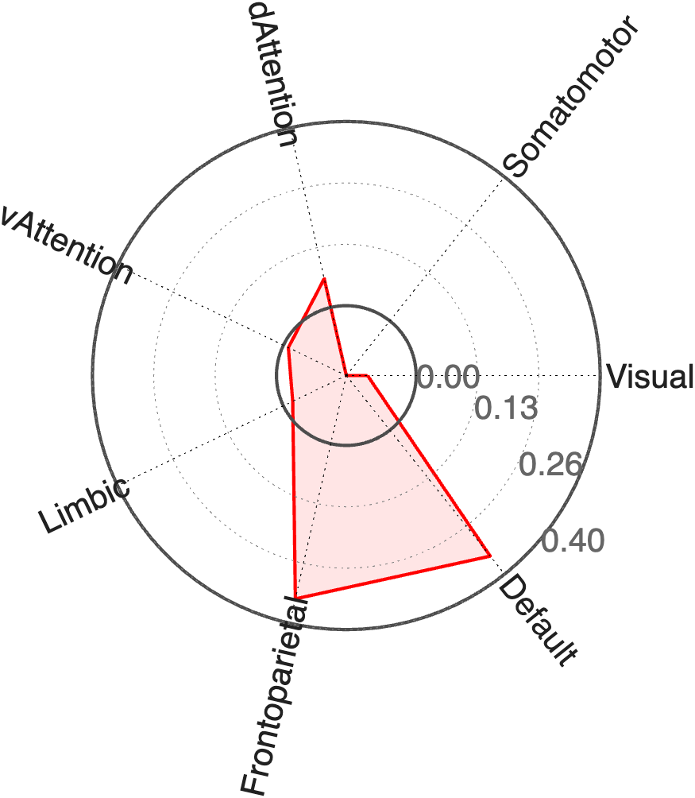

# `fmri_data.image_similarity_plot_bucknermaps` — wedge plot vs. Buckner cortical networks

[← back to `fmri_data` methods](../fmri_data_methods.md) ·
[Object methods index](../Object_methods.md)

Convenience wrapper around `image_similarity_plot` that compares an
`fmri_data` (single image, signature, or stack of contrasts) against the
seven Buckner-Lab cortical resting-state networks (Yeo et al. 2011) and
renders a polar / wedge plot. Use it to ask *"which large-scale cortical
networks does my map load on?"*

## Quick example

```matlab
imgs = load_image_set('emotionreg');
t = ttest(imgs);
stats = image_similarity_plot_bucknermaps(t);
```



## See also

- [`image_similarity_plot`](fmri_data_image_similarity_plot.md) — the underlying engine
- [`hansen_neurotransmitter_maps`](fmri_data_hansen_neurotransmitter_maps.md) — same idea for PET tracer maps
- [`wedge_plot_by_atlas`](fmri_data_wedge_plot_by_atlas.md) — wedge plot driven by an atlas you choose
