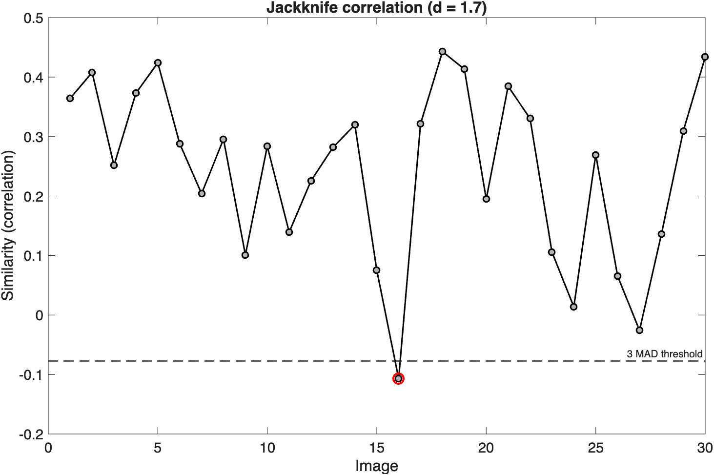
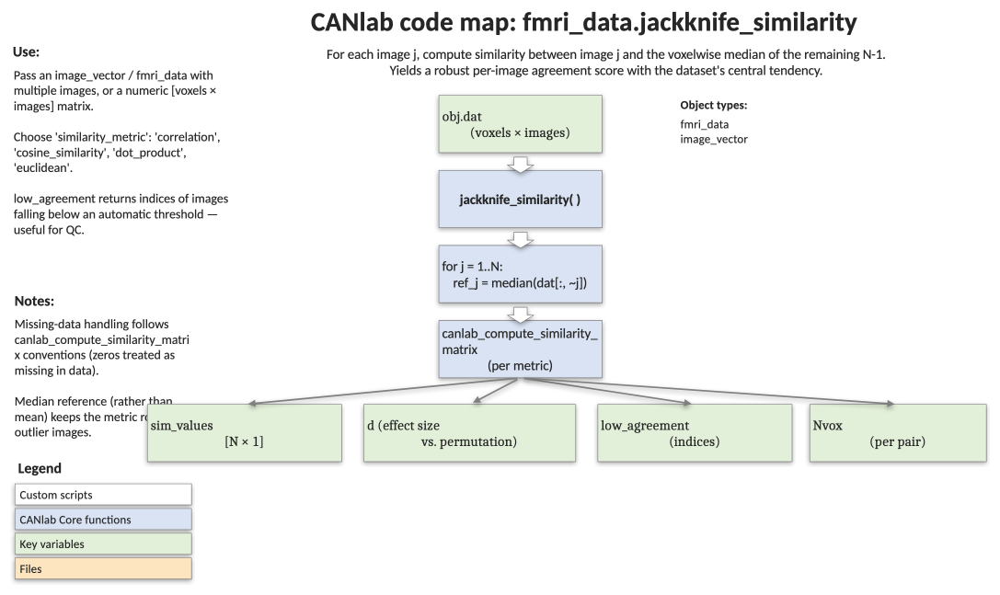

# `fmri_data.jackknife_similarity` — leave-one-out similarity of each image to the group reference

[← back to `fmri_data` methods](../fmri_data_methods.md) ·
[Object methods index](../Object_methods.md) ·
[Recasting objects](../recasting_objects.md)

For each image `j`, compute the spatial similarity between image `j` and
the voxelwise median of the **other** images. This gives a robust,
out-of-sample measure of how typical each image is — useful for outlier
detection, second-level QC, and quantifying overall agreement in a stack
of contrast maps. Supports nine similarity metrics (correlation, cosine,
dot product, Dice, Bray–Curtis, Lin's CCC, plus three normalized
deviation metrics that decompose pattern, mean, and scale shifts) and
returns a Cohen's-d effect size for the group as a whole.

## Quick example

```matlab
imgs = load_image_set('emotionreg');
[sim_values, d, low_agreement, Nvox] = jackknife_similarity(imgs, ...
    'similarity_metric', 'correlation', 'doplot', true);
```



## Code map



[Editable PowerPoint version](../code_maps_pptx/fmri_data_jackknife_similarity_codemap.pptx)

## Usage

```matlab
[sim_values, d, low_agreement, Nvox] = jackknife_similarity(obj, varargin)
```

The reference image for image `j` is `median(dat(:, setdiff(1:k, j)), 2)`.
The chosen `similarity_metric` is then evaluated between image `j` and
that reference.

## Inputs

| Argument | Type | Description |
|---|---|---|
| `obj` | `image_vector` (e.g. `fmri_data`) or numeric `[voxels × images]` | Data to evaluate. |
| `'similarity_metric'` | string, default `'correlation'` | One of `'correlation'`, `'cosine_similarity'`, `'dot_product'`, `'dice'`, `'normalized_absolute_agreement'` (Bray–Curtis), `'concordance_correlation'` (Lin's CCC), `'standardized_abs_deviation'`, `'mean_shift_z'`, `'scale_shift_z'`. See "Metrics" below. |
| `'treat_zero_as_data'` | logical, default `false` | Treat zeros as valid data instead of missing values. Forced `true` for `'dice'`. |
| `'complete_cases'` | logical, default `false` | Restrict to voxels that are valid in *all* images (rather than pairwise relative to the reference). |
| `'doplot'` / `'plot'` | logical / flag | Plot per-image similarity with low-agreement images highlighted and the 3-MAD threshold drawn. |
| `'verbose'` / `'noverbose'` | logical / flag | Print summary text including `d` and any flagged outliers. Default verbose. |

### Metrics at a glance

| Metric | Sensitive to | Insensitive to | Range |
|---|---|---|---|
| `correlation` | pattern noise | mean / scale shifts (per image and global) | `[-1, 1]` |
| `cosine_similarity` | pattern noise, image-level mean shifts | — | `[-1, 1]` |
| `dot_product` | pattern, magnitude, scale | — | unbounded |
| `dice` | spatial overlap of binary maps | magnitude | `[0, 1]` |
| `normalized_absolute_agreement` (Bray–Curtis) | absolute voxel-value differences, intensity | — | `[0, 1]` (signed: `~[-1, 1]`) |
| `concordance_correlation` | pattern, mean, and scale agreement | — | `[-1, 1]` |
| `standardized_abs_deviation` | pattern noise + per-image mean / scale shifts | — | `(0, 1]` |
| `mean_shift_z` | global mean shift per image | scale, pattern | `(0, 1]` |
| `scale_shift_z` | within-image scale per image | mean, pattern | `(0, 1]` |

`standardized_abs_deviation`, `mean_shift_z`, and `scale_shift_z`
normalize by the mean within-image MAD (a global within-image scale),
so the resulting numbers are comparable across datasets without absorbing
structured noise.

## Outputs

| Output | Type | Description |
|---|---|---|
| `sim_values` | `[k × 1]` | Similarity of each image to the median of the rest. |
| `d` | scalar | Cohen's d for the group: `mean(sim_values) / std(sim_values)`. Higher = better agreement. Random noise yields `d ≈ 0`. (For bounded metrics this is a "pseudo-d" — interpret with care.) |
| `low_agreement` | `[k × 1]` logical | Images whose similarity is more than 3 MAD below the median. Candidate outliers. |
| `Nvox` | `[k × 1]` | Voxels used for each comparison (after missing-data handling). |

## Notes

- The reference is recomputed for each image, so each comparison is
  out-of-sample (no circularity).
- Pre-flight check: any image with zero L1 norm or only NaN/zero voxels
  causes an early error — fix or drop those before calling.
- `'dice'` requires binary 0/1 maps and forces `treat_zero_as_data` on.
- **Recommendation for participant-level contrast images entering group
  analysis:** prefer `standardized_abs_deviation` as a single summary
  (sensitive to pattern noise, location shifts, and scale shifts);
  `cosine_similarity` is a reasonable second choice. The trio
  `correlation`, `mean_shift_z`, `scale_shift_z` provides an orthogonal
  decomposition of agreement into pattern, location, and scale
  components.
- Group effect size for `correlation` should be interpreted with
  caution — global pattern noise can deflate within-group variance and
  *inflate* d.

## Example

```matlab
% Jackknife agreement on the emotion-regulation sample
obj = load_image_set('emotionreg');

% Default (correlation), with summary output
[sim_values, d, low_agreement, Nvox] = jackknife_similarity(obj);

% Diagnostic plot highlighting outliers
jackknife_similarity(obj, 'plot');

% Robust agreement metric, recommended for contrast images
sim_sad = jackknife_similarity(obj, ...
    'similarity_metric', 'standardized_abs_deviation', 'plot');
```

## Other examples

```matlab
% Cosine similarity, treating zeros as data
sim_cos = jackknife_similarity(obj, ...
    'similarity_metric', 'cosine_similarity', 'treat_zero_as_data', true);

% Decompose agreement into pattern, mean, and scale components
sim_corr  = jackknife_similarity(obj, 'similarity_metric', 'correlation');
sim_mean  = jackknife_similarity(obj, 'similarity_metric', 'mean_shift_z');
sim_scale = jackknife_similarity(obj, 'similarity_metric', 'scale_shift_z');
```

## See also

- [`fmri_data.qc_metrics_second_level`](fmri_data_qc_metrics_second_level.md) — group-level QC battery; complements outlier detection
- [`fmri_data.normalize_gm_by_wm_csf`](fmri_data_normalize_gm_by_wm_csf.md) — corrects scale heterogeneity flagged by jackknife metrics
- [`fmri_data.descriptives`](fmri_data_descriptives.md) — per-image summary statistics
- [`fmri_data` methods](../fmri_data_methods.md) — full method index
