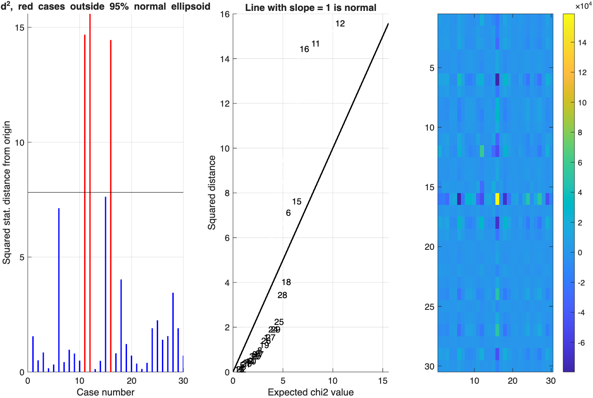

# `fmri_data.mahal` — Mahalanobis distance per image vs. the group

[← back to `fmri_data` methods](../fmri_data_methods.md) ·
[Object methods index](../Object_methods.md)

Compute the Mahalanobis distance of each image from the group centroid in
the principal-component subspace, return expected distances under
multivariate normality, and flag potential outliers (uncorrected and
Bonferroni-corrected). Used as a building block by
[`outliers`](fmri_data_outliers.md) and by 2nd-level QC.

## Quick example

```matlab
imgs = load_image_set('emotionreg');
[ds, expectedds, p, wh_outlier_uncorr, wh_outlier_corr] = mahal(imgs);
```



## See also

- [`fmri_data.outliers`](fmri_data_outliers.md) — combined-criterion outlier detection that uses `mahal`
- [`fmri_data.qc_metrics_second_level`](fmri_data_qc_metrics_second_level.md) — QC metrics for a 2nd-level dataset
- `multivar_dist` — the underlying multivariate-distance helper
