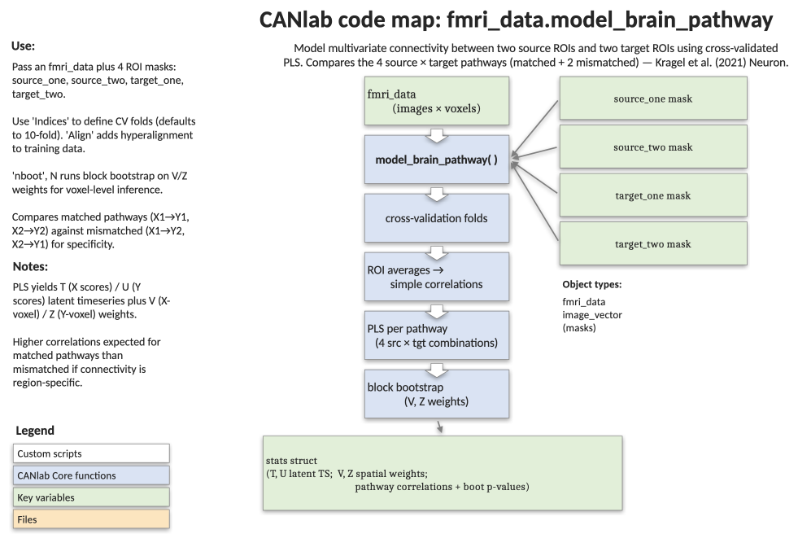

# `fmri_data.model_brain_pathway` — multivariate pathway connectivity (4-pathway design)

[← back to `fmri_data` methods](../fmri_data_methods.md) ·
[Object methods index](../Object_methods.md) ·
[Recasting objects](../recasting_objects.md)

Test multivariate pathway-level connectivity between two pairs of brain
regions using cross-validated Partial Least Squares regression. Designed
to test whether *two* hypothesised "on-target" pathways
(`X1→Y1`, `X2→Y2`) are more strongly coupled than the corresponding
"off-target" pathways (`X1→Y2`, `X2→Y1`). Returns simple ROI-average
connectivity for comparison, latent-correlation strength, voxel-level
weight maps, and (optionally) bootstrap inference. This is the original
implementation from Kragel et al. (2021, Neuron); see
[`model_mpathi`](fmri_data_model_mpathi.md) for a streamlined
single-pathway version.

## Code map



[Editable PowerPoint version](../code_maps_pptx/fmri_data_model_brain_pathway_codemap.pptx)

## Usage

```matlab
stats = model_brain_pathway(obj, source_one, source_two, ...
                            target_one, target_two, varargin)
```

## Inputs

| Argument | Type | Description |
|---|---|---|
| `obj` | `fmri_data` | Image series (single-trial betas, time series, etc.) — `images = trials/timepoints`. |
| `source_one` | `fmri_data` | Binary mask defining source region X1. |
| `source_two` | `fmri_data` | Binary mask defining source region X2. |
| `target_one` | `fmri_data` | Binary mask defining target region Y1. |
| `target_two` | `fmri_data` | Binary mask defining target region Y2. |
| `'plot'` | flag | Bar plot of pathway strengths (simple correlations + latent correlations). |
| `'names', {...}` | cellstr | Pathway labels, e.g. `{'Path1' 'Offtarget1' 'Offtarget2' 'Path2'}`. |
| `'nboot', N` | int | Number of block-bootstrap samples for voxel-wise inference on `Z` and `V` weight maps. |
| `'Indices', v` | int vector | `n_obs × 1` block IDs (typically subject IDs). Used both for cross-validation holdouts and for block bootstrap. Default: 10-fold via `crossvalind`. |
| `'Align'` | flag | Hyperalign training data across subjects (requires `'Indices'`). |
| `'noroi'` | flag | Don't return masked ROI data in `stats` (smaller output). |

## Outputs

`stats` is a structure with:

| Field | Type | Description |
|---|---|---|
| `simple_correlations` | `[fold × 4]` | Cross-validated correlations using region averages. Cols = `X1→Y1`, `X2→Y1`, `X1→Y2`, `X2→Y2`. |
| `latent_correlations` | `[fold × 4]` | Cross-validated correlations between PLS-optimised latent timeseries `T_hat` and `U_hat` (on / off / off / on). |
| `latent_timeseries_source`, `latent_timeseries_target` | `[n_obs × 4]` | Predicted latent timeseries for source (T_hat) and target (U_hat) regions, one column per pathway. |
| `path1_overall_xval_r`, `path2_overall_xval_r` | scalar | Correlation of source/target latent timeseries across all held-out data. |
| `path1_overall_xval_dot`, `path2_overall_xval_dot` | scalar | Dot product equivalents. |
| `latent_correlation_interaction_ttest` | struct | T-test on Fisher-z latent correlations: contrast `[1 -1 -1 1]` (on > off across both pathways). |
| `simple_correlation_interaction_ttest` | struct | Same contrast for ROI-average correlations. |
| `latent_correlation_pathway_one_ttest`, `latent_correlation_pathway_two_ttest` | struct | Per-pathway on vs. off contrasts (latent). |
| `simple_correlation_pathway_one_ttest`, `simple_correlation_pathway_two_ttest` | struct | Per-pathway on vs. off contrasts (simple). |
| `Z_pathway_one`, `Z_pathway_four` | `[voxels × 1]` | Whole-sample source weights (X-side) for paths 1 and 2. |
| `V_pathway_one`, `V_pathway_four` | `[voxels × 1]` | Whole-sample target weights (Y-side) for paths 1 and 2. |
| `T_pathway_one`, `U_pathway_one`, `T_pathway_four`, `U_pathway_four` | vectors | Whole-sample latent scores. |
| `PLS_bootstrap_stats_Z`, `PLS_bootstrap_stats_V` | `statistic_image(2)` | Bootstrap voxel-level inference (only with `'nboot'`); index `(1)` is path 1, `(2)` is path 2. |
| `source_one_obj`, `source_two_obj`, `target_one_obj`, `target_two_obj` | `fmri_data` | Resampled, masked ROI data (omitted with `'noroi'`). |
| `pathwaynames` | cellstr | Labels passed in via `'names'`. |
| `pathway_sign` | `[1 × 4]` | Sign flips applied for orientation consistency. |
| `stats_report` | char | Human-readable narrative summary. |

## Notes

- Pathway 1 = `X1 ↔ Y1` and Pathway 2 = `X2 ↔ Y2`; the interaction
  contrast `[1 -1 -1 1]` is the canonical on-target > off-target test.
- For multi-subject data, **always** pass `'Indices'` so the
  cross-validation respects subject groupings (otherwise images from
  the same subject leak across folds) and so block bootstrap blocks are
  whole subjects.
- Latent variable signs are flipped to align with the mean source-region
  signal (`pathway_sign`), enabling consistent interpretation of weight
  maps across folds.
- `Z = pinv(X) * U` (source voxels × 1, predicting target latents) and
  `V = pinv(Y) * T` (target voxels × 1, predicting source latents).
- Reference: Kragel et al. (2021), *Neuron*. See also
  `canlab_help_MPathI_multivariate_pathway.mlx` walkthrough.

## Example: thalamic vs. brainstem inputs to amygdala / insula (BMRK3 toy data)

```matlab
% Multi-subject single-trial pain dataset (toy size, 6 images per subject)
imgs = load_image_set('bmrk3');

% Define ROIs from canlab2018_2mm
atlas_obj = load_atlas('canlab2018_2mm');
vpl   = select_atlas_subset(atlas_obj, {'VPL'},          'flatten');
pbn   = select_atlas_subset(atlas_obj, {'pbn'},          'flatten');
cea   = select_atlas_subset(atlas_obj, {'Amygdala_CM'},  'flatten');
dpins = select_atlas_subset(atlas_obj, {'Ig'},           'flatten');

% Subject IDs are needed for proper CV / bootstrap blocking
indx = imgs.additional_info.subject_id;

% Path 1: VPL → dpIns,  Path 2: PBN → CeA
stats = model_brain_pathway(imgs, vpl, pbn, dpins, cea, ...
    'Indices', indx, 'plot', ...
    'names', {'vpl->dpins' 'pbn->dpins' 'vpl->cea' 'pbn->cea'});

% Compare ROI-average vs. multivariate-pathway connectivity
disp(stats.stats_report);

% With voxel-wise bootstrap inference on the weight maps:
stats = model_brain_pathway(imgs, vpl, pbn, dpins, cea, ...
    'Indices', indx, 'nboot', 1000);

montage(threshold(stats.PLS_bootstrap_stats_Z(1), .005, 'unc'));
```

## See also

- [`fmri_data.model_mpathi`](fmri_data_model_mpathi.md) — single-pathway streamlined version
- [`fmri_data.predict`](fmri_data_predict.md) — cross-validated multivariate prediction
- [`fmri_data.regress`](fmri_data_regress.md) — voxelwise multiple regression
- [`fmri_data.canlab_connectivity_preproc`](fmri_data_canlab_connectivity_preproc.md) — connectivity-prep pipeline (despike / nuisance / bandpass)
- [`brainpathway` methods](../brainpathway_methods.md) — class-based pathway / connectivity modelling
