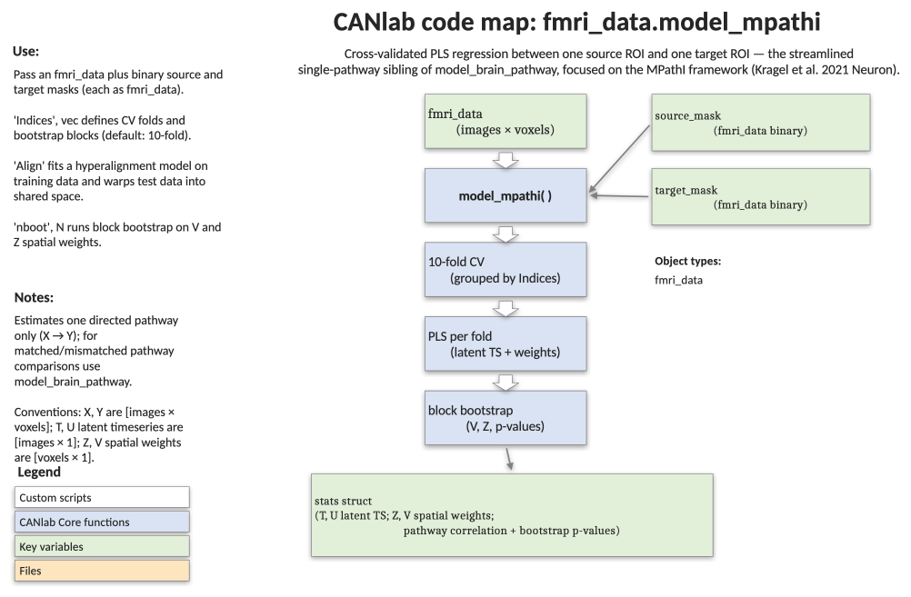

# `fmri_data.model_mpathi` — multivariate pathway interaction (single source/target)

[← back to `fmri_data` methods](../fmri_data_methods.md) ·
[Object methods index](../Object_methods.md) ·
[Recasting objects](../recasting_objects.md)

Estimate cross-validated multivariate pathway-level connectivity (MPathI)
between **one** source region and **one** target region using PLS
regression. A streamlined, single-pathway descendant of
[`model_brain_pathway`](fmri_data_model_brain_pathway.md) — same
underlying math (find latent population activity in each ROI whose
timeseries covary maximally), but no four-pathway on/off-target
contrast. Use this when you simply want a multivariate analogue of ROI
functional connectivity for a hypothesised X→Y pathway.

## Code map



[Editable PowerPoint version](../code_maps_pptx/fmri_data_model_mpathi_codemap.pptx)

## Usage

```matlab
stats = model_mpathi(obj, source_mask, target_mask, ...
    'Indices', wh_subject, 'nboot', 1000, 'plot')
```

Conventions:

- `X`, `Y`: `[images × voxels]`
- `T`, `U`: `[images × 1]` latent timeseries (source / target)
- `Z`, `V`: `[voxels × 1]` spatial weights (source / target)

## Inputs

| Argument | Type | Description |
|---|---|---|
| `obj` | `fmri_data` | Image series (single-trial betas, time series, etc.). |
| `source_mask` | `fmri_data` | Binary mask defining the source region X. |
| `target_mask` | `fmri_data` | Binary mask defining the target region Y. |
| `'Indices', v` | int vector | `n_images × 1` block IDs (e.g. subject ID). Used for cross-validation folds and bootstrap blocks. Default: 10-fold via `crossvalind`. |
| `'Align'` | flag | Hyperalign training data across subjects (requires `'Indices'`). |
| `'nboot', N` | int | Number of block-bootstrap samples for voxelwise inference on `Z` and `V`. |
| `'plot'` | flag | Bar plot of cross-validated latent correlations per fold. |
| `'noroi'` | flag | Don't return masked ROI data in `stats` (smaller output). |

## Outputs

`stats` is a structure with:

| Field | Type | Description |
|---|---|---|
| `xval.latent_correlations` | vector | `corr(T_hat, U_hat)` per cross-validation fold. |
| `xval.T_latent_timeseries` | vector | Predicted source latent timeseries (held-out, full length). |
| `xval.U_latent_timeseries` | vector | Predicted target latent timeseries (held-out, full length). |
| `xval.whfolds` | vector | Fold assignment used. |
| `overall_xval_r` | scalar | Correlation of T_hat and U_hat across all held-out data — the primary pathway-strength index. |
| `overall_xval_dot` | scalar | Dot product of T_hat and U_hat across all held-out data. |
| `whole.T_latent_timeseries` | vector | Whole-sample source latent timeseries. |
| `whole.U_latent_timeseries` | vector | Whole-sample target latent timeseries. |
| `whole.Z_weights` | `[voxels × 1]` | Whole-sample source voxel weights (`pinv(X) * U`). |
| `whole.V_weights` | `[voxels × 1]` | Whole-sample target voxel weights (`pinv(Y) * T`). |
| `pathway_sign` | scalar | Sign flip applied to align latents with mean source signal. |
| `PLS_bootstrap_stats_Z` | `statistic_image` | Source-side bootstrap inference (only with `'nboot'`). |
| `PLS_bootstrap_stats_V` | `statistic_image` | Target-side bootstrap inference (only with `'nboot'`). |
| `source_obj`, `target_obj` | `fmri_data` | Resampled, masked ROI data (omitted with `'noroi'`). |

## Notes

- The primary pathway-strength index is `stats.overall_xval_r`. The
  per-fold values in `stats.xval.latent_correlations` are useful for
  diagnostics or as second-level summary statistics across subjects.
- Latent variable signs are sign-indeterminate in PLS; the function
  flips them so the source latent positively correlates with the mean
  source-region signal. The same flip is applied consistently across
  cross-validation folds and the whole-sample model.
- For multi-subject data, **always** pass `'Indices'` so cross-validation
  respects subject grouping. Block bootstrap also resamples subjects.
- Whole-sample weight maps should be interpreted descriptively unless
  supported by `'nboot'` bootstrap inference.
- Reference: Kragel et al. (2021), *Neuron*.

## Example: VPL → dorsoposterior insula MPathI on the BMRK3 toy data

```matlab
% Multi-subject single-trial pain images (6 per subject)
imgs = load_image_set('bmrk3');

% Define ROIs
atlas_obj = load_atlas('canlab2018_2mm');
vpl   = select_atlas_subset(atlas_obj, {'VPL'}, 'flatten');
dpins = select_atlas_subset(atlas_obj, {'Ig'},  'flatten');

% Subject IDs for proper CV/bootstrap blocking
indx = imgs.additional_info.subject_id;

% Single-pathway MPathI with voxelwise bootstrap inference and a plot
stats = model_mpathi(imgs, vpl, dpins, ...
    'Indices', indx, 'nboot', 1000, 'plot');

fprintf('Overall held-out latent r = %.3f\n', stats.overall_xval_r);

% Visualise voxel-level source weights, thresholded
montage(threshold(stats.PLS_bootstrap_stats_Z, .005, 'unc'));
```

## See also

- [`fmri_data.model_brain_pathway`](fmri_data_model_brain_pathway.md) — original four-pathway implementation
- [`fmri_data.predict`](fmri_data_predict.md) — cross-validated multivariate prediction
- [`fmri_data.regress`](fmri_data_regress.md) — voxelwise multiple regression
- [`fmri_data.canlab_connectivity_preproc`](fmri_data_canlab_connectivity_preproc.md) — connectivity-prep pipeline
- [`brainpathway` methods](../brainpathway_methods.md) — class for connectivity / pathway modelling
