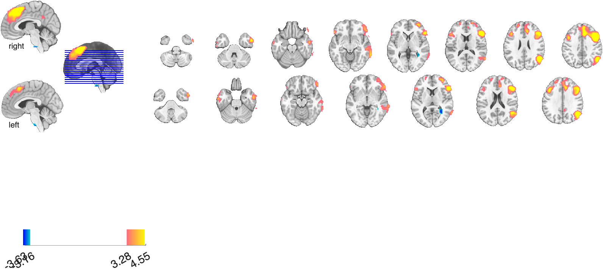

# `fmri_data.montage` — slice montage on a canonical anatomical underlay

[← back to `fmri_data` methods](../fmri_data_methods.md) ·
[Object methods index](../Object_methods.md)

Render an `fmri_data` / `statistic_image` / `image_vector` as a slice
montage with anatomical underlay and optional colorbar. The fastest way
to look at a results map. Returns an `fmridisplay` object whose handles
you can reuse to swap blob layers in and out without redrawing the
anatomy.

## Quick example

```matlab
imgs = load_image_set('emotionreg');
t = ttest(imgs);
t = threshold(t, .005, 'unc', 'k', 10);
create_figure('m'); axis off; montage(t);
```



## See also

- [`canlab_results_fmridisplay`](canlab_results_fmridisplay.md) — pre-built montage layouts (`'full'`, `'compact'`, `'multirow'`)
- [`fmri_data.surface`](fmri_data_surface.md) — render on cortical surfaces instead
- [`fmri_data.orthviews`](fmri_data_orthviews.md) — interactive SPM orthviews
