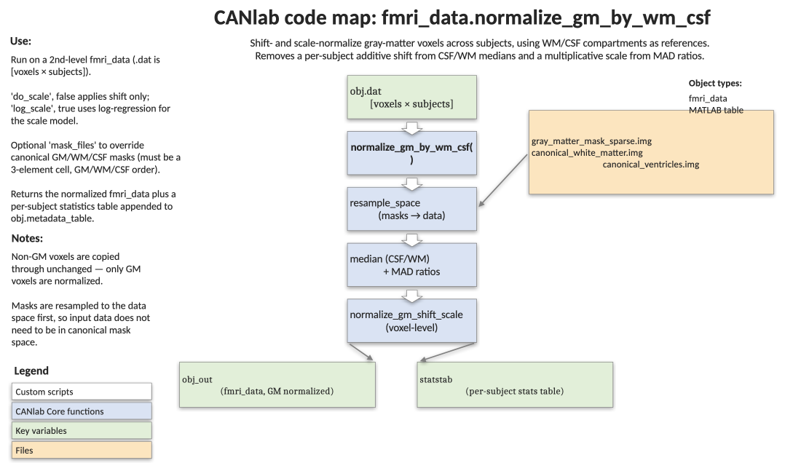

# `fmri_data.normalize_gm_by_wm_csf` — shift- and scale-normalize GM voxels using WM/CSF references

[← back to `fmri_data` methods](../fmri_data_methods.md) ·
[Object methods index](../Object_methods.md) ·
[Recasting objects](../recasting_objects.md)

Reduce between-subject heterogeneity in contrast/beta images by removing a
subject-specific additive shift (estimated from CSF/WM medians) and a
subject-specific multiplicative scale (estimated from MADs in GM, WM, and
CSF). Returns an `fmri_data` object with **only GM voxels modified** and a
table of every per-subject statistic for downstream QC. Use it when group
analyses are noisy because subjects sit on different intensity scales — for
example before group t-tests or pattern expression in heterogeneous
datasets.

## Code map



[Editable PowerPoint version](../code_maps_pptx/fmri_data_normalize_gm_by_wm_csf_codemap.pptx)

## Usage

```matlab
[obj_out, statstab] = normalize_gm_by_wm_csf(obj)
[obj_out, statstab] = normalize_gm_by_wm_csf(obj, ...
    'do_scale', true, 'log_scale', false, 'trim_pct', 5, ...
    'mask_files', masks_cell)
```

The function:

1. Resamples canonical GM, WM, and CSF masks to the object's space.
2. Removes a per-subject additive shift estimated from CSF and WM medians.
3. Estimates a per-subject multiplicative scale from MADs in GM, WM, and
   CSF (linear or log-linear regression).
4. Applies shift + scale only to GM voxels; non-GM voxels are returned
   unchanged.

## Inputs

| Argument | Type | Description |
|---|---|---|
| `obj` | `fmri_data` | Input data. `.dat` is `[V × S]` (V voxels, S subjects/images). |
| `'do_scale'` | logical, default `true` | If `false`, only shift-normalize (skip the multiplicative scale step). |
| `'log_scale'` | logical, default `false` | If `true`, fit `log(r_GM) ~ log(r_CSF) + log(r_WM)` instead of the linear model `r_GM ~ r_CSF + r_WM`. |
| `'trim_pct'` | scalar, default `5` | Percentage trimmed from each tail when estimating tissue medians and MADs. Must be in `[0, 50)`. |
| `'mask_files'` | `1×3` cellstr | Paths (or bare names resolved by `which`) for GM, WM, CSF masks. Defaults to `{'gray_matter_mask_sparse.img', 'canonical_white_matter.img', 'canonical_ventricles.img'}`. |

## Outputs

| Output | Type | Description |
|---|---|---|
| `obj_out` | `fmri_data` | Same shape as `obj`. GM voxels normalized; non-GM voxels copied unchanged. `metadata_table` is the input table with all per-subject stats appended. |
| `statstab` | `table`, S rows | Every value from the internal `STATS` struct as one or more columns: per-subject shifts, scales, regression coefficients, etc. |

## Notes

- The method does **not** subset to GM. The output keeps the full spatial
  geometry of the input and only modifies GM voxels in `.dat`. To
  hard-mask to GM, follow with `apply_mask` against the GM mask.
- All masks are resampled to the data object's space using
  nearest-neighbour interpolation, so binarity is preserved.
- If `obj.metadata_table` already has S rows it is concatenated with the
  stats table; if it is missing or has the wrong height, `statstab` is
  used directly and a warning is issued.
- For the underlying voxel-level routine, see `normalize_gm_shift_scale`.

## Example

```matlab
% Compare a t-test before and after GM-by-WM/CSF normalization
imgs = load_image_set('emotionreg');

t = ttest(imgs);
histogram(t); set(gcf, 'Tag', 'unnormalized');

imgs_norm = normalize_gm_by_wm_csf(imgs);
t2 = ttest(imgs_norm);
histogram(t2);

% Voxelwise comparison of t-values
figure; plot(t.dat, t2.dat, '.');
hold on; plot([-10 10], [-10 10], '--', 'Color', 'k');
xlabel('t before normalization'); ylabel('t after normalization');
```

## Other examples

```matlab
% Shift only (skip the scale correction)
obj_shift_only = normalize_gm_by_wm_csf(imgs, 'do_scale', false);

% Log-linear scale model with heavier trimming
obj_log = normalize_gm_by_wm_csf(imgs, 'log_scale', true, 'trim_pct', 10);

% Inspect per-subject normalization parameters
[~, stat] = normalize_gm_by_wm_csf(imgs);
head(stat)
```

## See also

- [`fmri_data.extract_gray_white_csf`](fmri_data_extract_gray_white_csf.md) — pull GM/WM/CSF summaries underlying the model
- [`fmri_data.qc_metrics_second_level`](fmri_data_qc_metrics_second_level.md) — second-level QC that flags exactly the heterogeneity this routine corrects
- [`fmri_data.rescale`](fmri_data_rescale.md) — alternative intensity normalization (windsorize, z-score, etc.)
- [`fmri_data.ttest`](fmri_data_ttest.md) — what you typically run after normalization
