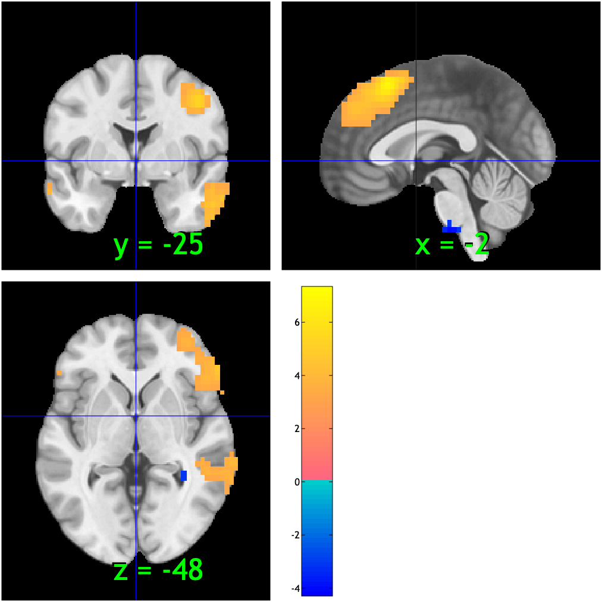

# `fmri_data.orthviews` — interactive SPM-style orthogonal views

[← back to `fmri_data` methods](../fmri_data_methods.md) ·
[Object methods index](../Object_methods.md)

Open an SPM-style three-pane orthogonal viewer (axial / coronal /
sagittal) on an `fmri_data` / `statistic_image`. Click anywhere to move
the crosshair. Useful for browsing a results map at high resolution and
for grabbing peak coordinates interactively.

## Quick example

```matlab
imgs = load_image_set('emotionreg');
t = ttest(imgs);
t = threshold(t, .005, 'unc', 'k', 10);
orthviews(t);
```



## See also

- [`fmri_data.montage`](fmri_data_montage.md) — non-interactive slice montage
- [`fmri_data.surface`](fmri_data_surface.md) — cortical-surface rendering
- `spm_orthviews` — the underlying SPM viewer (configurable colormap and underlay)
