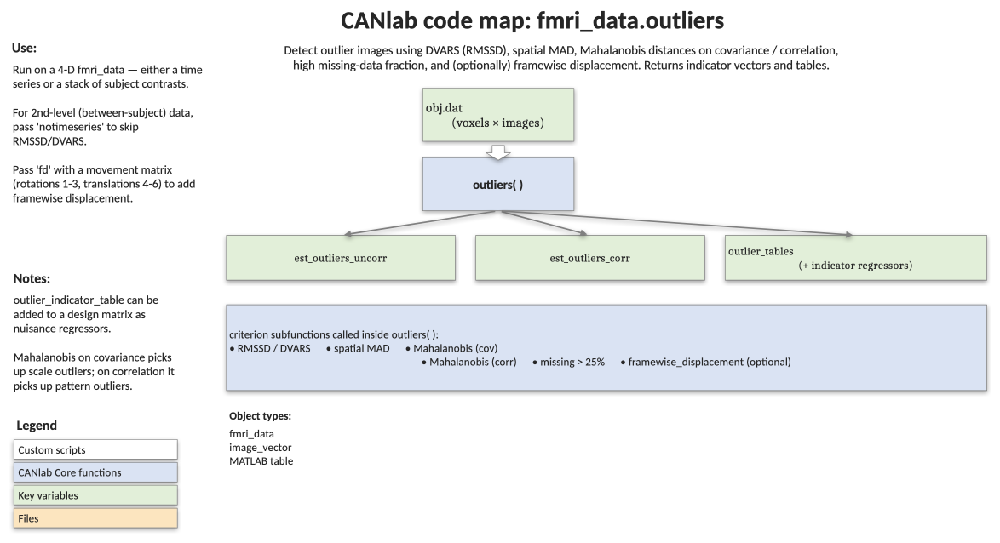

# `fmri_data.outliers` — flag artefactual images and build nuisance regressors

[← back to `fmri_data` methods](../fmri_data_methods.md) ·
[Object methods index](../Object_methods.md) ·
[Recasting objects](../recasting_objects.md)

Identify images that look like outliers across a battery of complementary
criteria — global mean, global-mean-to-variance, spatial robust SD, RMSSD
(DVARS), Mahalanobis distance on covariance and correlation, missing-data
fraction, and (optionally) framewise displacement. Returns logical
indicators at uncorrected and corrected thresholds plus a tidy set of
tables suitable for inclusion as nuisance regressors in a first- or
second-level GLM.

## Code map



[Editable PowerPoint version](../code_maps_pptx/fmri_data_outliers_codemap.pptx)

## Usage

```matlab
[est_outliers_uncorr, est_outliers_corr, outlier_tables] = outliers(dat, ...)
```

Use `'notimeseries'` for second-level / contrast / beta-series datasets
where successive-difference metrics like DVARS are not meaningful.

## Inputs

| Argument | Type | Description |
|---|---|---|
| `dat` | `fmri_data` / `image_vector` | The image set to assess. `dat.dat` is `[voxels × images]`. |
| `'madlim', m` | numeric | Robust z-score limit for global means / spatial-MAD / RMSSD. Default `3`. |
| `'noverbose'` | flag | Suppress the printed summary table. |
| `'noplot'` | flag | Suppress the default outlier-score plot. |
| `'fullplot'` | flag | Plot each criterion in its own subplot instead of the brief overlay. |
| `'notimeseries'` | flag | Skip RMSSD / DVARS — use for second-level or trial-beta datasets. |
| `'fd', mvmt_mtx` | `[images × 6]` | Movement matrix for `framewise_displacement`. **Rotations must be the first three columns, then translations.** |
| `'fd_thresh', mm` | numeric | Framewise-displacement cutoff in mm (default `0.5`). |

## Outputs

| Output | Type | Description |
|---|---|---|
| `est_outliers_uncorr` | logical column | Outliers at uncorrected thresholds (any criterion flags the image). |
| `est_outliers_corr` | logical column | Outliers at corrected thresholds (more conservative; uses `q < .05` corrected Mahalanobis). |
| `outlier_tables` | struct | See fields below. |

`outlier_tables` fields:

| Field | Description |
|---|---|
| `outlier_indicator_table` | MATLAB `table` of logical columns, one per criterion: global mean, global-mean-to-variance, missing values, RMSSD/DVARS, spatial variability, Mahalanobis cov / corr (uncorrected and corrected), optionally `fd`, plus `Overall_uncorrected` and `Overall_corrected`. |
| `score_table` | Continuous score per criterion (robust z scores, RMSSD, Mahalanobis distances). |
| `summary_table` | Counts and percentages of flagged images per criterion. |
| `est_outliers_uncorr` / `est_outliers_corr` | Same as the function outputs. |
| `outlier_regressor_matrix_uncorr` / `outlier_regressor_matrix_corr` | Indicator matrices for direct use as nuisance regressors (one column per flagged image, no intercept). |

## Notes

- The Mahalanobis criteria use both the covariance and correlation
  matrices via [`mahal`](../image_vector_methods.md), so an image can be
  flagged for unusual scale, unusual pattern, or both.
- "Corrected" criteria use the FDR-style threshold from `mahal` plus the
  same MAD-based limits as the uncorrected version on the univariate
  metrics — i.e. corrected here means *less* sensitive, not more.
- Append `outlier_regressor_matrix_uncorr` (or its corrected sibling) to
  your design matrix to scrub flagged volumes / images out of subsequent
  GLMs.
- For first-level fMRI denoising, prefer the time-series mode (default).
  For multi-study or trial-beta datasets, pass `'notimeseries'`.

## Example: outlier QC on a multi-study dataset

```matlab
% Heterogeneous multi-study dataset — rescale per image, then flag outliers
obj  = load_image_set('kragel18_alldata');
obj2 = rescale(obj, 'l2norm_images');

[est_outliers_uncorr, est_outliers_corr, outlier_tables] = ...
    outliers(obj2, 'notimeseries');

% Inspect criterion-level summary
disp(outlier_tables.summary_table);

% Drop flagged images before downstream analysis
keep = ~est_outliers_corr;
obj2 = get_wh_image(obj2, find(keep));
```

## Other examples

```matlab
% Time-series QC with framewise-displacement flag at 0.4 mm
[unc, corr, tab] = outliers(ts_obj, 'fd', mvmt_mtx, 'fd_thresh', 0.4);

% Concatenate condition images from a CANlab 2nd-level batch script run,
% then flag subjects with any outlier
load('data_objects.mat')                % Loads DATA_OBJ
load('image_names_and_setup.mat');      % Loads DAT
obj = cat(DATA_OBJ{:});
[unc, corr, tab] = outliers(obj, 'notimeseries');
```

## See also

- [`fmri_data.descriptives`](fmri_data_descriptives.md) — full coverage / summary report (called internally for missing-value detection)
- [`fmri_data.pca`](fmri_data_pca.md) — unsupervised look at structure remaining after outlier removal
- [`fmri_data.regress`](fmri_data_regress.md) — feed `outlier_regressor_matrix_*` columns into the design matrix
- [`image_vector` methods](../image_vector_methods.md) — `mahal`, `rescale`, and other prep methods
