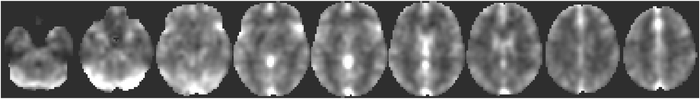
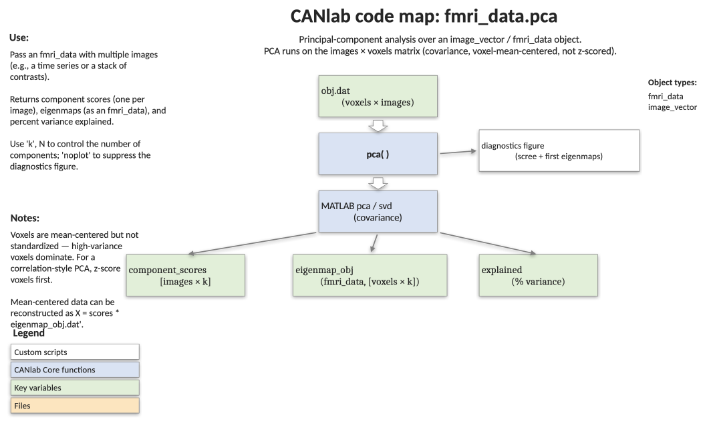

# `fmri_data.pca` — principal components decomposition of an image set

[← back to `fmri_data` methods](../fmri_data_methods.md) ·
[Object methods index](../Object_methods.md) ·
[Recasting objects](../recasting_objects.md)

Principal components analysis on the `[images × voxels]` matrix
(`obj.dat'`). Returns image-level scores, an image-vector / `fmri_data`
object whose images are the eigenmaps (canonical brain patterns), and the
variance explained by each component. Useful for unsupervised exploration,
denoising, and as a precursor to PCR / ICA pipelines.

## Quick example

```matlab
imgs = load_image_set('emotionreg');
[scores, eigenmap_obj, explained] = pca(imgs, 'k', 5);
```



## Code map



[Editable PowerPoint version](../code_maps_pptx/fmri_data_pca_codemap.pptx)

## Usage

```matlab
[component_scores, eigenmap_obj, explained] = pca(obj, ['noplot'], ['k', num_components])
```

Voxels are mean-centered but **not** scaled — PCA operates on the
covariance matrix, so high-variance voxels have proportionally more
influence on the eigenmaps. The mean-centered data can be reconstructed
as `X = component_scores * eigenmap_obj.dat'`.

## Inputs

| Argument | Type | Description |
|---|---|---|
| `obj` | `image_vector` / `fmri_data` | Multi-image object (e.g. a time series or a set of contrast images). |
| `'k', num_components` | int | Optional. Number of components to compute. Default `3`; lower is faster. Synonym: `'numcomponents'`. |
| `'noplot'` | flag | Suppress the default score-trace and eigenmap montages. |

## Outputs

| Output | Type | Description |
|---|---|---|
| `component_scores` | `[images × k]` matrix | Score for each image on each component — feed to downstream tests, plot against design regressors, etc. |
| `eigenmap_obj` | `image_vector` / `fmri_data` | Same shape as `obj`, with one image per component holding voxel weights (eigenmap). |
| `explained` | column | Percent variance explained by each component. |

## Notes

- The covariance-based decomposition means you may want to z-score voxels
  beforehand (e.g. with `rescale(obj, 'zscoreimages')`) if all voxels
  should contribute equally — i.e. switching to a correlation-based PCA.
- When the input is a time-series dataset, plot the FFT of each component
  to spot scanner artefacts vs. neural rhythms (see example).
- `pca` will silently choose the smaller of `k` and the number of images
  via MATLAB's built-in `pca` function with `'Economy', true`.

## Example: PCA of an emotion-regulation contrast set

```matlab
% Load 30 single-subject contrast images
obj = load_image_set('emotionreg');

% Default: 3 components, with score traces and montages of each eigenmap
[component_scores, eigenmap_obj, explained] = pca(obj);

% Re-display the eigenmaps as transparent overlays
montage(eigenmap_obj, 'trans')

% Variance-explained scree plot
figure; bar(explained); xlabel('Component'); ylabel('% variance');
```

## Other examples

```matlab
% Frequency content of component scores from a TR = 1.8 s time series
[scores, eigenmap_obj] = pca(ts_obj, 'k', 10, 'noplot');
create_figure('fft'); [fftmag, fftfreq, h] = fft_calc(scores, 1.8);
```

## See also

- [`fmri_data.predict`](fmri_data_predict.md) — supervised PCR / lasso-PCR uses the same decomposition under the hood
- [`fmri_data.outliers`](fmri_data_outliers.md) — flag artefactual images before PCA
- [`fmri_data.descriptives`](fmri_data_descriptives.md) — sanity-check the input set
- [`image_vector` methods](../image_vector_methods.md) — full method index, including `ica`
