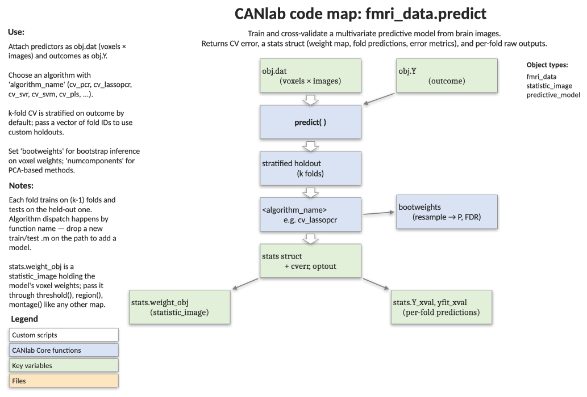

# `fmri_data.predict` — cross-validated multivariate prediction

[← back to `fmri_data` methods](../fmri_data_methods.md) ·
[Object methods index](../Object_methods.md) ·
[Recasting objects](../recasting_objects.md)

Train a multivariate brain model that predicts an outcome `obj.Y` from the
voxelwise data in `obj.dat` and evaluate it with k-fold cross-validation.
Returns the cross-validated error, a struct of detailed prediction
statistics, and the per-fold raw outputs of the underlying algorithm.
Supports a wide menu of regression / classification algorithms, custom
fold assignment, bootstrap voxel weights, and nested parameter estimation.

## Code map



[Editable PowerPoint version](../code_maps_pptx/fmri_data_predict_codemap.pptx)

## Usage

```matlab
[cverr, stats, optout] = predict(obj, varargin)
```

`obj.Y` is the outcome (continuous or class labels — use `+1`/`-1` for SVM)
and `obj.dat` (`[voxels × images]`) is the predictor matrix. Folds are
stratified on the outcome by default.

## Inputs

| Argument | Type | Description |
|---|---|---|
| `obj` | `fmri_data` | Object with `.dat` and `.Y`. `.Y` may be a column or — for multiclass / multilevel models — a matrix. |
| `'algorithm_name', name` | string | Built-in algorithm name (see table below) or a custom function with signature `[yfit, other_outputs] = predfun(xtrain, ytrain, xtest, ...)`. Default `'cv_pcr'`. |
| `'nfolds', k` | int / vector | Number of folds (default `5`); or vector of integer fold IDs for custom holdout sets. `k = 1` skips CV and trains on all data (useful for bootstrapping). |
| `'error_type', name` | string | `'mcr'` or `'mse'`. Default chosen from outcome type. |
| `'useparallel', tf` | 0 / 1 | Use parallel pool when available. Default `1`. |
| `'bootweights'` | flag | Bootstrap voxel weights (uses all observations). |
| `'savebootweights'` | flag | Keep raw bootstrap weights (useful for combining iterations). |
| `'bootsamples', n` | int | Number of bootstrap samples (default `100`). |
| `'numcomponents', n` | int | Number of components for PCA-based methods. |
| `'nopcr'` | flag | For `cv_lassopcr` / `cv_lassopcrmatlab`: skip PCR and use original variables. |
| `'lasso_num', n` | int | Components/variables to retain after LASSO shrinkage. |
| `'hvblock', [h, v]` | 1×2 | hv-block CV: block size `h` (0 → v-fold) and `v` test obs (0 → h-block). |
| `'rolling', [h, v, g]` | 1×3 | Rolling CV with surrounding training size `2g`. |
| `'verbose', tf` | 0 / 1 | Suppress chatter when `0`. Default `1`. |
| `'platt_scaling'` | flag | Cross-validated Platt scaling for SVM; softmax `[A, B]` saved in `other_output{3}`. |
| `'subjID', vec` | column | Required for `cv_mlpcr` and `cv_multilevel_glm` — block / subject labels. |

### Built-in algorithm choices

| `algorithm_name` | Description |
|---|---|
| `cv_multregress` | Plain multiple regression. |
| `cv_univregress` | Average predictions from per-feature univariate regressions. |
| `cv_svr` | Support vector regression (Spider package). |
| `cv_pcr` | **Default.** Cross-validated principal-components regression. |
| `cv_mlpcr` | Multilevel PCR with within/between decomposition. Requires `'subjID'`. Optional `{'cpca', 1}`, `{'numcomponents', [bt wi]}`. |
| `cv_pls` | Cross-validated partial least squares (univariate `Y` only). |
| `cv_lassopcr` | LASSO-PCR. Optional `'lasso_num'`, `'nopcr'`, `'EstimateParams'` (nested-CV optimal lambda). |
| `cv_lassopcrmatlab` | MATLAB `lassoglm` backend; supports `'Alpha'` for ridge / lasso / elastic net. Use `'cv', K, 'nfolds', 1` to estimate λ via internal CV. |
| `cv_svm` | Support vector machine (Spider). Use `Y ∈ {-1, +1}`. Optional `'C', c`, `'rbf', sigma`, `'EstimateParams'`, `'MultiClass'`, `'Balanced', ridge`. |
| `cv_multilevel_glm` | Calls `glmfit_multilevel`. Requires `'subjIDs'`; trials must be contiguous within subject. 2nd-level predictors not yet supported. |

## Outputs

| Output | Type | Description |
|---|---|---|
| `cverr` | scalar | Cross-validated error (`mcr` or `mse`). |
| `stats` | struct | Detailed results — see fields below. |
| `optout` | cell | Per-fold raw outputs from the algorithm (weights, intercepts, model details). |

Selected `stats` fields:

| Field | Description |
|---|---|
| `Y`, `yfit`, `err` | Outcome, cross-validated predictions, and per-trial errors. |
| `algorithm_name`, `function_call`, `function_handle` | Bookkeeping. |
| `error_type`, `cverr` | Error metric and value. |
| `nfolds`, `cvpartition`, `teIdx`, `trIdx` | Fold assignment and per-fold logical index cell arrays. |
| `mse`, `rmse`, `meanabserr`, `pred_outcome_r` | Regression-only error summaries. |
| `phi` | Binary correlation between `Y` and `yfit` (classification). |
| `dist_from_hyperplane_xval` | Cross-validated signed distance from the SVM boundary. Use as a continuous score. |
| `weight_obj` | `statistic_image` / `fmri_data` of voxel weights from the full-sample model — feed to `orthviews`, `montage`, or `apply_mask` to predict new images via dot product. |
| `WTS` | Bootstrapped weight statistics (when `'bootweights'`). |
| `other_output`, `other_output_descrip`, `other_output_cv`, `other_output_cv_descrip` | Algorithm-specific extras (full-sample and per-fold). |

## Notes

- Bootstrapping: each algorithm must return three outputs to participate
  (programming convention). Parallel processing is disabled by default
  during bootstrapping to avoid memory blow-up.
- For `cv_mlpcr`, bootstrap is done at the image level, not the block
  level. Higher-order within-block components are unstable; consider
  `'cpca', 1` if your design is balanced.
- `cv_svm` is sensitive to the scale of the outcomes — encode classes as
  `+1` / `-1`.
- `nfolds = 1` trains on the full dataset without cross-validation —
  useful for fitting a final model after CV-based hyperparameter selection.

## Example: cross-validated PCR on the emotion-regulation sample

```matlab
% Load 30 single-subject contrast maps and a continuous behavioural outcome
obj   = load_image_set('emotionreg');
obj.Y = obj.metadata_table.Reappraisal_Success;

% 5-fold CV principal-components regression with bootstrap voxel weights
[cverr, stats, optout] = predict(obj, ...
    'algorithm_name', 'cv_pcr', ...
    'nfolds', 5, ...
    'error_type', 'mse', ...
    'bootweights');

% Inspect the CV-error and the predictive map
fprintf('CV MSE = %.3f, prediction-outcome r = %.3f\n', cverr, stats.pred_outcome_r);
orthviews(stats.weight_obj);

% Per-subject scatter of CV predictions vs. observed outcomes
line_plot_multisubject(stats.yfit, stats.Y);
```

## Other examples

```matlab
% LASSO-PCR with 5 components retained, MSE error, bootstrapped weights
[cverr, stats, optout] = predict(obj, 'algorithm_name', 'cv_lassopcr', ...
    'lasso_num', 5, 'nfolds', 5, 'error_type', 'mse', 'bootweights');

% Linear SVM with 5-fold CV (binary classification, encode Y as +/-1)
[cverr, stats, optout] = predict(obj, 'algorithm_name', 'cv_svm', ...
    'nfolds', 5, 'error_type', 'mse');

% Nonlinear SVM with RBF kernel
[cverr, stats, optout] = predict(obj, 'algorithm_name', 'cv_svm', ...
    'rbf', 2, 'nfolds', 5, 'error_type', 'mse');

% Elastic net (cv_lassopcrmatlab) with the first 10 PCs and Alpha = 0.5
[cverr, stats, optout] = predict(obj, 'algorithm_name', 'cv_lassopcrmatlab', ...
    'nfolds', 5, 'error_type', 'mse', 'numcomponents', 10, 'Alpha', .5);

% hv-block CV on a time-series dataset
[cverr, stats, optout] = predict(obj, 'algorithm_name', 'cv_lassopcr', ...
    'hvblock', [3, 5]);
```

## See also

- [`fmri_data.regress`](fmri_data_regress.md) — mass-univariate regression alternative
- [`fmri_data.ttest`](fmri_data_ttest.md) — voxelwise one-sample test
- [`fmri_data.pca`](fmri_data_pca.md) — unsupervised dimensionality reduction
- [`fmri_data.outliers`](fmri_data_outliers.md) — flag artefactual images before training
- [`statistic_image.threshold`](statistic_image_threshold.md) — threshold the bootstrapped weight map
