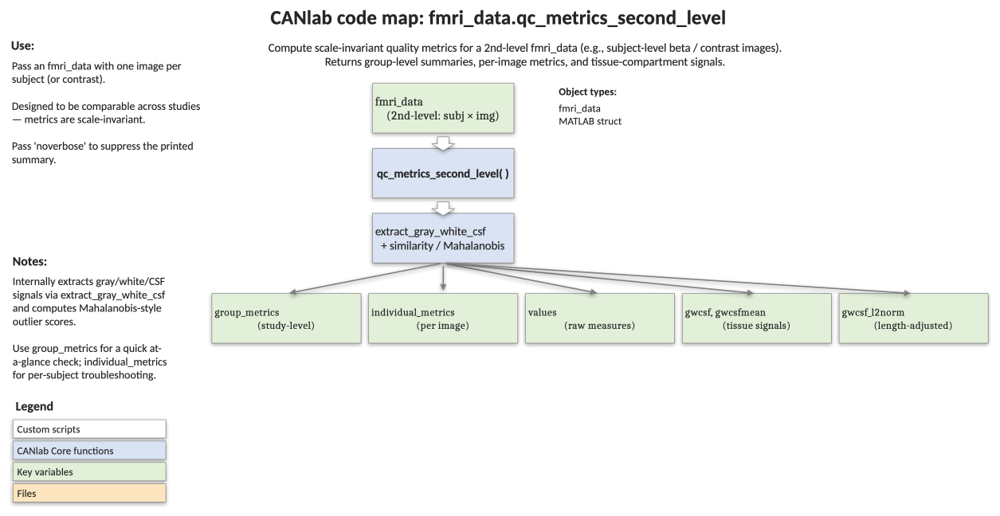

# `fmri_data.qc_metrics_second_level` — group-level QC for a stack of subject images

[← back to `fmri_data` methods](../fmri_data_methods.md) ·
[Object methods index](../Object_methods.md) ·
[Recasting objects](../recasting_objects.md)

Run a battery of second-level quality-control metrics over a set of
participant-level beta or contrast images. The aim is a small set of
scale-invariant numbers that can be compared across datasets — coverage,
signal in CSF/WM, scale homogeneity, and global activation/deactivation
artefacts — together with per-image versions for spotting problematic
participants. Returns a group-level summary, an individual-level
breakdown, and the underlying GM/WM/CSF data objects for further plotting.

## Code map



[Editable PowerPoint version](../code_maps_pptx/fmri_data_qc_metrics_second_level_codemap.pptx)

## Usage

```matlab
[group_metrics, individual_metrics, values, gwcsf, gwcsfmean, gwcsf_l2norm] = ...
    qc_metrics_second_level(obj, varargin)
```

`obj` should be an `fmri_data` containing one image per participant —
typically first-level beta or contrast maps in MNI space. The function
calls [`extract_gray_white_csf`](fmri_data_extract_gray_white_csf.md) under
the hood and computes derived metrics from those tissue summaries.

## Inputs

| Argument | Type | Description |
|---|---|---|
| `obj` | `fmri_data` | Stack of subject-level beta or contrast images. |
| `'noverbose'` | flag | Suppress printed summary and warnings. |

## Outputs

| Output | Type | Description |
|---|---|---|
| `group_metrics` | struct | Group-level QC metrics (described below). Includes a `warnings` cell-array string for each metric out of its safe range. |
| `individual_metrics` | struct | Per-image versions of the metrics — useful for identifying problematic subjects or as covariates in group analyses. |
| `values` | `[images × 3]` | Mean signal in GM, WM, CSF for each image. |
| `gwcsf` | `1×3` cell | Per-tissue masked `fmri_data` objects (GM, WM, CSF). |
| `gwcsfmean` | `fmri_data` | Across-subject means in each tissue (3 columns: GM, WM, CSF). |
| `gwcsf_l2norm` | `[images × 3]` | Length-adjusted L2 norms per tissue, per image. |

### Metrics computed

| Field | Range | Interpretation |
|---|---|---|
| `mean_gray_matter_coverage` | `[0, 1]` | Fraction of GM mask voxels with non-zero/non-NaN data. Lower = dropout or space mismatch. |
| `csf_to_gm_signal_ratio` | `[0, ∞)` | Mean abs CSF signal / mean abs GM signal. `> 1` flags strong ventricle contamination. |
| `global_d_ventricles`, `global_d_wm` | `(-∞, ∞)` | Effect size (`mean / std`) of group-mean signal in CSF or WM. Far from 0 indicates global activation/deactivation in non-GM. |
| `global_logp_ventricles`, `global_logp_wm` | `[0, ∞)` | `-log(p) / -log(.05)` for the t-test of zero global signal. `> 1` is a "significant" global artefact. |
| `r2_explained_by_csf`, `gm_explained_by_csf_pvalue` | `[0, 1]` | Variance in per-subject GM means explained by CSF means. High r² = non-spatially specific contamination. |
| `r2_l2norm_explained_by_csf`, `gm_l2norm_explained_by_csf_pvalue` | `[0, 1]` | Same idea on the scale (L2 norm) rather than the mean. |
| `gm_scale_inhom`, `csf_scale_inhom` | `[0, ∞)` | Coefficient of variation of L1-norm across images in GM / CSF. High = subjects on different scales. CSF version is the most diagnostic; GM may pick up real signal differences. |
| `warnings` | cell | Human-readable strings for any metric that crossed its threshold (e.g. CSF inhomogeneity > 0.3). |

Per-image versions live on `individual_metrics`:
`gray_matter_coverage`, `global_ventricle_values`,
`global_white_matter_values`, `csf_to_gm_signal_ratio`, `gm_L1norm`,
`csf_L1norm`.

## Notes

- Several metrics listed in the help block are placeholders in the
  current implementation (`brightedge`, dice template match) and are
  not computed. The implemented set is the table above.
- The metrics are designed to be **scale-invariant** so values can be
  compared across datasets and modalities.
- Pair high `csf_scale_inhom` or high `r2_explained_by_csf` with a
  call to [`normalize_gm_by_wm_csf`](fmri_data_normalize_gm_by_wm_csf.md)
  to correct the offending heterogeneity.

## Example

```matlab
% Run the full QC battery on the emotion-regulation sample
obj = load_image_set('emotionreg');

[group_metrics, individual_metrics] = qc_metrics_second_level(obj);

% Plot per-tissue distributions per image
hist_han = histogram(obj, 'byimage', 'by_tissue_type');

% Flag subjects with low GM coverage
bad = individual_metrics.gray_matter_coverage < 0.9;
fprintf('Subjects below 90%% coverage: %s\n', num2str(find(bad)'));
```

## See also

- [`fmri_data.extract_gray_white_csf`](fmri_data_extract_gray_white_csf.md) — the per-tissue summaries this routine builds on
- [`fmri_data.normalize_gm_by_wm_csf`](fmri_data_normalize_gm_by_wm_csf.md) — corrective normalization driven by the same tissue references
- [`fmri_data.jackknife_similarity`](fmri_data_jackknife_similarity.md) — image-level outlier detection by leave-one-out similarity
- [`fmri_data.histogram`](fmri_data_histogram.md) — `'by_tissue_type'` plotting used in the example
- [`fmri_data` methods](../fmri_data_methods.md) — full method index
