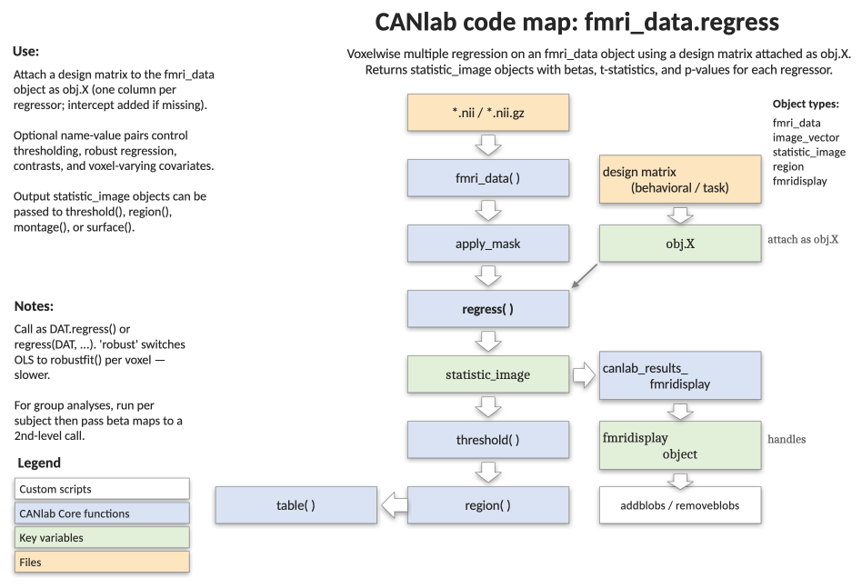

# `fmri_data.regress` — voxelwise multiple regression

[← back to `fmri_data` methods](../fmri_data_methods.md) ·
[Object methods index](../Object_methods.md) ·
[Recasting objects](../recasting_objects.md)

Voxelwise multiple regression on an `fmri_data` object using a design matrix
attached as `obj.X`. Returns a structure of `statistic_image` objects with
betas, t-statistics, p-values, and (optionally) contrast maps for each
regressor. Supports OLS, robust regression, AR(p) time-series modelling,
voxel-varying covariates, and contrast specification.

## Code map



[Editable PowerPoint version](../code_maps_pptx/fmri_data_regress_codemap.pptx)

## Usage

```matlab
regression_results = regress(obj, varargin)
```

`obj` should be an `fmri_data` object with the `X` field defined. Each column
of `obj.X` is a regressor; the intercept is the last column and is added
automatically unless `'nointercept'` is specified. `obj.X` may also be a
`design_matrix` object.

## Inputs

| Argument | Description |
|---|---|
| `obj` | An `fmri_data` object. `obj.dat` is `[voxels × images]`, `obj.X` is `[images × regressors]`. |
| `[threshold, 'unc' \| 'fdr' \| ...]` | p-value threshold and type. See `help statistic_image.threshold` for the full list of options. |
| `'robust'` | Run robust regression (per-voxel `robustfit`) instead of OLS. Considerably slower. |
| `'AR'` | Use an autoregressive time-series model. |
| `'grandmeanscale'` | Scale grand mean to 100 (1st-level only — reduces between-subject scale heterogeneity). |
| `'C', M` | Contrast matrix `[k × c]` where `k = size(X, 2)` (including intercept) and `c` is the number of contrasts. |
| `'nointercept'` | Do not add an intercept to the model. |
| `'display'` / `'display_results'` | Show thresholded results with `orthviews` (only if fewer than 10 regressors). |
| `'nodisplay'` | Suppress thresholded `orthviews` plot. |
| `'brainony'` | Univariate prediction of `obj.Y` from each voxel (slow — loops over voxels). |
| `'residual'` | Return residuals as an `fmri_data` object. |
| `'noverbose'` | Suppress verbose output. |
| `'variable_names'` (or `'names'`), `{...}` | Cell array of regressor names (excluding intercept). |
| `'contrast_names'`, `{...}` | Cell array of contrast names. |
| `'analysis_name'`, str | A descriptive name for this analysis. |
| `'covdat'`, `fmri_data` (or cell of) | Voxel-varying covariates (one set per voxel). **Robust mode only.** |

## Outputs

`regression_results` is a structure with the following fields:

| Field | Type | Description |
|---|---|---|
| `b` | `statistic_image` | Beta values, one image per regressor (unthresholded). |
| `t` | `statistic_image` | t-values, thresholded by the input p-threshold. |
| `df` | `fmri_data` | Degrees of freedom per voxel. |
| `sigma` | `fmri_data` | Variance of the residual. |
| `residual` | `fmri_data` | Residuals (returned only with `'residual'`). |
| `con_b`, `con_t` | `statistic_image` | Contrast betas and t-values (returned when `'C'` is supplied). |
| `diagnostics` | struct | `Variance_inflation_factors` and `Leverages` for the design. |
| `input_parameters`, `X`, `variable_names`, `warnings` | misc. | Bookkeeping. |

T-images are thresholded; beta and contrast images are not — re-threshold
them with the [`threshold`](statistic_image_threshold.md) method as needed.
The output `statistic_image` objects can be visualised with any CANlab
display method (`montage`, `surface`, `orthviews`) and selected with
`get_wh_image`.

## Notes

- `regress()` does **not** use the `covariates` field of `fmri_data`.
  Include any covariates manually as additional columns of `obj.X`.
- Use `'robust'` for outlier-resistant inference at the cost of speed.
- For a 2nd-level group analysis, mean-center `X` so the intercept map
  represents the average image.
- `covdat` (voxel-varying covariates) is implemented for robust mode only.

## Example: 2nd-level group analysis on the emotion-regulation sample

```matlab
% Load 30 single-subject contrast maps (Wager et al. 2008, Neuron)
obj = load_image_set('emotionreg');

% Predictor: reappraisal success (mean-centered) + intercept
obj.X = obj.metadata_table.Reappraisal_Success;
obj.X = obj.X - mean(obj.X);
obj.X(:, end + 1) = 1;

% Run the regression with a liberal voxelwise threshold
regression_results = regress(obj, .05, 'unc', ...
    'names', {'Reapp_Success' 'Intercept'}, ...
    'analysis_name', 'Emotion Regulation');

% Inspect and visualise thresholded t-maps
montage(regression_results.t)

% Re-threshold the Reapp_Success t-map at p < 0.005
t_reapp = get_wh_image(regression_results.t, 1);
t_reapp = threshold(t_reapp, .005, 'unc');
create_figure('surface'); surface(t_reapp);
```

## Other examples

```matlab
% Robust regression with FDR thresholding
regression_results = regress(obj, .05, 'fdr', 'robust');

% Brain-on-Y univariate prediction
regression_results = regress(obj, .05, 'unc', 'brainony');

% Save residuals for downstream connectivity work
regression_results = regress(obj, .001, 'unc', 'residual');

% Contrast matrix C: each column is a contrast across regressors
regression_results = regress(obj, 'variable_names', names, ...
    'C', C.weights, 'contrast_names', C.names);

% Re-threshold beta map at FDR
regression_results.b = threshold(regression_results.b, .05, 'fdr');
```

## See also

- [`statistic_image.threshold`](statistic_image_threshold.md) — re-threshold the returned t / beta / contrast maps
- [`fmri_data.ttest`](fmri_data_ttest.md) — one-sample voxelwise t-test
- [`fmri_data.predict`](fmri_data_predict.md) — cross-validated multivariate alternative
- [`fmri_data.robfit_parcelwise`](fmri_data_robfit_parcelwise.md) — robust regression at parcel level
- [`fmri_data.fitlme_voxelwise`](fmri_data_fitlme_voxelwise.md) — voxelwise mixed-effects model
