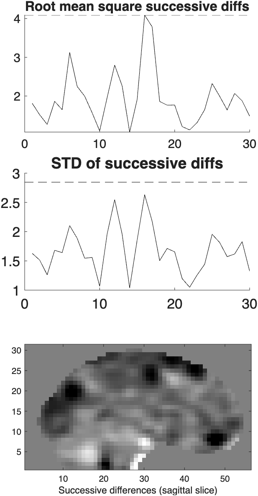

# `fmri_data.rmssd_movie` — root-mean-square successive-difference movie

[← back to `fmri_data` methods](../fmri_data_methods.md) ·
[Object methods index](../Object_methods.md)

Compute frame-to-frame RMSSD (a.k.a. DVARS) on a 4-D `fmri_data` time
series and play it back as an inline movie of difference images, with
overlaid timecourse markers. Useful for visually inspecting head motion,
gradient artifacts, and other sudden between-volume changes.

## Quick example

```matlab
imgs = load_image_set('emotionreg');
rmssd_movie(imgs);
```



## See also

- [`fmri_data.outliers`](fmri_data_outliers.md) — uses RMSSD as one of its criteria
- `slice_movie` — analogous movie of slice intensities
- `intercept_model` — build per-run intercept regressors that often capture RMSSD jumps
