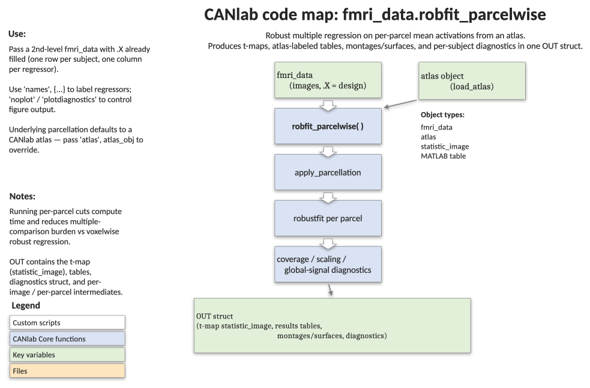

# `fmri_data.robfit_parcelwise` — robust regression at the parcel level

[← back to `fmri_data` methods](../fmri_data_methods.md) ·
[Object methods index](../Object_methods.md) ·
[Recasting objects](../recasting_objects.md)

Run robust multiple regression on parcel-mean activations, one model per
atlas parcel, and return labelled tables, FDR-thresholded t-maps, and a
suite of QC diagnostics. Working at the parcel level dramatically
reduces the multiple-comparisons burden vs. voxelwise analysis,
delivers labelled regions of interest "for free" via the atlas, and is
typically the right tool for **2nd-level (group) contrast analyses**
when you don't need voxelwise resolution. Output is a single `OUT`
structure with everything from per-parcel betas to a Cohen's d power
floor.

## Code map



[Editable PowerPoint version](../code_maps_pptx/fmri_data_robfit_parcelwise_codemap.pptx)

## Usage

```matlab
OUT = robfit_parcelwise(imgs, varargin)
```

`imgs.X` should hold the design matrix (one row per image, no
intercept — added automatically). If `imgs.X` is empty, an
intercept-only group analysis is run.

## Inputs

| Argument | Type | Description |
|---|---|---|
| `imgs` | `fmri_data` | 2nd-level images (typically one 1st-level contrast image per participant). `imgs.X` should be `[n_images × k]`. |
| `'names', {...}` | cellstr | Predictor names. Last entry is treated as `'Intercept (Group avg)'`. |
| `'analysis_name', s` | char | Descriptive name for the analysis. |
| `'mask', atlas` | `atlas` | Custom atlas defining parcels. Default uses the canlab2024 / canlab2018_2mm atlas via `brainpathway`. |
| `'doplot' / 'noplot'` | flag | Toggle figures (design matrix, montages, diagnostics). Default `doplot = true`. |
| `'plotdiagnostics', tf` | flag | Toggle the diagnostic figures (mask, weights, plotmatrix). Default `true`. |
| `'simpleplots', tf` | flag | Slim, no-surface results plots. Default `false`. |
| `'doverbose' / 'noverbose'` | flag | Toggle printed output. Default `doverbose = true`. |
| `'use_BH_fdr', tf` | flag | Use Benjamini-Hochberg FDR (`FDR.m`) instead of Storey's `mafdr`. Default `false`. |
| `'csf_wm_covs', tf` | flag | Append global WM and CSF signals (from MNI masks) as covariates. Default `false`. |
| `'remove_outliers', tf` | flag | Drop images flagged as outliers by `mahal` at p < .05 uncorrected (covariance and correlation distance, OR'd). Default `false`. |

Requires the MATLAB Bioinformatics Toolbox (`mafdr`) unless
`'use_BH_fdr'` is set.

## Outputs

`OUT` is a structure. Sizes shown for an atlas of 489 parcels and 2 predictors (1 + intercept).

| Field | Type | Description |
|---|---|---|
| `analysis_name` | char | Echo of the input. |
| `regressors` | table | Design summary (mean, levels, VIF). |
| `betas` | `[parcels × k]` | Robust regression slopes. |
| `tscores` | `[parcels × k]` | t-scores. |
| `pvalues` | `[parcels × k]` | Two-tailed p-values. |
| `nsubjects` | `[parcels × 1]` | Subjects with data per parcel. |
| `maskvol` | `[parcels × 1]` | 1 if parcel was estimable, else 0. |
| `weights` | `[parcels × n_images]` | Robust weights (low = downweighted images). |
| `dfe` | `[parcels × 1]` | Error d.f. per parcel. |
| `pthr_FDRq05` | `[1 × k]` | P-threshold giving FDR q < .05 for each map. |
| `sig_q05` | `[parcels × k]` | Logical mask of FDR-significant parcels. |
| `cohens_d_fdr05` | `[1 × k]` | Minimum Cohen's d detectable at FDR q < .05. |
| `t_obj` | `statistic_image` | Voxelwise t-map (parcels populated with `tscores`), thresholded q < .05 FDR. |
| `beta_obj` | `fmri_data` | Voxelwise beta map (parcels populated with `betas`). |
| `mask` | `fmri_data` | Mask of analysed parcels. |
| `nsubjects_obj` | `fmri_data` | Voxelwise N map. |
| `resultstable` | table | Per-predictor summary across the brain. |
| `region_objects` | `{1×k}` | Region objects of significant blobs at q < .05 FDR (positive then negative). |
| `contrast_tables_FDR05` | `{1×k}` | Region-labelled tables of significant blobs. |
| `group_metrics`, `individual_metrics` | structs | QC metrics from `qc_metrics_second_level`. |
| `outliers_corr`, `outliers_uncorr` | `[n_images × 1]` | Mahalanobis outlier flags (corrected / uncorrected). |
| `ind_quality_dat` | table | Per-image diagnostics (mean weight, global GM/WM/CSF, Mahalanobis distances, etc.). |
| `predicting_weights_from_image_metrics` | table | GLM table predicting mean robust weights from image diagnostics — useful to spot bad data. |
| `datmatrix` | `[n_images × parcels]` | Parcel-mean data matrix actually fitted. |

## Notes

- An intercept is added automatically as the **last** column of the
  design. The intercept map represents the group mean only if all other
  predictors are mean-centred — a warning is printed otherwise.
- Robust regression is `robustfit(..., 'bisquare')`; weights closer to 1
  mean an image is well-fit, weights near 0 mean it is downweighted.
- Default thresholding is FDR via Storey's `mafdr`. If the prior
  probability of significance approaches 1, the function falls back to
  Benjamini-Hochberg automatically (and `'use_BH_fdr'` forces it).
- `OUT.t_obj` is a `statistic_image` and can be re-thresholded,
  rendered via `montage` / `surface`, or labelled via `region`.
- The atlas is loaded via `brainpathway`; pass `'mask', atlas_obj` to
  use a custom parcellation (e.g. cortex-only).

## Example: 2nd-level analysis on the emotion-regulation sample

```matlab
% 30 single-subject reappraisal contrast images
imgs = load_image_set('emotionreg');

% Behavioural predictor: reappraisal success (z-scored)
Xinfo = importdata(which('Wager_2008_emotionreg_behavioral_data.txt'));
imgs.X = zscore(Xinfo.data(:, 2));

% Robust parcelwise regression with diagnostics
OUT = robfit_parcelwise(imgs, ...
    'names', {'Reapp_Success' 'Intercept (Group avg)'}, ...
    'analysis_name', 'Emotion regulation: reappraisal success');

% Region tables and FDR montages were rendered automatically.
% Inspect the labelled significant regions for predictor 1:
disp(OUT.contrast_tables_FDR05{1})

% Re-threshold the t-map for predictor 1 at a stricter level
t1 = get_wh_image(OUT.t_obj, 1);
montage(threshold(t1, .001, 'unc'));
```

## Other examples

```matlab
% Add global WM/CSF as covariates and remove Mahalanobis outliers
OUT = robfit_parcelwise(imgs, 'csf_wm_covs', true, 'remove_outliers', true);

% Use a custom atlas (e.g. cortex only)
atl = load_atlas('canlab2024'); cortex = select_atlas_subset(atl, {'Ctx'});
OUT = robfit_parcelwise(imgs, 'mask', cortex);

% Slim output for reports — no diagnostic figures
OUT = robfit_parcelwise(imgs, 'plotdiagnostics', false, 'simpleplots', true);
```

## See also

- [`fmri_data.regress`](fmri_data_regress.md) — voxelwise multiple regression (incl. a robust option)
- [`fmri_data.ttest`](fmri_data_ttest.md) — voxelwise one-sample t-test
- [`fmri_data.qc_metrics_second_level`](fmri_data_qc_metrics_second_level.md) — the underlying QC metric routine
- [`statistic_image.threshold`](statistic_image_threshold.md) — re-threshold the returned t-map
- [`atlas` methods](../atlas_methods.md) — load / subset atlases for the `'mask'` argument
