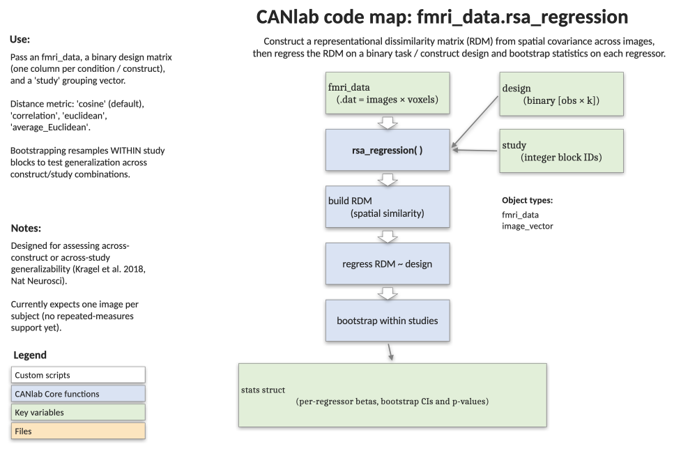

# `fmri_data.rsa_regression` — representational similarity regression with bootstrap stats

[← back to `fmri_data` methods](../fmri_data_methods.md) ·
[Object methods index](../Object_methods.md) ·
[Recasting objects](../recasting_objects.md)

Test whether a hypothesised grouping of images (a categorical model
RDM) explains the dissimilarity structure of brain activity patterns
across images. Builds a representational dissimilarity matrix (RDM)
from `obj.dat` and regresses it on one or more model RDMs derived from
binary design columns. Block-bootstrap stratified by `study` gives
inference on each "generalisation index" — the canonical use case is
testing whether a brain pattern generalises across constructs and
studies (Kragel et al. 2018, *Nature Neuroscience*).

## Code map



[Editable PowerPoint version](../code_maps_pptx/fmri_data_rsa_regression_codemap.pptx)

## Usage

```matlab
stats = rsa_regression(obj, design, study, varargin)
```

## Inputs

| Argument | Type | Description |
|---|---|---|
| `obj` | `fmri_data` | Image object — typically one image per subject (no repeated measures). |
| `design` | `[n_images × p]` logical/binary | Each column is a grouping variable; columns are converted into pairwise model dissimilarities (`pdist` of column → distances among images), normalised to sum to 1e5. |
| `study` | `[n_images × 1]` int | Block IDs for stratified bootstrap (e.g. study number). |
| `'average_Euclidean'` | flag | Brain RDM = Euclidean distance between **mean** voxel values per image (univariate). |
| `'euclidean'` | flag | Brain RDM = Euclidean distance using all voxels. |
| `'cosine'` | flag | Brain RDM = cosine distance using all voxels. |
| `'correlation'` | flag | Brain RDM = correlation distance, `1 - r` (default). |
| `'nobootstrap'` | flag | Skip the 1000-iteration bootstrap and return point estimates only. |

## Outputs

`stats` is a structure with:

| Field | Type | Description |
|---|---|---|
| `gen_index` | `[p+1 × 1]` | OLS regression slopes (the "generalisation indices") for each model RDM column predicting the brain RDM. The first row is the intercept. |
| `bs_gen_index` | `[1000 × p+1]` | Bootstrap distribution for each generalisation index (only without `'nobootstrap'`). |
| `ste` | `[p+1 × 1]` | Bootstrap standard error per index. |
| `Z` | `[p+1 × 1]` | Bootstrap normal-approx Z-scores. |
| `p` | `[p+1 × 1]` | Two-tailed p-values from `Z`. |
| `sig` | `[p+1 × 1]` | Significant at FDR q < .05 across the indices. |
| `RDM` | square matrix | Full brain RDM in square form (handy for plotting). |

## Notes

- Each column of `design` defines a partition of images. The `pdist`
  of a binary column is 0 within a group and 1 between groups, so the
  resulting model RDM tests whether brain dissimilarity tracks that
  partition. Use `condf2indic(...)` to turn a categorical labelling
  into a column-binary matrix.
- The bootstrap is **stratified by `study`**: within each study, images
  are resampled with replacement preserving the study membership of
  each row. This is the right null for "does the result hold within
  studies, after accounting for study identity?".
- This implementation does not handle repeated measures — include only
  one image per subject.
- Pairs of images with brain distance < 1e-5 are treated as missing
  (NaN) before fitting.

## Example: testing pain / cognition / emotion generalisation in amygdala (Kragel 2018)

```matlab
% 270 subject-level images systematically sampled from 18 studies in 3 domains
[data_obj, names] = load_image_set('kragel18_alldata');

% Restrict to amygdala
amy        = select_atlas_subset(load_atlas('Canlab2018'), {'Amy'});
masked_dat = apply_mask(data_obj, amy);

% Design: studies grouped 6-at-a-time → categorical study-cluster regressor
dsgn  = condf2indic(ceil(data_obj.metadata_table.Studynumber / 6));
study = data_obj.metadata_table.Studynumber;

% Regress brain RDM (correlation distance, default) on model RDM, with
% within-study bootstrap inference
stats = rsa_regression(masked_dat, dsgn, study);

disp([stats.gen_index stats.Z stats.p stats.sig])
imagesc(stats.RDM); axis square; title('Amygdala brain RDM');
```

## See also

- [`fmri_data.image_similarity_plot`](fmri_data_image_similarity_plot.md) — pairwise similarity vs. a basis set of maps
- [`fmri_data.jackknife_similarity`](fmri_data_jackknife_similarity.md) — leave-one-out spatial similarity
- [`fmri_data.predict`](fmri_data_predict.md) — cross-validated multivariate prediction
- [`fmri_data.regress`](fmri_data_regress.md) — voxelwise multiple regression
- [`atlas.select_atlas_subset`](atlas_select_atlas_subset.md) — pull out a region by name (e.g. `'Amy'` here)
