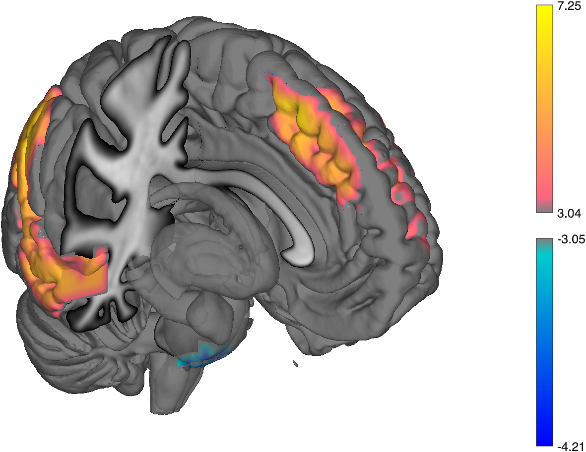

# `fmri_data.surface` — render an image on cortical surfaces

[← back to `fmri_data` methods](../fmri_data_methods.md) ·
[Object methods index](../Object_methods.md)

Render an `fmri_data` / `statistic_image` as a colored overlay on
inflated or pial cortical surfaces. Returns surface handles you can
manipulate (alpha, colormap, view). The fastest path to a publication-
quality surface figure for a thresholded results map.

## Quick example

```matlab
imgs = load_image_set('emotionreg');
t = ttest(imgs);
t = threshold(t, .005, 'unc', 'k', 10);
create_figure('s'); surface(t);
```



## See also

- [`fmri_data.montage`](fmri_data_montage.md) — slice-based view
- [`region.surface`](region_surface.md) — render a region object on cutaway surfaces
- [`addbrain`](addbrain.md) — get bare anatomical surface handles to draw onto
- `render_on_surface` — lower-level surface-rendering primitive
