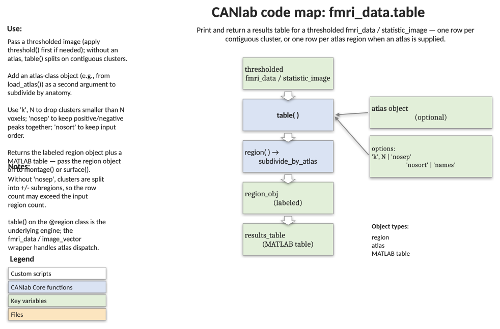

# `fmri_data.table` — tabulate clusters in a thresholded image

[← back to `fmri_data` methods](../fmri_data_methods.md) ·
[Object methods index](../Object_methods.md) ·
[Recasting objects](../recasting_objects.md)

Print a labelled table of all suprathreshold clusters in an image and
return a `region` object plus a MATLAB `table` of the same information.
Works with `fmri_data`, `statistic_image`, `image_vector`, and `atlas`
inputs. Two modes:

- **Default** — calls `region.table` on contiguous clusters; one row per
  cluster, with positive- and negative-peak clusters separated and rows
  grouped by macro-scale brain structures (cortex, basal ganglia, …).
- **`'subdivide'`** — uses an atlas to split each cluster into its
  constituent labelled regions; one row per atlas region covered by the
  thresholded image (longer tables, finer anatomy).

## Code map



[Editable PowerPoint version](../code_maps_pptx/fmri_data_table_codemap.pptx)

## Usage

```matlab
[region_obj, results_table] = table(w, ...)
```

## Inputs

| Argument | Type | Description |
|---|---|---|
| `w` | `fmri_data` / `statistic_image` / `image_vector` / `atlas` | Image to tabulate. Should already be thresholded (use [`statistic_image.threshold`](statistic_image_threshold.md) first). |
| `'atlas_obj', atl` | `atlas` | Atlas object to drive labelling (default behaviour falls back to a built-in atlas if available on the path). |
| `'subdivide'` | flag | Subdivide each cluster by the atlas so each row is a unique labelled region. Loads CANlab 2024 atlas if `atlas_obj` is not supplied. |
| `'k', n` (or `'maxsize'`) | int | Print only regions with at least `n` contiguous voxels. |
| `'nosep'` | flag | Do not separate clusters with positive and negative peaks. |
| `'names'` (`'name'`, `'donames'`) | flag | Manually name clusters before printing; saved in `.shorttitle`. (Legacy.) |
| `'forcenames'` | flag | Force manual naming, removing existing `.shorttitle` values. (Legacy.) |
| `'nosort'` (`'nosortrows'`) | flag | Do not sort rows by network / brain lobe. |
| `'legacy'` (`'dolegacy'`) | flag | Use the legacy table renderer. |
| `'nolegend'` | flag | Omit the printed legend that explains table columns. |

## Outputs

| Output | Type | Description |
|---|---|---|
| `region_obj` | `region` | Labelled region object — concatenation of positive- and negative-peak regions in default mode, or one element per atlas region in `'subdivide'` mode. Auto-labelled when `Neuroimaging_Pattern_Masks` is on the path. |
| `results_table` | MATLAB `table` | Same data as the printed table, ready for `writetable`, `disp`, or further filtering. |

## Notes

- Default region tables split each cluster into positive- and negative-peak
  sub-regions, so the row count may exceed the original number of contiguous
  blobs. Use `'nosep'` to suppress this.
- Default sorting groups rows by macro-scale brain area; this is *not*
  the order of the original `region` array. Use `'nosort'` to keep the
  original order.
- `'subdivide'` calls `image_vector.subdivide_by_atlas` and is appropriate
  when you want anatomically labelled rows even if a single contiguous
  blob spans multiple atlas regions.
- For very fine-grained labelling, pass an atlas via `'atlas_obj'` (e.g.
  `load_atlas('canlab2024')`).

## Example: tabulate a thresholded group t-map

```matlab
% Standard group analysis on the emotion-regulation sample
imgs = load_image_set('emotionreg');
t    = ttest(imgs, .005, 'unc');
t    = threshold(t, .005, 'unc', 'k', 10);

% One row per contiguous cluster, auto-labelled, separated by sign
[r, results_table] = table(t);

% Visualise each labelled region
montage(r, 'regioncenters', 'colormap');

% Save the table to disk
writetable(results_table, 'emotionreg_clusters.csv');
```

## Other examples

```matlab
% Subdivide clusters using the CANlab 2024 atlas — one row per atlas region
atl = load_atlas('canlab2024');
[region_obj, results_table] = table(t, 'subdivide', 'atlas_obj', atl);

% Return positive- and negative-peak regions separately
[rpos, rneg] = table(r);

% Suppress sign-splitting and re-sorting
[region_obj, results_table] = table(t, 'nosep', 'nosort');
```

## See also

- [`statistic_image.threshold`](statistic_image_threshold.md) — produce the suprathreshold image to tabulate
- [`fmri_data.ttest`](fmri_data_ttest.md) / [`fmri_data.regress`](fmri_data_regress.md) — produce the underlying statistic map
- [`region` methods](../region_methods.md) — `region.table`, `montage(r, 'regioncenters')`, etc.
- [`atlas` methods](../atlas_methods.md) — `atlas2region`, `select_atlas_subset`, `load_atlas`
