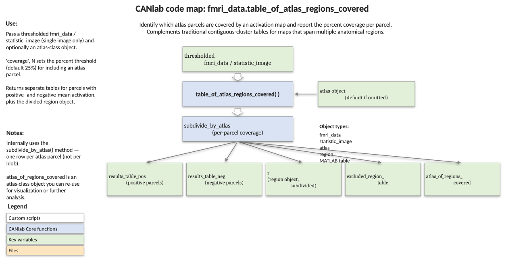

# `fmri_data.table_of_atlas_regions_covered` — atlas-coverage table for a thresholded map

[← back to `fmri_data` methods](../fmri_data_methods.md) ·
[Object methods index](../Object_methods.md) ·
[Recasting objects](../recasting_objects.md)

Build a labelled table of which atlas parcels are covered by an
activation / signature map. Traditional results tables divide blobs
into contiguous clusters, but a single large blob often spans several
anatomically distinct regions (e.g. insula + claustrum + putamen). This
function inverts the question — for each atlas parcel, what fraction is
covered by the map? — and returns separate positive- and negative-effect
tables, the underlying region object, and the labelled atlas subset.
Use it when an atlas-aware summary is more informative than blob-based
clustering.

## Code map



[Editable PowerPoint version](../code_maps_pptx/fmri_data_table_of_atlas_regions_covered_codemap.pptx)

## Usage

```matlab
[results_table_pos, results_table_neg, r, ...
 excluded_region_table, atlas_of_regions_covered, ...
 region_list, full_table] = table_of_atlas_regions_covered(obj, varargin)
```

`obj` must contain a single image. Threshold it first (see
[`statistic_image.threshold`](../statistic_image_methods.md)) — the
function reads `obj.sig` if present.

## Inputs

| Argument | Type | Description |
|---|---|---|
| `obj` | `fmri_data` / `statistic_image` / `image_vector` | A **single** image to label. Typically a thresholded statistic map. |
| `'coverage', pct` (alias `'percentile_threshold'`, `'percent'`) | numeric | Minimum percentage of an atlas parcel that must be non-zero in `obj` for inclusion. Default `25`. Set `0` to keep every parcel touched. |
| `'atlas', atlas_obj` (alias `'atlas_obj'`) | `atlas` | Custom atlas. Default tries CANLab2024 (2 mm), then falls back to canlab2018_2mm. |
| `'sort_by_column_name', name` | char | Sort tables by a column other than the default (`Coverage` desc, then `Voxels_in_region` desc). Useful with `'labels_2'`, etc. |
| `'noverbose'` (aliases `'noprint'`, `'nodisplay'`) | flag | Suppress printed tables. |

## Outputs

| Output | Type | Description |
|---|---|---|
| `results_table_pos` | table | Atlas regions with mean activation ≥ 0, sorted by coverage (desc). Columns: `Region`, `Coverage` (%), `Voxels_in_region`, `Atlas_index_number`, `mean_in_region`, `max_abs_in_region`, plus any `labels_2..labels_5` from the atlas, plus `atlas_mm_coords`. |
| `results_table_neg` | table | Same columns, regions with mean activation < 0. |
| `r` | `region` | Region object covering the included parcels (one element per region, ordered to match the tables). `r(i).Z` is filled with `mean_in_region`. |
| `excluded_region_table` | table | Atlas regions that fell **below** the coverage threshold. |
| `atlas_of_regions_covered` | `atlas` | Atlas subset containing only the included parcels. |
| `region_list` | cellstr | 4-cell text summary: positive header, positive list, negative header, negative list — each list as `Region (XX%), ...`. |
| `full_table` | table | Same columns as the results tables, but with **every** atlas region (regardless of coverage), in atlas index order. |

## Notes

- Coverage is `100 × n_joint / n_atlas`, where `n_joint` is the number
  of voxels in the parcel that are non-zero in `obj`, and `n_atlas` is
  the parcel size. So with `'coverage', 50`, half of the parcel must
  be active.
- For `statistic_image` inputs, the current threshold mask (`obj.sig`)
  is honoured automatically — re-threshold first to change the result.
- The function resamples `obj` to atlas space; pass a fine atlas (e.g.
  `canlab2024` 2 mm) for a precise count.
- See `region.table` for an alternative blob-centric table (one row per
  contiguous cluster, with autolabelling).

## Example: atlas-aware table for a thresholded craving signature

```matlab
% Multi-threshold drug-craving signature map (Koban et al. 2022, Nat Neurosci)
ncs = fmri_data(which('NCS_multithr_001k5_005_05_pruned.nii'), 'noverbose');

% Default coverage threshold (25%) and default atlas
[results_table_pos, results_table_neg, r] = ...
    table_of_atlas_regions_covered(ncs);

% Render the labelled regions in a small-multiples montage
montage(r, 'regioncenters', 'colormap');
```

## Other examples

```matlab
% Stricter coverage requirement, suppress printed table
[~, ~, r] = table_of_atlas_regions_covered(ncs, 'coverage', 50, 'noverbose');

% Use a specific atlas and sort by a secondary label set
atl = load_atlas('canlab2018_2mm');
[results_table_pos, results_table_neg] = ...
    table_of_atlas_regions_covered(t, 'atlas', atl, ...
    'sort_by_column_name', 'labels_2', 'noverbose');

% Trim columns before printing
results_table_pos.Coverage = [];
results_table_pos.mean_in_region = [];
disp(results_table_pos)
```

## See also

- [`fmri_data.wedge_plot_by_atlas`](fmri_data_wedge_plot_by_atlas.md) — visualise a map split by an atlas
- [`fmri_data.table`](fmri_data_table.md) — blob-centric autolabelled results table
- [`statistic_image.threshold`](statistic_image_threshold.md) — threshold the input map first
- [`atlas.select_atlas_subset`](atlas_select_atlas_subset.md) — restrict the atlas before tabulating
- [`region` methods](../region_methods.md) — work with the returned `region` object
