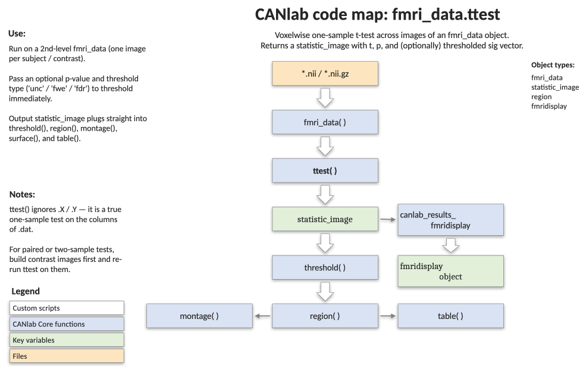

# `fmri_data.ttest` — voxelwise one-sample t-test

[← back to `fmri_data` methods](../fmri_data_methods.md) ·
[Object methods index](../Object_methods.md) ·
[Recasting objects](../recasting_objects.md)

One-sample t-test on every voxel of an `fmri_data` object. Returns a
`statistic_image` carrying t-statistics, two-tailed p-values, standard
errors, per-voxel sample sizes, and degrees of freedom — the canonical
group-level summary map for a set of contrast images. Optionally
thresholds the result before returning it.

## Code map



[Editable PowerPoint version](../code_maps_pptx/fmri_data_ttest_codemap.pptx)

## Usage

```matlab
statsimg = ttest(fmridat)
statsimg = ttest(fmridat, pvalthreshold, thresh_type)
```

For a two-sample t-test, use [`fmri_data.regress`](fmri_data_regress.md)
with a group indicator regressor.

## Inputs

| Argument | Type | Description |
|---|---|---|
| `fmridat` | `fmri_data` | Object with one image per row of the (eventual) test. `fmridat.dat` is `[voxels × images]`. |
| `pvalthreshold` | numeric | Optional. p-value threshold (e.g. `.05`, `.001`, or a vector like `[.001 .01 .05]`). |
| `thresh_type` | string | Optional. `'uncorrected'`, `'fwe'`, or `'fdr'`. Required if `pvalthreshold` is supplied. |

## Outputs

| Field | Type | Description |
|---|---|---|
| `statsimg.dat` | column | t-statistic per voxel. |
| `statsimg.p` | column | Two-tailed p-value per voxel. |
| `statsimg.ste` | column | Standard error per voxel. |
| `statsimg.N` | column | Number of non-NaN, non-zero observations per voxel. |
| `statsimg.dfe` | scalar | Degrees of freedom (`n - 1`). |
| `statsimg.volInfo` | struct | Inherited from `fmridat.mask.volInfo` so spatial position is preserved. |

The returned object is a `statistic_image` (subclass of `image_vector`) and
can be re-thresholded with [`statistic_image.threshold`](statistic_image_threshold.md),
turned into a region object with `region(...)`, displayed with
`montage`, `surface`, or `orthviews`, or registered into a layered
montage with `canlab_results_fmridisplay`.

## Notes

- Two-tailed p-values are computed inside the `statistic_image` constructor.
- Voxels that are all-NaN or all-zero get `p = 1` and `t = 0` so they will
  never survive a threshold.
- For more elaborate designs (covariates, contrasts, robust regression),
  use [`fmri_data.regress`](fmri_data_regress.md) instead.

## Example: one-sample group analysis on the emotion-regulation sample

```matlab
% Load 30 single-subject contrast images
imgs = load_image_set('emotionreg');

% QC: per-image montage and summary plots
slices(imgs);
plot(imgs);

% Voxelwise one-sample t-test (unthresholded)
t = ttest(imgs);

% Quick look at the unthresholded map
display_slices(t, 'axial'); colormap summer; colorbar;

% Layered slices + surfaces with registered handles
o2 = canlab_results_fmridisplay(t, 'full');
o2 = removeblobs(o2);

% Threshold and re-display the same montage
t  = threshold(t, .005, 'unc');
o2 = addblobs(o2, region(t), 'nolegend');
orthviews(t);

% Re-threshold at q < .05 FDR and tabulate clusters
t = threshold(t, .05, 'fdr');
r = table(t);
montage(r, 'regioncenters', 'colormap');
```

## See also

- [`fmri_data.regress`](fmri_data_regress.md) — voxelwise regression / two-sample t-test
- [`statistic_image.threshold`](statistic_image_threshold.md) — re-threshold the returned t-map
- [`fmri_data.predict`](fmri_data_predict.md) — multivariate alternative to mass-univariate testing
- [`fmri_data.table`](fmri_data_table.md) — tabulate clusters of a thresholded map
- [`fmri_data.descriptives`](fmri_data_descriptives.md) — summary statistics on the input images
