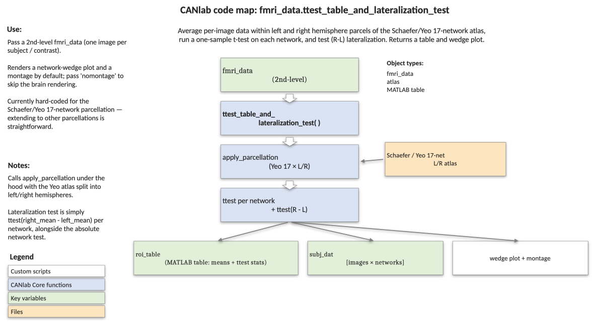

# `fmri_data.ttest_table_and_lateralization_test` — network-wise t-tests with hemispheric lateralization

[back to `fmri_data` methods](../fmri_data_methods.md) ·
[Object methods index](../Object_methods.md) ·
[Atlases / regions / patterns](../atlases_regions_and_patterns.md)

Summarises a group-level image set in terms of the 17 Yeo/Schaefer 2018
cortical networks split by hemisphere. For each image (typically one per
subject) it averages voxels within each L/R network, runs a one-sample
t-test per network, and additionally tests right-minus-left lateralization.
Produces a wedge plot, a results table, and a printed text report ready to
drop into a paper.

## Code map



[Editable PowerPoint version](../code_maps_pptx/fmri_data_ttest_table_and_lateralization_test_codemap.pptx)

## Usage

```matlab
[roi_table, subj_dat] = ttest_table_and_lateralization_test(imgs, ['nomontage'])
```

`imgs` is an `fmri_data` object whose images (rows of `.dat` after
transpose, or columns if you prefer; the function operates on per-image
ROI averages) represent the units to be tested — typically subject-level
contrast images for a 2nd-level analysis.

## Inputs

| Argument | Type | Description |
|---|---|---|
| `imgs` | `fmri_data` | An `fmri_data` object. Each image becomes one row of `subj_dat` after parcel-averaging. |
| `'nomontage'` | flag | Skip the brain montage in `wedge_plot_by_atlas`. Wedge plot is still drawn. |

## Outputs

| Field | Type | Description |
|---|---|---|
| `roi_table` | `table` | Network-by-statistic table with columns for R-hem mean, R t, R p, R stars; same for L hem; and R−L lateralization mean, t, p, stars. Row names are the 16 network labels (LH/RH stripped). |
| `subj_dat` | `[images × networks]` double | Mean image value within each L/R network, for each input image. Column order alternates L, R, L, R, ... matching the atlas. |

The function also prints to the command window:

- The full `roi_table`.
- A Bonferroni-corrected summary of which networks show bilateral, right-only, or left-only increases / decreases.
- A summary of right- and left-lateralized networks (R−L test, Bonferroni across 16 regions).
- The same summaries at uncorrected p < 0.05.

Significance stars: `****` Bonferroni-corrected; `***` p < .001; `**` p < .01; `*` p < .05; `+` p < .10.

## Notes

- Hard-coded to the `'yeo17networks'` atlas (Schaefer/Yeo 2018, 17 networks split L/R).
  The internal palette uses 16 network colours mirrored across hemispheres.
- ROI extraction is done by `wedge_plot_by_atlas`, which calls
  `apply_parcellation` internally. `extract_roi_averages(imgs, atlas_obj)`
  yields slightly different values because of interpolation differences.
- Two-tailed t-tests; Bonferroni correction is computed across 32 R/L
  network tests for the activation tests, and across 16 networks for the
  lateralization tests.
- Network labels in the printed report are abbreviated:
  Cont = Control, Default = Default Mode, DorsAttn = Dorsal Attention,
  SalVentAttn = Salience/Ventral Attention, SomMot = Somatomotor,
  TempPar = Temporal/parietal, VisCent = Central visual, VisPeri = Peripheral visual.

## Example: lateralization summary on the emotion-regulation sample

```matlab
% Load 30 single-subject contrast maps (Wager et al. 2008, Neuron)
imgs = load_image_set('emotionreg');

% Run the network-wise tests + lateralization, with brain montage
[roi_table, subj_dat] = ttest_table_and_lateralization_test(imgs);

% Inspect the results table
disp(roi_table)

% Skip the montage (faster) and reuse subj_dat for downstream stats
[roi_table, subj_dat] = ttest_table_and_lateralization_test(imgs, 'nomontage');
```

## See also

- [`fmri_data.ttest`](fmri_data_ttest.md) — voxelwise one-sample t-test
- [`fmri_data.regress`](fmri_data_regress.md) — voxelwise multiple regression
- [`atlas.select_atlas_subset`](atlas_select_atlas_subset.md) — pick a subset of regions from an atlas
- [`atlas` methods](../atlas_methods.md) — full atlas method index
- [Atlases, regions, and patterns](../atlases_regions_and_patterns.md) — overview of CANlab atlases including Yeo/Schaefer 2018
