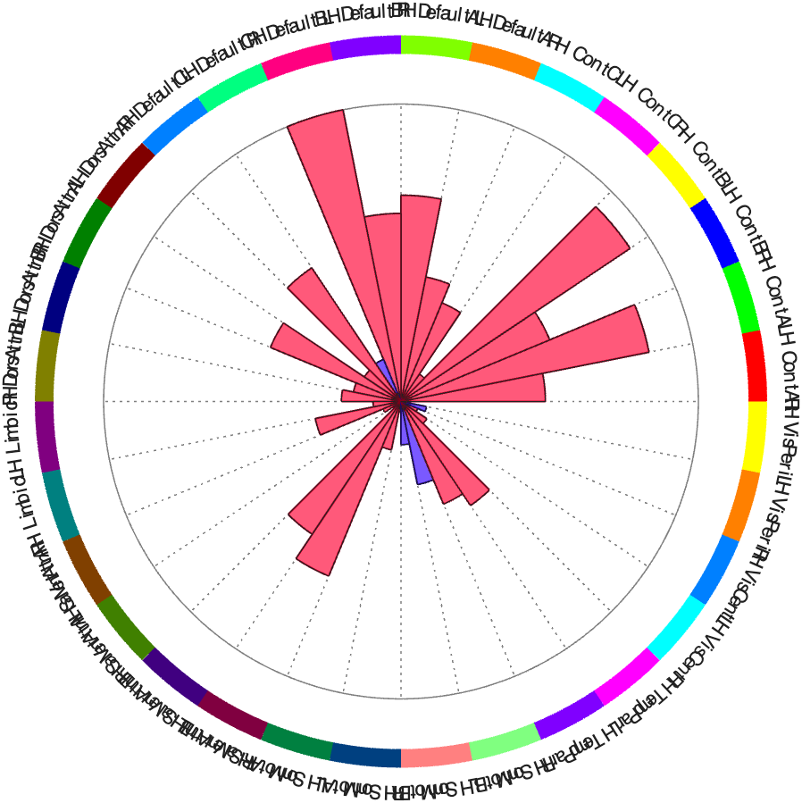
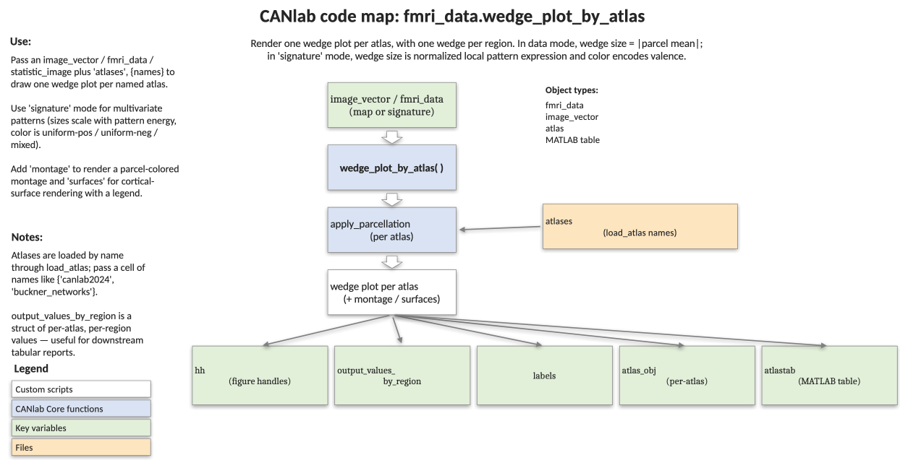

# `fmri_data.wedge_plot_by_atlas` — wedge plot of a map split by an atlas

[← back to `fmri_data` methods](../fmri_data_methods.md) ·
[Object methods index](../Object_methods.md) ·
[Recasting objects](../recasting_objects.md)

Render one or more wedge plots that summarise a brain map (data values
or a multivariate signature) parcel-by-parcel, using an atlas to define
the wedges. In **data mode** (default), each wedge's size is the
absolute parcel mean and colour encodes the sign — useful for showing
where positive and negative effects live across e.g. basal ganglia and
thalamus. In **signature mode** (`'signature'`), wedge size is a
volume-normalised measure of pattern energy and colour encodes pattern
valence (uniformly positive = red, uniformly negative = blue, mixed =
purple) — useful for visualising the spatial structure of a CANLab
signature.

## Quick example

Wedge plot of the emotion-regulation group t-map split by the Yeo 17 networks:

```matlab
imgs = load_image_set('emotionreg');
t = ttest(imgs); t = threshold(t, .005, 'unc');
[hh, vals] = wedge_plot_by_atlas(t, 'atlases', {'yeo17networks'});
```



## Code map



[Editable PowerPoint version](../code_maps_pptx/fmri_data_wedge_plot_by_atlas_codemap.pptx)

## Usage

```matlab
[hh, output_values_by_region, labels, atlas_obj, ...
 colorband_colors, atlastab] = wedge_plot_by_atlas(obj_to_plot, varargin)
```

## Inputs

| Argument | Type | Description |
|---|---|---|
| `obj_to_plot` | `image_vector` / `fmri_data` / `statistic_image` | The data or signature pattern to plot. May contain multiple images (data mode adds SE shading across them). |
| `'signature'` | flag | Use signature mode (volume-normalised pattern energy + valence colouring). Default is data mode. |
| `'atlases', {names}` | cellstr or cell of atlas objs | One wedge plot per atlas. Default `{'basal_ganglia', 'thalamus'}`. Names are resolved via `load_atlas`; you can also pass atlas objects directly. |
| `'colors', {neg, pos}` | cell | 2-element cell with colours for negative and positive ends of the valence colormap (signature mode). Default blue → red. |
| `'colorband_colors', {...}` | cell | Outer-band colours, one cell per atlas; each cell holds a cell array of colours of length `num_regions(atlas)`. |
| `'montage'` | flag | Also render a montage figure for each atlas (compact + region-centres views). |
| `'surfaces'` | flag | Render the regions of the **first** atlas on cortical surfaces, with a legend. |

## Outputs

| Output | Type | Description |
|---|---|---|
| `hh` | cell of handles | Wedge-plot handles, one cell per atlas. |
| `output_values_by_region` | cell | One cell per atlas; each is `[images × regions]`. In data mode = parcel means. In signature mode = `sqrt(w'*w) / (vol_in_mm + 1000)`. |
| `labels` | cell of cellstr | Region names per atlas (legend-formatted). |
| `atlas_obj` | cell of `atlas` | Atlas objects used (handy if loaded by keyword). |
| `colorband_colors` | cell | Outer-band colours actually used per atlas. |
| `atlastab` | table | Combined region-by-value table: `LabelIndx`, `Label`, `Value1`, `Value2`, ... (one column per atlas). |

## Notes

- Pattern valence is the cosine similarity of the parcel's pattern
  weights with a unit vector. +1 means uniformly positive weights
  (region average is a faithful summary of the pattern), −1 means
  uniformly negative weights, ~0 means mixed weights (region average
  loses information).
- Wedge size in signature mode regularises by volume — it adds 1 cm³ to
  every parcel so small high-weighted regions don't dominate, but large
  regions with diffuse weights also don't dominate. This is
  *importance per cubic mm of tissue*, not absolute pattern weight.
- In data mode with multiple input images, the darker shaded ring shows
  the SEM across images.
- The function calls `apply_parcellation` under the hood; that's where
  the parcel-mean / pattern-expression maths lives.

## Example: NPS signature visualised on basal ganglia + thalamus

```matlab
% Load NPS (1st of the npsplus set)
nps = get_wh_image(load_image_set('npsplus'), 1);

% Default atlases (basal ganglia + thalamus), signature mode
hh = wedge_plot_by_atlas(nps, 'signature');

% Custom colours and an attached montage of each atlas
hh = wedge_plot_by_atlas(nps, 'signature', ...
    'colors', {[0 0 1] [1 0 0]}, 'montage');
```

## Other examples

```matlab
% Data mode: 30 emotion-regulation contrast images, CIT168 + brainstem
imgs = load_image_set('emotionreg');
hh = wedge_plot_by_atlas(imgs, 'atlases', {'cit168' 'brainstem'});

% Custom interleaved L/R colours over the Yeo 17-network atlas, with a montage
[c1, c2] = deal(scn_standard_colors(16));
colors = {}; idx = 1;
for i = 1:length(c1)
    colors{idx} = c1{i}; colors{idx + 1} = c2{i}; idx = idx + 2;
end
[hh, output_values_by_region, labels, atlas_obj, colorband_colors] = ...
    wedge_plot_by_atlas(imgs, 'atlases', {'yeo17networks'}, ...
                        'montage', 'colorband_colors', colors);
```

## See also

- [`fmri_data.image_similarity_plot`](fmri_data_image_similarity_plot.md) — wedge / polar similarity vs. a basis set of maps
- [`fmri_data.table_of_atlas_regions_covered`](fmri_data_table_of_atlas_regions_covered.md) — atlas-coverage table for a thresholded map
- [`fmri_data.apply_parcellation`](fmri_data_apply_parcellation.md) — the underlying parcel-mean / pattern-expression routine
- [`atlas.select_atlas_subset`](atlas_select_atlas_subset.md) — pull out specific atlas regions before plotting
- [`atlas` methods](../atlas_methods.md) — load / subset atlases
