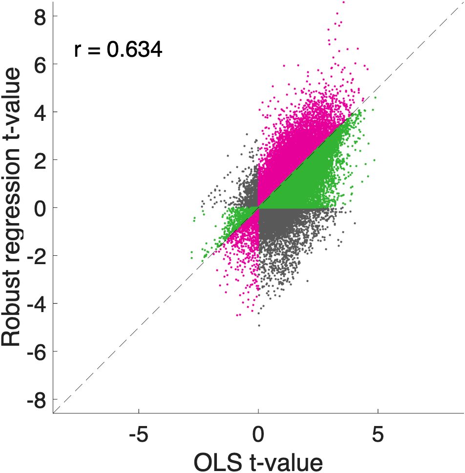

# `image_scatterplot` — voxelwise scatterplot of two stat / data maps

[Object methods index](../Object_methods.md) ·
[Atlases / regions / patterns](../atlases_regions_and_patterns.md)

`image_scatterplot` is the fastest way to compare two whole-brain
statistical maps voxel-by-voxel. Pass it two CANlab image objects
(`fmri_data`, `statistic_image`, anything with a `.dat` field) and it
draws a scatter of map 1 vs. map 2 with a square symmetric axis, an
identity line, the Pearson correlation displayed in the upper-left, and
optional p-value-threshold boxes, color coding by extremity, or a 2-D
density contour for very large maps.

The typical use is sanity-checking that two analyses of the same data
agree — e.g. comparing OLS to mixed-effects fits of the same contrast,
or comparing a hand-rolled implementation to a CANlab routine. Color
coding (`'colorpoints'`) highlights voxels where one map is more
extreme than the other in a sign-aware way, so disagreements pop out
visually. The optional `'pvaluebox'` overlay marks the |t| threshold
for a chosen two-tailed p, derived from the input objects' `.dfe`
field (or from a normal approximation if df is unknown), making it
trivial to see how many "significant" voxels would be lost or gained
if you switched between the two maps.

The function uses `inputParser` (CANlab style) and accepts the
`'colorpoints'` and `'contour'` flags either as bare keywords or as
name/value pairs.

## Quick example

Compare OLS vs. robust regression t-values for the same predictor on the
emotionreg sample. Points off the identity line are voxels where robust
regression up- or down-weights outlier subjects relative to OLS:

```matlab
imgs = load_image_set('emotionreg');
imgs.X = [imgs.metadata_table.Reappraisal_Success - ...
          mean(imgs.metadata_table.Reappraisal_Success), ...
          ones(size(imgs.dat, 2), 1)];
out_ols = regress(imgs, 'noverbose', 'nodisplay');
out_rob = regress(imgs, 'robust', 'noverbose', 'nodisplay');
t_ols = get_wh_image(out_ols.t, 1);
t_rob = get_wh_image(out_rob.t, 1);
image_scatterplot(t_ols, t_rob, 'colorpoints');
xlabel('OLS t-value'); ylabel('Robust regression t-value');
```



## Usage

```matlab
h = image_scatterplot(tmap1, tmap2, ...
                      'pvaluebox', p, 'df', df, ...
                      'colorpoints', 'contour', ...
                      'nbins', nbins, 'title', titlestr);
```

`tmap1` and `tmap2` are any objects with a numeric `.dat` field
(`fmri_data`, `statistic_image`, plain `image_vector`). Their `.dat`
fields are flattened and intersected (only finite-finite voxel pairs
are kept).

## How it works

1. **Data extraction.** `local_get_dat_vector` pulls `.dat` out of each
   input and reshapes to a column vector. Non-finite pairs (`NaN` /
   `Inf` in either map) are dropped so the count `h.n` reflects the
   voxels actually plotted.

2. **Axis setup.** Limits are symmetric around zero and the same for
   both axes (`[-maxAbs +maxAbs]`), so the identity line at y = x is
   the diagonal of a square plot. The figure is created via
   `create_figure(opt.title)` if available, otherwise plain `figure`.

3. **Plot mode.** If `'contour'` is set, the function bins the points
   into an `nbins × nbins` 2-D histogram with `histcounts2`, computes
   bin centres, and draws contour lines via `contour`. Otherwise it
   draws a scatter; with `'colorpoints'` it overlays two highlighted
   subsets (dark pink / green) on top of a neutral-gray base layer.

4. **Color rules** (with `'colorpoints'`):
   - Dark pink: `(x > 0 & y > x) | (x < 0 & y < x)` — map 2 is more
     extreme than map 1 in the same direction.
   - Green: `(y > 0 & x > y) | (y < 0 & x < y)` — map 1 is more
     extreme than map 2 in the same direction.
   - Gray: everything else, plus voxels inside the `'pvaluebox'` if
     both options are used together.

5. **p-value box.** With `'pvaluebox', p`, the function infers
   `df` from `.dfe` on either input (use `'df', df` to override) and
   computes the two-tailed t threshold `tinv(1 - p/2, df)`. If df is
   unknown it falls back to `norminv(1 - p/2)` and warns. The square
   `[-tthr +tthr]` is drawn as a dashed black line.

6. **Correlation text.** Pearson `corr(x, y, 'Rows', 'complete')` is
   computed and printed near the top-left of the axes in 22 pt black.

## Inputs

| Argument | Type | Description |
|---|---|---|
| `tmap1` | object with `.dat` | First image (x-axis). `fmri_data`, `statistic_image`, etc. |
| `tmap2` | object with `.dat` | Second image (y-axis). |

## Optional inputs

| Argument | Type | Description |
|---|---|---|
| `'pvaluebox'` | scalar 0–1 | Two-tailed p threshold. Draws a dashed `|t| ≥ tinv(1-p/2, df)` square. |
| `'df'` | positive scalar | Degrees of freedom for the p-to-t conversion. Defaults to `tmap1.dfe` (or `tmap2.dfe`); falls back to a normal approximation if absent. |
| `'colorpoints'` | flag | Color-code points by relative extremity (dark pink / green; see rules above). |
| `'contour'` | flag | Plot a 2-D density contour instead of individual points. |
| `'nbins'` | integer ≥ 10 | Bins per dimension for `'contour'` mode. Default 60. |
| `'title'` | string | Figure title and `create_figure` tag. Default `'t-value comparison'`. |

## Outputs

| Output | Type | Description |
|---|---|---|
| `h` | struct | Bundle of handles and stats: `h.fig`, `h.ax`, `h.scatter`, `h.contour`, `h.identity`, `h.pbox`, `h.corrtext`, `h.r` (Pearson correlation), `h.n` (number of finite voxel pairs). |

## Notes

- The two inputs must already share voxel correspondence — the function
  does NOT call `resample_space`. Resample one map onto the other
  upstream if needed (`a = resample_space(a, b)`).
- For very large maps (whole-brain at 2 mm ≈ 230 K voxels) the scatter
  becomes a solid blob and `'contour'` is more informative.
- The displayed correlation is computed across all finite voxel pairs,
  including outside-brain zeros from poorly masked maps. If you only
  want grey-matter voxels, pre-mask both images with the same mask
  (`apply_mask(t, mask)`) before passing them in.
- Bare-flag style (`'colorpoints'`, `'contour'`) is supported as well
  as name/value (`'colorpoints', true`); the helper
  `local_coerce_flags` handles the conversion.
- Df inference reads `.dfe`; if your object stores df under a
  different field, pass `'df'` explicitly.

## Examples

```matlab
% Basic scatter of two t-maps
image_scatterplot(t_obj_2sss, t_obj_fitlme);

% p-value threshold box at p < .001 (two-tailed), df=120
image_scatterplot(t_obj_2sss, t_obj_fitlme, 'pvaluebox', 0.001, 'df', 120);

% Color-code disagreement points by which map is more extreme
image_scatterplot(t_obj_2sss, t_obj_fitlme, 'colorpoints');

% Density contour for whole-brain comparison
image_scatterplot(t_obj_2sss, t_obj_fitlme, 'contour', 'nbins', 80);

% Both: highlight disagreements but gray-out subthreshold voxels
image_scatterplot(t_obj_2sss, t_obj_fitlme, 'colorpoints', ...
                  'pvaluebox', 0.005);
```

## See also

- [`fmri_data.regress`](fmri_data_regress.md) / [`fmri_data.fitlme_voxelwise`](fmri_data_fitlme_voxelwise.md) — produce stat maps to compare
- [`plot_correlation_matrix`](plot_correlation_matrix.md) — many-pair view of correlations among images
- [`fmri_data.image_similarity_plot`](fmri_data_image_similarity_plot.md) — wedge-plot view of similarities
- `resample_space` — align two image objects before comparing them
- `apply_mask` — restrict both maps to the same voxel set first
