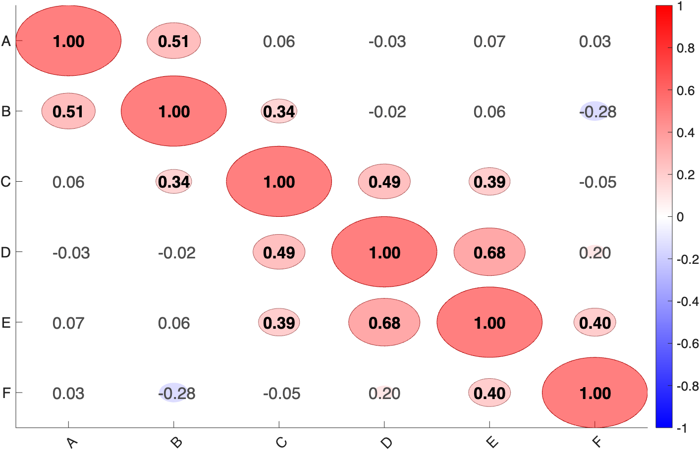

# `plot_correlation_matrix` — heatmap / circle-plot of a correlation matrix

[Object methods index](../Object_methods.md)

`plot_correlation_matrix` computes and renders the pairwise correlation
matrix among columns of a data matrix. Out of the box it does Pearson
correlations of an `n × k` matrix, draws a circle plot (where each
circle's diameter encodes magnitude and its color encodes sign), and
overlays the numeric correlation as text in each cell. Optionally it
switches to Spearman / robust regression / partial correlations,
applies FDR correction across the pairwise tests, swaps the circles
for a flat heatmap, sorts the variables by partition labels or by a
clustering dendrogram, and overlays partition color bars along the
edges.

The function is also useful as a thin display layer for any correlation
matrix you've already computed: pass `'input_is_r'` and a precomputed
`R` matrix (or a `ttest3d`-style struct with `.r`, `.p`, `.sig`) and it
will skip recomputation and just draw. This is the recommended way to
plot output from `canlab_compute_similarity_matrix`,
`canlab_sort_distance_matrix`, and other CANlab pairwise routines.

It returns an `OUT` struct with the correlation values, p-values,
significance mask, FDR-corrected mask, reordered names, and the figure
handle, so the same call can drive both the figure and downstream
reporting code.

## Quick example

```matlab
rng(7);
S = toeplitz([1 .6 .3 .1 0 0]);
X = mvnrnd([0 0 0 0 0 0], S, 50);
var_names = {'A' 'B' 'C' 'D' 'E' 'F'};
OUT = plot_correlation_matrix(X, 'var_names', var_names);
```



## Usage

```matlab
OUT = plot_correlation_matrix(X, [optional inputs])

% Pre-computed matrix (skip stats):
OUT = plot_correlation_matrix(R,    'input_is_r', true, 'names', n);
OUT = plot_correlation_matrix(stat, 'input_is_r', true);   % stat has .r .p .sig
```

`X` may be:
- A numeric `n × k` data matrix — correlations are computed.
- A MATLAB `table` — variable names are pulled out automatically.
- A `ttest3d`-style struct with `.r`, `.p`, `.sig` (k × k) — used as-is.
- A pre-computed `R` matrix when paired with `'input_is_r', true`.

## How it works

1. **Input handling.** Tables are converted with `table2array`, keeping
   `Properties.VariableNames` as labels. A struct input with `.r .p .sig`
   triggers `skip_calculation`. With `'input_is_r'` the input matrix is
   treated as a correlation matrix and stats are not computed (so
   significance markers will not be drawn unless you supply your own).

2. **Correlation method.** Default is Pearson. `'dospearman'` uses
   Spearman rank correlations. `'dopartial'` uses `partialcorr`
   (controls each pair for all other columns). The methods can be
   combined.

3. **Significance.** Pairwise p-values are obtained from the chosen
   method. With `'dofdr'`, p-values are FDR-corrected across all
   `k*(k-1)/2` unique pairs and the corrected mask used for star
   overlays / cell highlighting. With `'p_thr'` you can change the
   uncorrected threshold (default `.05`).

4. **Display style.** Two render modes:
   - **Circles** *(default for k ≤ 50)*: each cell is a filled circle
     whose radius scales with `|r|` and whose color is sampled from a
     blue–white–red colormap by the signed `r`. Numeric `r` is overlaid
     as text (suppressed automatically for k > 15 or with `'notext'`).
   - **Image** *(default for k > 50, or via `'doimage'`)*: a flat
     `imagesc` heatmap. Combine with `'docircles', false` to suppress
     the circle layer entirely.

5. **Reordering.** With `'partitions'` (a `k`-length integer vector
   defining variable groups), columns are sorted ascending by partition
   ID and color bars are drawn along the matrix edges using
   `'partitioncolors'` and `'partitionlabels'`. With
   `'reorder_by_clustering'`, the function calls a hierarchical
   dendrogram routine to reorder variables so that highly-correlated
   ones are adjacent. Either reordering is reflected in the returned
   `var_names`.

6. **Color limits and sizing.** `'colorlimit'` (default `[-1 1]`) sets
   the colormap range; `'max_radius'` controls the maximum circle size
   (defaults to `range(colorlimit)/4` or 0.5). Text size, color, and
   offsets are controllable via the `text_*` options.

## Inputs

| Argument | Type | Description |
|---|---|---|
| `X` | matrix / table / struct / R-matrix | Data matrix (`n × k`), a `table`, a `ttest3d`-style struct (`.r .p .sig`), or a precomputed correlation matrix with `'input_is_r'`. |

## Optional inputs

### Stats

| Argument | Type | Description |
|---|---|---|
| `'p_thr'` | scalar | Uncorrected p-value threshold for significance markers. Default `.05`. |
| `'dospearman'` / `'spearman'` / `'rank'` / `'dorank'` | flag | Use Spearman rank correlations. |
| `'dopartial'` / `'partial'` / `'partialcorr'` | flag | Use partial correlations (controls for other columns). |
| `'dofdr'` / `'fdr'` / `'FDR'` | flag | FDR-correct across all pairs. |
| `'input_is_r'` / `'input_rmatrix'` | flag | Skip computation; treat `X` as a correlation matrix. |

### Display

| Argument | Type | Description |
|---|---|---|
| `'image'` | flag | Heatmap mode (`doimage = true`, `docircles = false`). |
| `'circles'` | flag | Circle mode (default for small matrices). |
| `'doimage'` | logical | Same as `'image'` flag, name/value form. |
| `'docircles'` | logical | Toggle circles. |
| `'dotext'` | logical | Overlay numeric `r` in each cell. Default true for k ≤ 15. |
| `'notext'` | flag | Suppress numeric overlays. |
| `'colorlimit'` | 2-vector | Colormap range (default `[-1 1]`). |
| `'max_radius'` | scalar | Max circle radius (default `range(colorlimit)/4` or 0.5). |
| `'text_x_offset'` | scalar | Horizontal offset for text labels (default `.15`). |
| `'text_y_offset'` | scalar | Vertical offset for text labels (default `0`). |
| `'text_fsize'` | scalar | Font size for in-cell text. Default 16. |
| `'text_nonsig_color'` | RGB | Text color for non-significant cells. Default `[.3 .3 .3]`. |
| `'text_sig_color'` | RGB | Text color for significant cells. Default `[0 0 0]`. |
| `'nofigure'` | flag | Don't open a new figure (use the current axes). |
| `'dofigure'` | flag | Open a new figure (default). |

### Labels and grouping

| Argument | Type | Description |
|---|---|---|
| `'var_names'` / `'names'` / `'labels'` | cell of strings | Column labels (auto from `table` input). |
| `'partitions'` | k-length integer vector | Group labels — columns will be sorted ascending and partition bars drawn. |
| `'partitioncolors'` | cell of strings or RGBs | One color per partition. |
| `'partitionlabels'` | cell of strings | One label per partition. |
| `'reorder_by_clustering'` | flag | Reorder columns by hierarchical clustering of `R` so similar variables are adjacent. |

## Outputs

| Output | Type | Description |
|---|---|---|
| `OUT.r` | k × k matrix | Correlation values. |
| `OUT.p` | k × k matrix | p-values for each pair. |
| `OUT.sig` | k × k logical | Significant pairs (uncorrected, at `p_thr`). |
| `OUT.fdrsig` | k × k logical | FDR-significant pairs (when `'dofdr'`). |
| `OUT.fdrthr` | scalar | FDR threshold (when `'dofdr'`). |
| `OUT.var_names` | cell | Column labels (re-ordered if a partition or clustering reorder happened). |
| `OUT.reorder_note` | char | Present when reordering occurred; describes the reorder. |
| `OUT.han` | handles | Figure / axis / circle / text / colorbar handles. |

## Notes

- For matrices with k > 15, text overlays are turned off automatically.
  For k > 50, circles are switched off in favour of a heatmap. Override
  these by passing the relevant flags explicitly.
- `'partitions'` requires the partition labels to be sortable in a way
  that corresponds to a meaningful grouping; the function sorts them
  ascending and warns when reordering happens. Re-sort your data
  matrix yourself first if you need a custom partition order.
- With `'input_is_r'`, no significance is computed and so no stars
  appear by default. If you want significance overlays, pre-compute
  them and pass a `ttest3d`-style struct.
- `'dopartial'` uses `partialcorr`, which requires the Statistics
  Toolbox and complete cases. NaNs need to be handled upstream.
- The default colormap is blue-white-red and can be tuned implicitly
  by `'colorlimit'` (asymmetric ranges shift the white point).

## Examples

```matlab
% Larger matrix without circles
OUT = plot_correlation_matrix(X, 'doimage', true, 'docircles', false);

% Spearman partial correlations with FDR correction
OUT = plot_correlation_matrix(X, 'doimage', true, 'docircles', false, ...
                              'dospearman', true, ...
                              'dopartial', true, 'dofdr', true);

% Plot a precomputed similarity matrix from canlab_compute_similarity_matrix
obj = load_image_set('hansen22');
[R, ~] = canlab_compute_similarity_matrix(obj.dat, 'doplot', false);
plot_correlation_matrix(R, 'input_is_r', true, ...
                        'names', obj.metadata_table.target);

% Sort by clustering and re-plot
[R_sorted, perm_order] = canlab_sort_distance_matrix(R, ...
                            'correlation_matrix', true);
plot_correlation_matrix(R_sorted, 'input_is_r', true, ...
                        'names', obj.metadata_table.target(perm_order));

% Use auto-reordering
plot_correlation_matrix(R, 'input_is_r', true, ...
                        'names', obj.metadata_table.target, ...
                        'reorder_by_clustering');

% Color-bar partitions for grouped variables
partition  = [1 1 1 2 2 3 3 3];
pcolors    = {'r', 'g', 'b'};
plabels    = {'Sensory', 'Affect', 'Cognitive'};
plot_correlation_matrix(X, 'partitions', partition, ...
                        'partitioncolors', pcolors, ...
                        'partitionlabels', plabels);
```

## See also

- [`barplot_columns`](barplot_columns.md) — bar / dot plot of column means with stats
- [`image_scatterplot`](image_scatterplot.md) — bivariate scatter of voxel values
- `canlab_compute_similarity_matrix` — pairwise similarity for image objects
- `canlab_sort_distance_matrix` — clustering-based reordering of a similarity matrix
- `clusterdata_permtest` — permutation testing of clustering structure
- `partialcorr` (Statistics Toolbox) — used internally for `'dopartial'`
