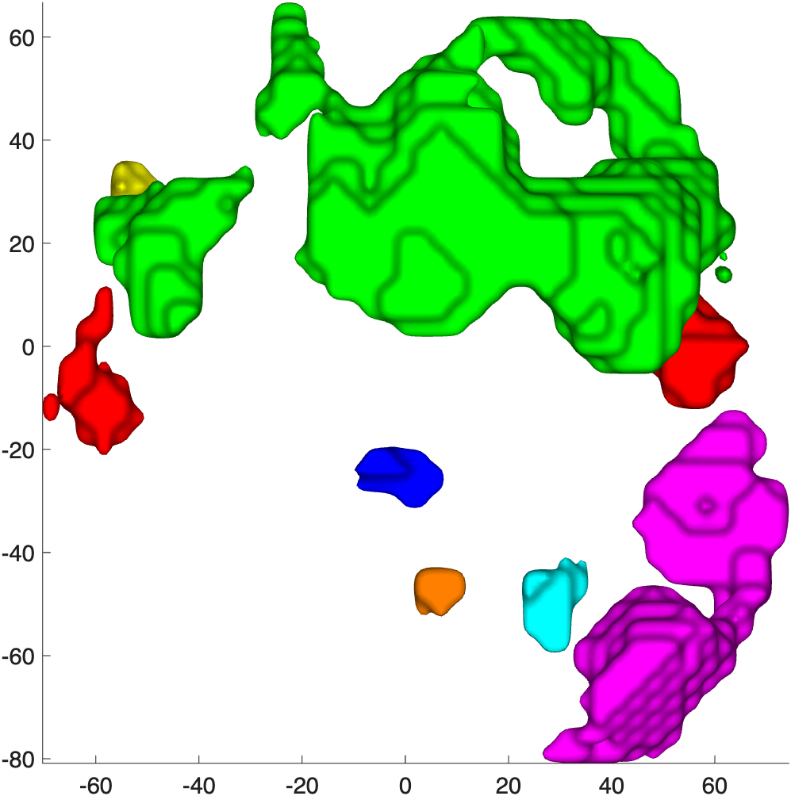

# `region.isosurface` — 3-D isosurface for each region in a region object

[← back to `region` methods](../region_methods.md) ·
[Object methods index](../Object_methods.md)

Render each element of a `region` object array as a 3-D isosurface in a
distinct color, with optional alpha, smoothing, custom colormap, and
left/right matched colors across hemispheres. Useful as a 3-D companion
to slice montages — drop the result into an `addbrain` figure for
context.

## Quick example

```matlab
imgs = load_image_set('emotionreg');
t = ttest(imgs);
t = threshold(t, .005, 'unc', 'k', 10);
r = region(t);
create_figure('ri'); set(gcf, 'Position', [100 100 900 700]);
isosurface(r);
```



## See also

- [`atlas.isosurface`](atlas_select_atlas_subset.md#code-map) — same idea for atlas regions
- [`region.surface`](region_surface.md) — projection onto cortical surfaces
- [`addbrain`](addbrain.md) — anatomical hull / cutaway behind the regions
- `imageCluster` — the underlying patch-rendering primitive
