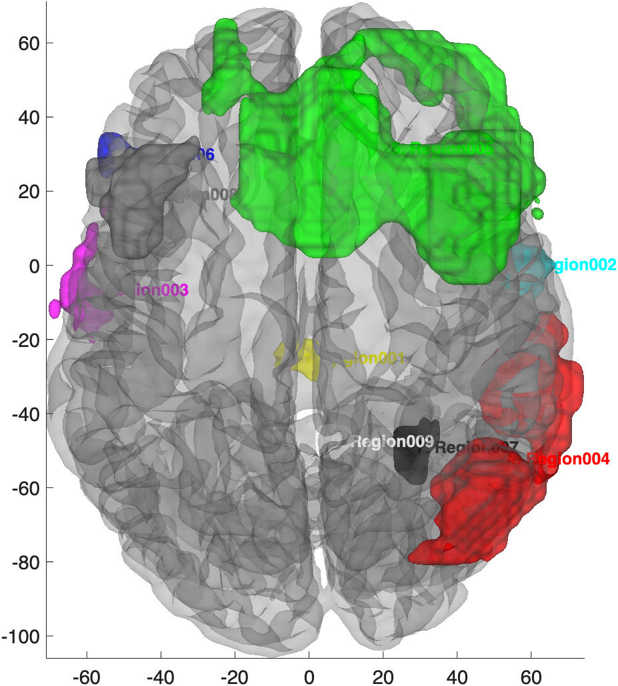

# `region.labelled_surface` — surface rendering with region centroids labelled

[← back to `region` methods](../region_methods.md) ·
[Object methods index](../Object_methods.md)

Render a `region` object on a cortical surface and draw a text label at
each region's centroid (using the region's `.shorttitle` / atlas label).
Optionally "popout" the labels with leader lines for readability when
regions cluster. Useful for figures where you need to identify each
cluster by name without a separate legend.

## Quick example

```matlab
imgs = load_image_set('emotionreg');
t = ttest(imgs);
t = threshold(t, .005, 'unc', 'k', 10);
r = region(t);
create_figure('rls'); labelled_surface(r);
```



## See also

- [`region.surface`](region_surface.md) — same surface rendering without the labels
- [`region.table`](region_table.md) — atlas-labelled table of the same regions
- [`addbrain`](addbrain.md) — anatomical surface backdrops
