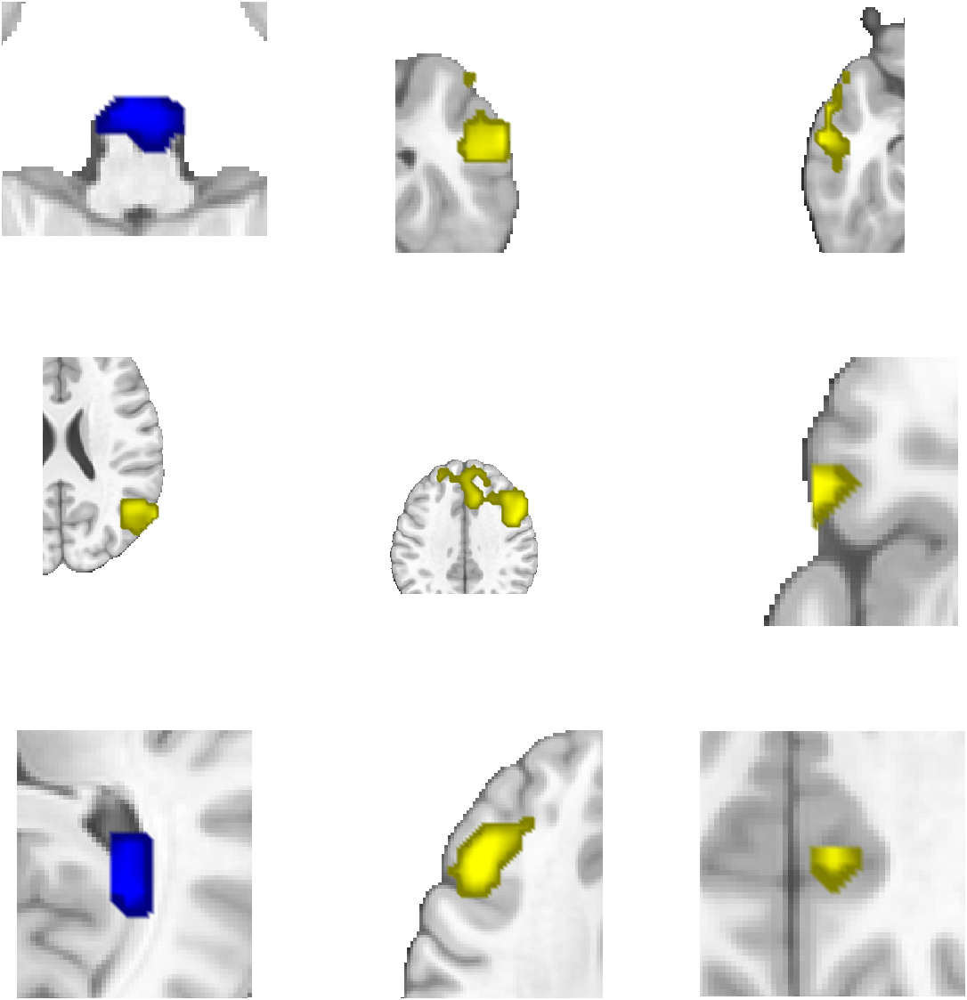

# `region.montage` — slice montage of a region object

[← back to `region` methods](../region_methods.md) ·
[Object methods index](../Object_methods.md)

Render a `region` object as a slice montage on canonical anatomy — either
as a single full montage or, with `'regioncenters'`, as one mini-montage
per region centred on its peak coordinate. The fastest way to see *every*
cluster in a thresholded results set without scrolling.

## Quick example

```matlab
imgs = load_image_set('emotionreg');
t = ttest(imgs);
t = threshold(t, .005, 'unc', 'k', 10);
r = region(t);
montage(r, 'regioncenters', 'colormap');
```



## See also

- [`fmri_data.montage`](fmri_data_montage.md) — montage for a stat map (one set of slices for the whole map)
- [`region.surface`](region_surface.md) — surface rendering of the same regions
- [`region.table`](region_table.md) — labelled tabular summary
