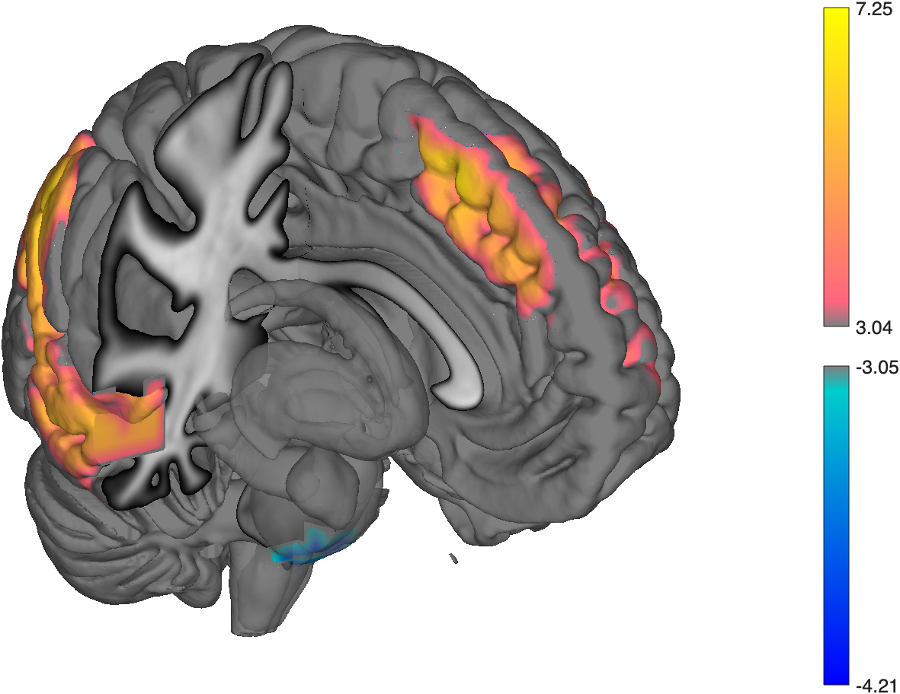

# `region.surface` — render regions on cortical / subcortical surfaces

[← back to `region` methods](../region_methods.md) ·
[Object methods index](../Object_methods.md)

Project a `region` object onto cortical and subcortical surfaces with
options for cutaways, four-panel cortical layouts, and custom positive /
negative colormaps. Wraps `surface_cutaway` and related helpers. The
quickest way to produce a publication-quality surface figure of an
existing set of clusters.

## Quick example

```matlab
imgs = load_image_set('emotionreg');
t = ttest(imgs);
t = threshold(t, .005, 'unc', 'k', 10);
r = region(t);
create_figure('rs'); surface(r);
```



## See also

- [`region.labelled_surface`](region_labelled_surface.md) — same idea with text labels
- [`region.isosurface`](region_isosurface.md) — 3-D blob isosurface in the same axes
- [`fmri_data.surface`](fmri_data_surface.md) — surface rendering directly from a stat map
- [`addbrain`](addbrain.md) — bare-bones anatomical surface backdrop
